# ALwrity Architecture: Brand Brain to Daily Content

> **Status:** Living document. Reflects current state (post-Autofill Phase 1–7 + WS1 user-ID fixes) and the roadmap for WS3–WS5.

---

## 1. Executive Summary

ALwrity is a **content intelligence system** that turns a brand's onboarding data into a persistent, source-tracked **Brand Brain** (`canonical_profile`). The brain drives a 3-step strategy setup, a 12-step calendar generator, and a daily adaptive workflow powered by a 5-agent committee.

The system has three concentric layers:

| Layer | What it does | Where it lives |
|---|---|---|
| **Brand Brain** (the persistent core) | Synthesizes all onboarding data into one source-tracked JSON; consumed by 117+ downstream callers | `OnboardingDataIntegration.canonical_profile` |
| **Strategy + Calendar** (the long-term plan) | A comprehensive strategy doc (insights, competitive analysis, roadmap) and a 12-step generated calendar of events | `EnhancedContentStrategy`, `CalendarEvent` tables |
| **Today's Workflow** (the daily execution) | A 6-pillar task list (plan, generate, publish, analyze, engage, remarket) generated each morning from calendar + agent proposals | `DailyWorkflowPlan`, `DailyWorkflowTask` tables |

A **5-agent committee** (Strategy, Content, SEO, Social, Competitor) proposes tasks. **SLA monitoring** (future WS4) will detect strategy drift and trigger agent-led remediation.

---

## 2. System Overview

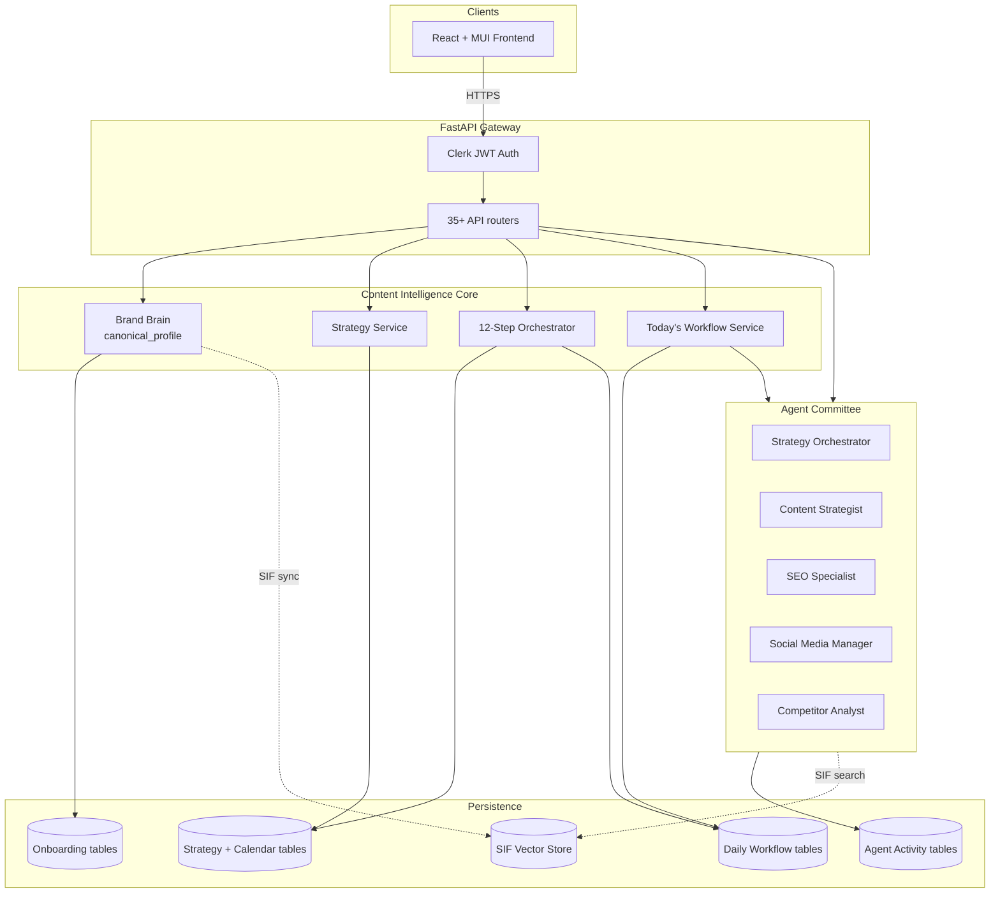

---

## 3. The End-to-End User Journey

The journey from signup to daily content production has **5 phases** with a strict dependency chain.

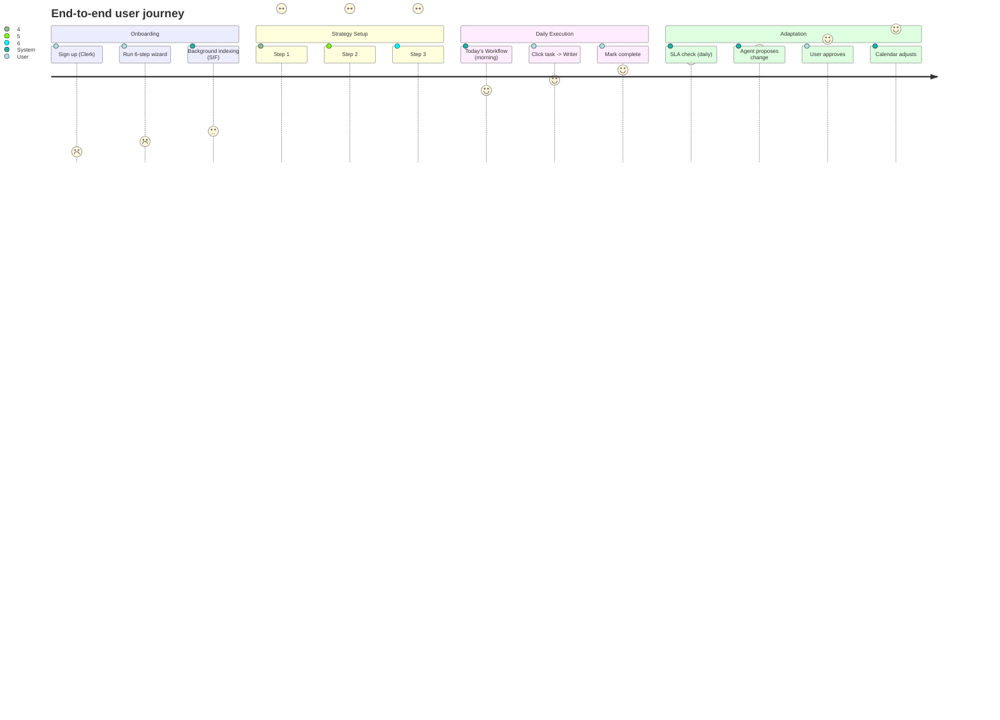

### Phase 1: Onboarding (5 min, user-driven)

| Step | What | Where |
|---|---|---|
| 1 | API keys (OpenAI, Anthropic, Google) | `OnboardingSession` + `APIKey` |
| 2 | Website analysis (URL) | `WebsiteAnalysis` (writing_style, brand_analysis, SEO audit) |
| 3 | Research preferences | `ResearchPreferences` (depth, content_types, audience) |
| 4 | Persona generation | `PersonaData` (core_persona, platform_personas) |
| 5 | Integrations (GSC, Bing, social) | `PlatformIntegration` |
| 6 | Finish (validates, fires background tasks) | `OnboardingSession.progress=100` |

After step 6, **fire-and-forget background tasks** run (persona regen, SIF indexing, market trends, deep competitor analysis).

### Phase 2: Strategy Setup (3 steps, user-driven) — **WS3**

Strict dependency: each step unlocks the next.

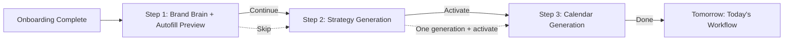

| Step | Displayed to user | Backend call | User action | Gate |
|---|---|---|---|---|
| **1** | `canonical_profile` (read-only) + 30 autofill values (read-only) | `GET /onboarding-data/canonical-profile`<br/>`POST /autofill/generate` | Click "Continue" | None (review optional) |
| **2** | Comprehensive strategy: insights, competitive analysis, performance predictions, roadmap, risks | `POST /ai-generation/generate-comprehensive-strategy` | Review → click "Activate Strategy" | **Required** to unlock step 3 |
| **3** | 12-step calendar progress | `POST /calendar-generation/generate-calendar` | Watch progress | Active strategy required |

### Phase 3: Daily Execution (auto + user)

After the calendar is generated:

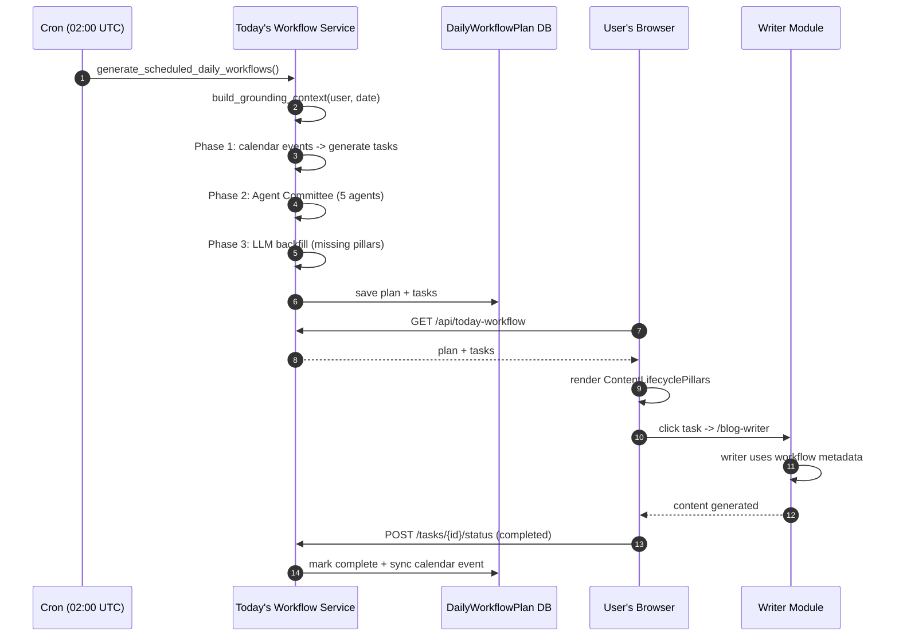

The 6 lifecycle pillars: **plan, generate, publish, analyze, engage, remarket**.

- **`generate` pillar** = calendar events filtered by today's date + status in {draft, scheduled}
- **Other pillars** = Agent Committee proposals (5 agents) + LLM backfill
- Each task has an `action_url` mapping to a writer module (e.g., `/blog-writer`, `/linkedin-writer`)
- Marking a task complete triggers `sync_workflow_tasks_from_calendar_event` → sets the linked calendar event to "published"

### Phase 4: Adaptation (auto + user) — **WS4 (future)**

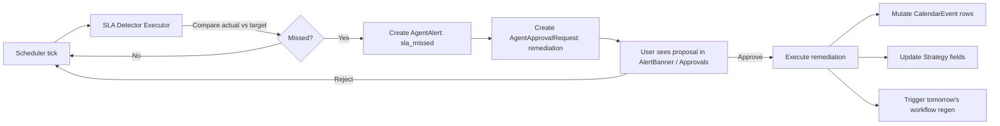

This loop is **not yet built**. The infrastructure exists (AgentAlert, AgentApprovalRequest, scheduler) but no executor currently does SLA detection. See §11 for the build plan.

---

## 4. Component Architecture

### 4.1 Backend Services

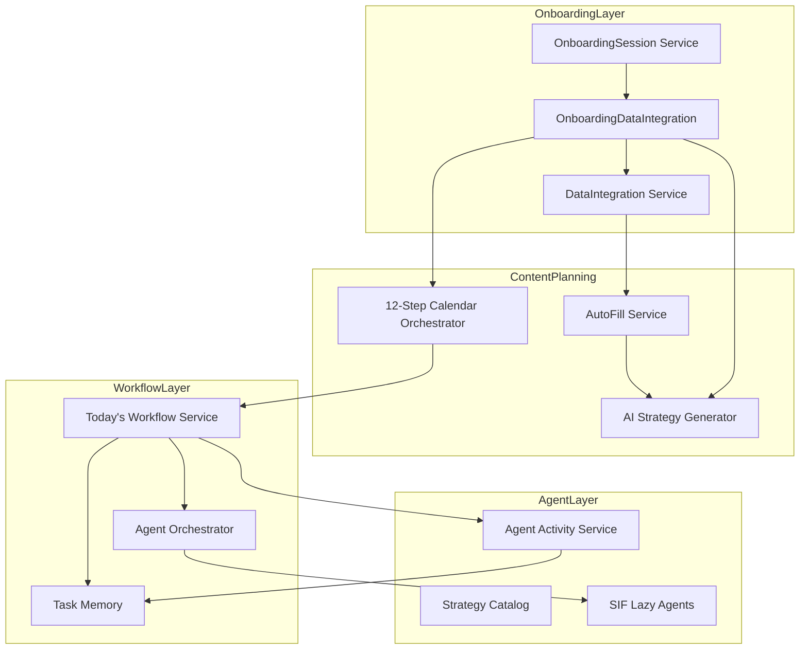

### 4.2 Frontend Pages

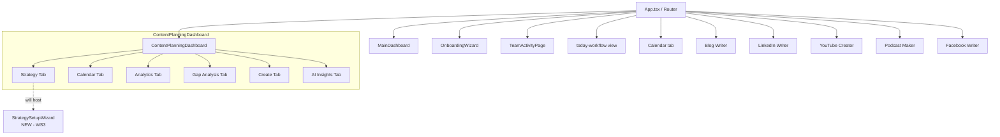

---

## 5. The 3-Step Strategy Setup Wizard (WS3 Detail)

### 5.1 Wizard Shell

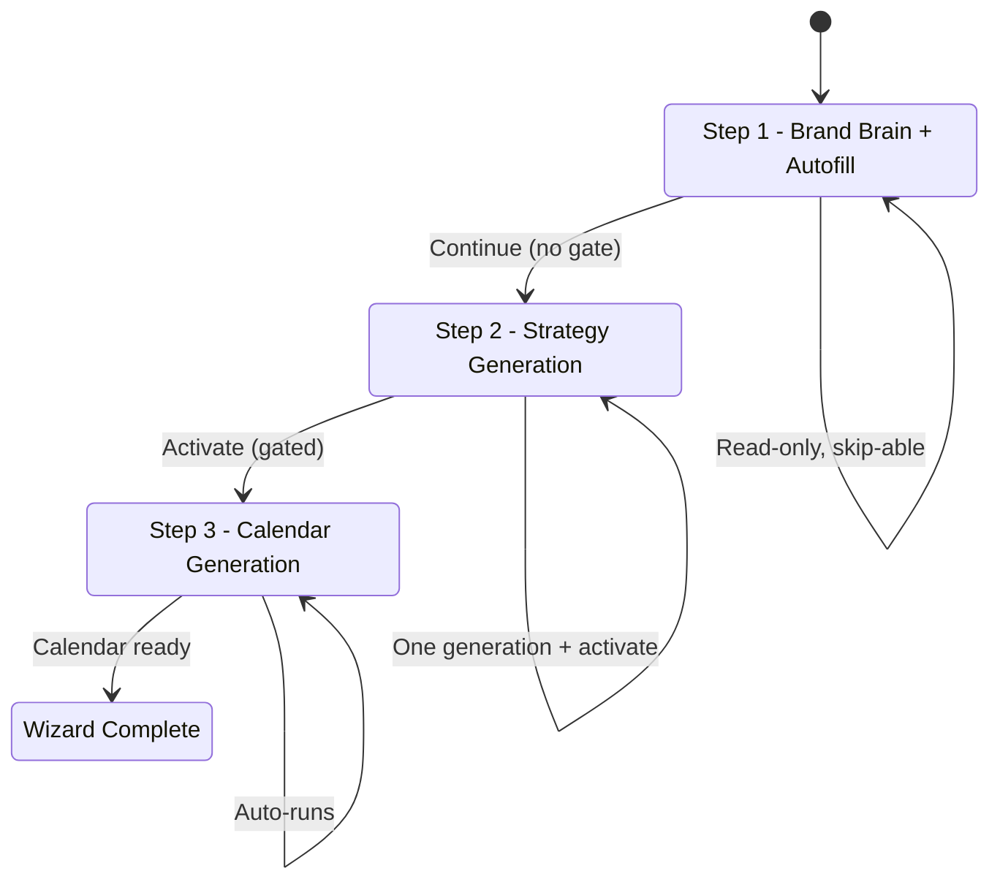

### 5.2 Step 1: Brand Brain + Autofill Preview

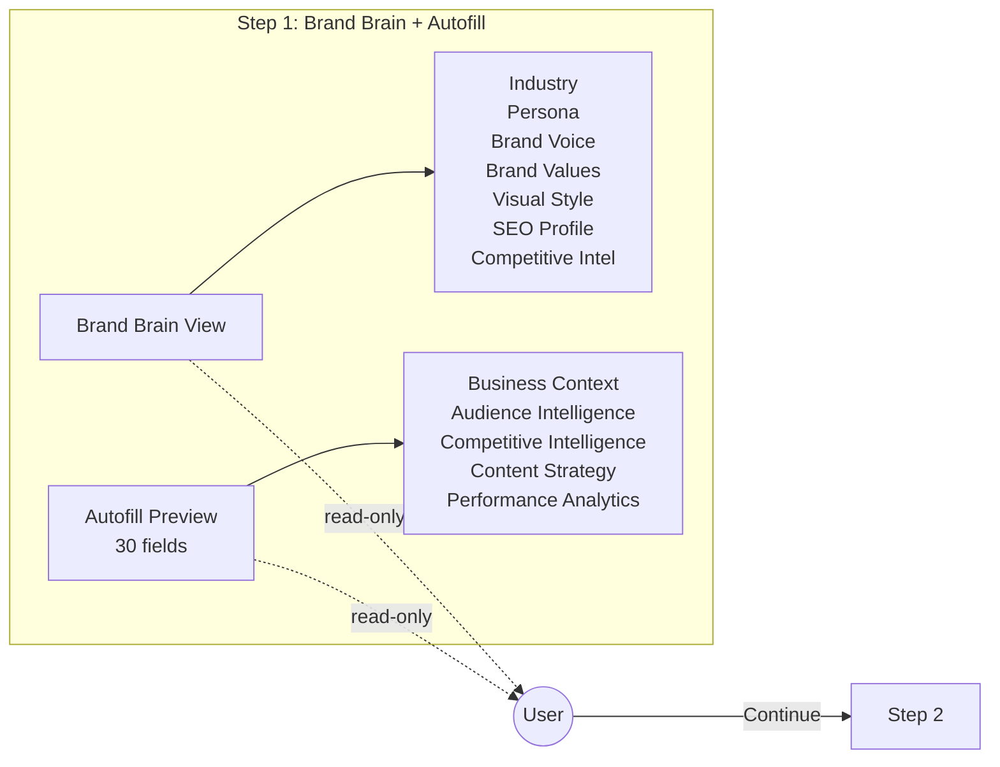

| Concern | Implementation |
|---|---|
| Source | `GET /api/content-planning/onboarding-data/canonical-profile` (existing `OnboardingDataIntegrationService.process_onboarding_data`) |
| Autofill | `POST /api/content-planning/enhanced-strategies/strategies/autofill/generate` (Phase 7 endpoint) |
| Editing | **Read-only** (decision: skip-able, no edits) |
| Source badges | Reuse Phase 6 chip component (`StrategicInputField` style) |

### 5.3 Step 2: Strategy Generation + Activation

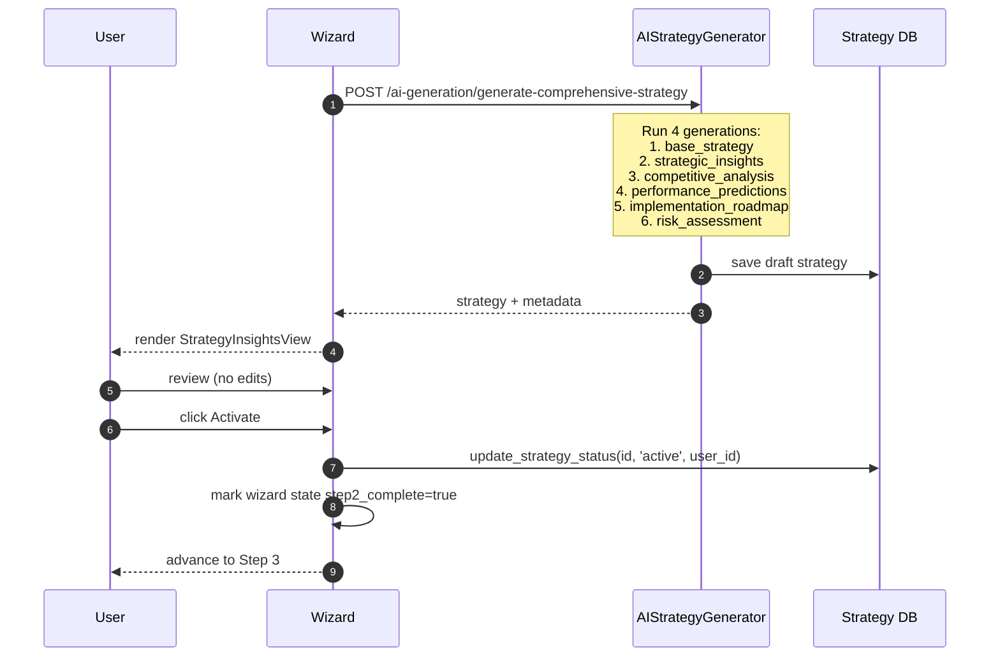

**Backend endpoints (all existing):**
- `POST /api/content-planning/enhanced-strategies/ai-generation/generate-comprehensive-strategy`
- `PATCH /api/content-planning/enhanced-strategies/{id}/activate` (via `update_strategy_status`)

### 5.4 Step 3: Calendar Generation

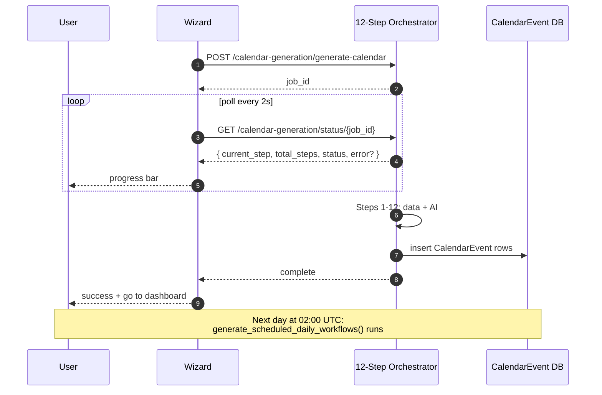

### 5.5 Wizard State Persistence

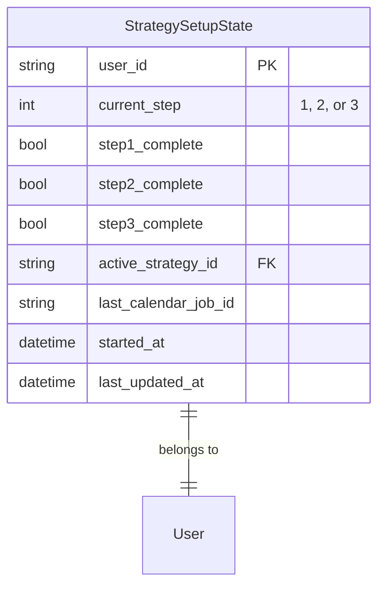

`GET/PUT /api/strategy-setup/state` — drives resume across browser sessions.

---

## 6. Today's Workflow + Agent Committee

### 6.1 Three-Phase Plan Generation

```mermaid
flowchart TB
    Start[get_or_create_daily_workflow_plan] --> P1[Phase 1: Calendar -> generate pillar]
    P1 --> P2[Phase 2: Agent Committee]
    P2 --> P3[Phase 3: LLM backfill]
    P3 --> V[Validation]
    V --> Done[Save plan + tasks]

    subgraph P1Detail [Phase 1]
        P1A[Filter CalendarEvent:<br/>scheduled_date = today<br/>status in {draft, scheduled}]
        P1B[Map to generate-pillar tasks]
    end

    subgraph P2Detail [Phase 2: Committee]
        Poll[Poll 5 agents in parallel]
        Agents[ContentStrategyAgent<br/>StrategyArchitectAgent<br/>SEOOptimizationAgent<br/>SocialAmplificationAgent<br/>CompetitorResponseAgent]
        Filter[Filter: valid pillar_id, dedup, semantic]
        Audit[ContentGuardianAgent.audit_committee]
        Trend[TrendSurferAgent.surf_trends]
    end

    subgraph P3Detail [Phase 3: Backfill]
        Check{All 6 pillars covered?}
        LLM[llm_text_gen to create task]
    end
```

### 6.2 Agent Team

| Agent | Role | Pillar focus | Key data |
|---|---|---|---|
| `content_strategist` | Content Strategist | plan, generate | calendar, brand brain |
| `strategy_orchestrator` | Marketing Team Lead | plan | cross-functional |
| `seo_specialist` | SEO Specialist | analyze | GSC, Bing, advertools |
| `social_media_manager` | Social Media Manager | engage, remarket | platform insights, trends |
| `competitor_analyst` | Competitor Analyst | plan | deep competitor data, SIF |

Plus utility agents:
- `ContentGuardianAgent.audit_committee()` — quality score for proposals
- `TrendSurferAgent.surf_trends()` — trend signals

### 6.3 The Committee Meeting Event

```json
{
  "event_type": "committee_meeting",
  "payload": {
    "agents_polled": 5,
    "total_proposals": 23,
    "accepted_count": 12,
    "rejected_count": 11,
    "proposals": [
      {
        "agent": "ContentStrategyAgent",
        "title": "Draft Q1 case study: SaaS growth metrics",
        "pillar_id": "generate",
        "priority": "high",
        "valid": true,
        "accepted": true,
        "reasoning": "Calendar has 4 case-study events this week, 2 unassigned",
        "estimated_time": 45,
        "action_type": "navigate",
        "action_url": "/blog-writer?..."
      }
    ]
  }
}
```

This event is consumed by:
- `CommitteeSummary.tsx` (full page at `/team-activity`)
- `TeamHuddleWidget.tsx` (compact, on MainDashboard)

### 6.4 Live Feed

| Endpoint | Type | Purpose |
|---|---|---|
| `GET /api/agents/huddle/feed` | Polling | Snapshot of {runs, events, alerts, approvals, cursor} |
| `GET /api/agents/huddle/stream` | SSE | Real-time delta events: `snapshot`, `delta`, `heartbeat` (every 2.5s) |
| `GET /api/agents/team` | REST | 5-agent catalog + per-user profiles |
| `GET /api/agents/alerts` | REST | Unread alerts |
| `GET /api/agents/approvals` | REST | Pending approval requests |

---

## 7. The Adaptive Loop (WS4 — Future)

### 7.1 The Missing Loop

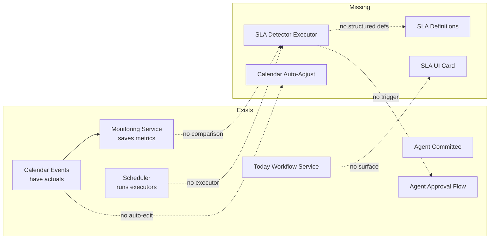

**State of WS4:** infrastructure exists, but the SLA detection mechanism is entirely missing.

### 7.2 What Needs To Be Built

| Component | Purpose | Effort |
|---|---|---|
| `sla_definitions` table (or extend `MonitoringTask`) | Structured `{metric, operator, threshold, window, severity}` instead of free-text `success_criteria`/`alert_threshold` | 1 day |
| `SlaBreachDetector` executor | Reads latest `StrategyPerformanceMetrics` + `PlatformInsightsTask`, compares to definitions, calls `AgentActivityService.create_alert(alert_type='sla_missed', ...)` + `AgentApprovalRequest` for remediation | 4 days |
| Calendar auto-adjust executor | On approval of a remediation, mutates `CalendarEvent` rows + regenerates next day's workflow | 2 days |
| SLA UI card on dashboard | New `/api/strategy/sla-status` endpoint + `SlaComplianceCard.tsx` widget next to `sifHealth` chip | 2 days |
| Strategy field auto-update | When strategy adjustments are approved, write to `EnhancedContentStrategy` fields + `canonical_profile` (with provenance) | 2 days |
| Tests + rollout | Coverage, edge cases, gradual rollout flag | 1 day |

**Total: ~12 days (~2.5 weeks).**

---

## 8. Data Model

### 8.1 Core Tables

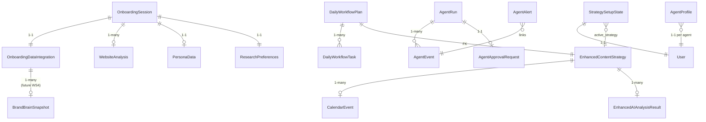

### 8.2 Key Models

| Model | File | Purpose |
|---|---|---|
| `OnboardingDataIntegration` | `backend/models/enhanced_strategy_models.py` | `canonical_profile` (JSON SSOT) + raw copies + `data_quality_scores` + `confidence_levels` + `data_freshness` |
| `EnhancedContentStrategy` | same | 30-field strategy form (the `core_fields` storage) |
| `EnhancedAIAnalysisResult` | same | Comprehensive strategy output (insights, competitive analysis, performance preds, roadmap, risks) |
| `CalendarEvent` | `backend/models/content_planning.py` | Individual scheduled content: `{strategy_id, title, content_type, platform, scheduled_date, status, ai_recommendations}` |
| `DailyWorkflowPlan` | `backend/models/daily_workflow_models.py` | Per-day plan: `{user_id, date, generated_at, quality_status, provenance_summary}` |
| `DailyWorkflowTask` | same | Per-task: `{plan_id, pillar_id, title, description, action_url, action_type, priority, status, metadata.source_agent}` |
| `AgentRun` | `backend/models/agent_activity_models.py` | One agent execution: `{user_id, agent_type, status, success, started_at, finished_at}` |
| `AgentEvent` | same | Log entry: `{run_id, event_type, severity, message, payload}` (incl. `committee_meeting`) |
| `AgentAlert` | same | User-facing: `{source, alert_type, severity, title, cta_path, dedupe_key, read_at}` |
| `AgentApprovalRequest` | same | User gates: `{run_id, action_type, risk_level, payload, status, decision}` |
| `AgentProfile` | same | Per-user agent config: `{agent_key, display_name, enabled, schedule, system_prompt, task_prompt_template}` |
| `StrategyMonitoringPlan` | `backend/models/monitoring_models.py` | Per-strategy observability: 8 monitoring tasks (LLM-generated) |
| `MonitoringTask` | same | Per-task: `{metric, measurement_method, success_criteria, alert_threshold, frequency, last_executed, next_execution}` |
| `StrategyPerformanceMetrics` | same | Aggregated: `{traffic_growth_pct, engagement_rate_pct, conversion_rate_pct, roi_ratio, ...}` |

---

## 9. API Contracts

### 9.1 Strategy Setup Wizard (WS3)

| Endpoint | Method | Body | Returns | Used in |
|---|---|---|---|---|
| `/api/content-planning/onboarding-data/canonical-profile` | GET | — | `canonical_profile` (full JSON) | Step 1 |
| `/api/content-planning/enhanced-strategies/strategies/autofill/generate` | POST | — | `{fields, sources, meta, ...}` | Step 1 |
| `/api/content-planning/enhanced-strategies/ai-generation/generate-comprehensive-strategy` | POST | `{strategy_name, config}` | `{strategy: {strategic_insights, competitive_analysis, performance_predictions, implementation_roadmap, risk_assessment}}` | Step 2 |
| `/api/content-planning/enhanced-strategies/{id}/activate` | PATCH | — | `{success, status: 'active'}` | Step 2 |
| `/api/content-planning/calendar-generation/generate-calendar` | POST | `{strategy_id, calendar_type}` | `{job_id}` | Step 3 |
| `/api/content-planning/calendar-generation/status/{job_id}` | GET | — | `{current_step, total_steps, status, error?}` | Step 3 polling |
| `/api/strategy-setup/state` | GET / PUT | `{current_step, step1_complete, step2_complete, ...}` | `StrategySetupState` | Resume |

### 9.2 Today's Workflow (existing)

| Endpoint | Method | Returns |
|---|---|---|
| `/api/today-workflow` | GET | Today's plan + tasks (404 if none) |
| `/api/today-workflow/status` | GET | Schedule status |
| `/api/today-workflow/generate` | POST | Triggers 3-phase generation |
| `/api/today-workflow/tasks/{task_id}/status` | POST | Update task status (completed/skipped/in_progress) |

### 9.3 Agent Committee (existing)

| Endpoint | Method | Returns |
|---|---|---|
| `/api/agents/team` | GET | 5-agent catalog + per-user profiles |
| `/api/agents/team/{agent_key}` | POST | Upsert agent profile |
| `/api/agents/team/{agent_key}/ai-optimize` | POST | LLM-rewrites agent prompts |
| `/api/agents/team/{agent_key}/preview` | POST | LLM-preview what agent will produce |
| `/api/agents/huddle/feed` | GET | Polling feed |
| `/api/agents/huddle/stream` | GET (SSE) | Real-time stream |
| `/api/agents/alerts` | GET | Unread alerts |
| `/api/agents/alerts/{id}/mark-read` | POST | Dismiss |
| `/api/agents/approvals` | GET | Pending approvals |
| `/api/agents/approvals/{id}/decision` | POST | Approve/reject |

### 9.4 SLA Loop (WS4 — future)

| Endpoint | Method | Returns |
|---|---|---|
| `/api/strategy/sla-status` | GET | `{metrics: [{name, value, threshold, status, breached, suggestion}]}` |
| `/api/strategy/sla-definitions` | GET / POST | Structured SLA defs per user |

---

## 10. Frontend Component Tree

### 10.1 New Components (WS3)

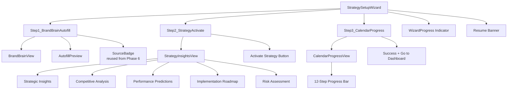

### 10.2 Existing TeamActivity Components (WS5 target)

```
/team-activity page
├── CommitteeSummary          (full daily brief)
├── CommitteeAuditTable       (sortable proposals)
├── AgentStatusPanel          (6-card agent grid)
├── AlertBanner               (alerts + approvals count)
├── QualityAuditPanel         (ContentGuardian score)
├── TrendSignalsPanel         (TrendSurfer opportunities)
├── ActivityLog               (raw runs/events)
└── AgentHelpModal            (help docs)
```

### 10.3 Reusable Components (already exist)

- `StrategicInputField` — with Phase 6 source badges
- `useAgentHuddleFeed` — SSE + polling fallback
- `workflowStore` (Zustand) — Today's workflow state
- `useStrategyBuilderStore` — Strategy Builder state

---

## 11. Backend Service Dependencies

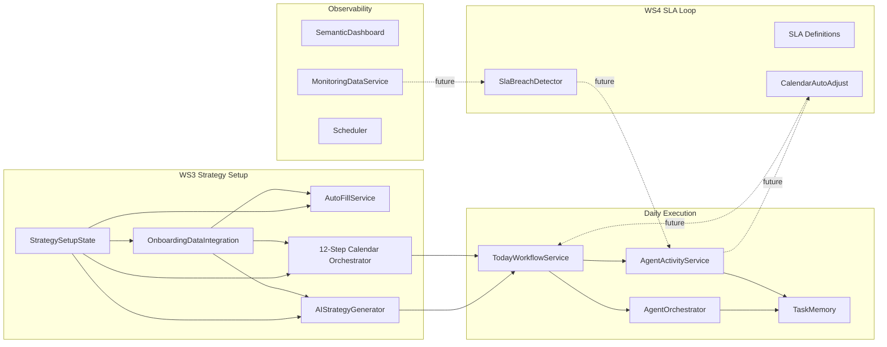

---

## 12. Cross-Cutting Concerns

### 12.1 Authentication

- **Clerk JWT** on all routes via `Depends(get_current_user)` (middleware: `backend/middleware/auth_middleware.py`)
- **Bugs fixed in WS1**: 6 places in `strategy_copilot_service.py` + 3 facebook writer services were using `ALWRITY_FALLBACK_USER_ID` env var instead of authenticated user. All fixed.
- **Pattern**: route injects `current_user: Dict[str, Any] = Depends(get_current_user)`, then `user_id = str(current_user['id'])`, passed to services.

### 12.2 Persistence

- **Per-user SQLite** workspace under `workspace/workspace_{user_id}/` (see `services/workspace_paths.py`)
- **Tables** registered with the workspace DB
- **SIF flat-file context** at `workspace_{user_id}/agent_context/step{2,3,4,5}_*.json` (300KB cap each)
- **LocalStorage** for transient UI state (Zustand `partialize`)

### 12.3 Observability

- **Loguru** for structured logging
- **SIF metrics**: `sif_search_total`, `sif_index_total`, `sif_cache_total` — exposed at `/api/sif/metrics`
- **Agent activity tracking**: every agent run creates `AgentRun` + `AgentEvent` rows
- **Task memory**: `TaskMemoryService` records outcomes (+1 completed, -1 skipped) — used to filter redundant proposals
- **Scheduler health**: `/api/seo-dashboard/sif-health` returns task status, last success/failure, consecutive failures

### 12.4 Wizard State Persistence (WS3)

```typescript
// useStrategySetupState hook
{
  userId: string,
  currentStep: 1 | 2 | 3,
  step1Complete: boolean,
  step2Complete: boolean,  // requires active strategy
  step3Complete: boolean,  // requires calendar events
  activeStrategyId: string | null,
  lastCalendarJobId: string | null,
  startedAt: datetime,
  lastUpdatedAt: datetime
}
```

Stored in DB (`strategy_setup_states` table) and mirrored to localStorage for instant resume.

---

## 13. Implementation Roadmap

### ✅ Completed

| Phase | Work | Outcome |
|---|---|---|
| Autofill 1–7 | Purge placeholders, fix merge, add regenerate-ai, source badges | Stable, source-tracked autofill |
| WS1 | Fix 6 user-ID bugs + missing auth | All routes per-user; CopilotKit usable |

### 📋 Next (4 days)

| Workstream | Deliverable | Days |
|---|---|---|
| **WS3 Day 1** | Wizard shell + Step 1 (Brand Brain + Autofill) | 1 |
| **WS3 Day 2** | Step 2 (Strategy + Activate) | 1 |
| **WS3 Day 3** | Step 3 (Calendar progress) | 1 |
| **WS3 Day 4** | Polish, MainDashboard auto-trigger, state persistence | 1 |

### 📋 After WS3 (3 days)

| Workstream | Deliverable | Days |
|---|---|---|
| **WS5** | Surface Agent Committee on MainDashboard (compact `CommitteeSummary`, `AgentStatusPanel`, `source_agent` on pillars, populate `taskSourceBreakdown`, reconcile 5-vs-6 agents) | 3 |

### 📋 After WS5 (2 days)

| Workstream | Deliverable | Days |
|---|---|---|
| **WS2** | Reframe Strategy Builder — `ContentStrategyBuilder.tsx` becomes `TacticalConfigPanel.tsx`, demoted to secondary, canonical profile becomes headline | 2 |

### 📋 After WS2 (12 days)

| Workstream | Deliverable | Days |
|---|---|---|
| **WS4 Day 1** | Structured SLA definitions (replace free-text `success_criteria`/`alert_threshold`) | 1 |
| **WS4 Day 2-5** | `SlaBreachDetector` executor + `sla_missed` alert type + `AgentApprovalRequest` for remediation | 4 |
| **WS4 Day 6-7** | Calendar auto-adjust executor | 2 |
| **WS4 Day 8-9** | SLA UI card on dashboard + `/api/strategy/sla-status` | 2 |
| **WS4 Day 10-11** | Strategy field auto-update on approved remediation | 2 |
| **WS4 Day 12** | Tests + gradual rollout | 1 |

**Total remaining: ~22 days of focused work.**

---

## 14. Open Questions & Risks

| Question | Where it matters | Status |
|---|---|---|
| Should `provenance_summary.taskSourceBreakdown` be hardcoded empty or populated by the committee event? | WS5 | Open — populating it is a small backend change |
| Should the wizard auto-redirect after onboarding, or wait for user to navigate? | WS3 | Open — auto-redirect is more guided but more invasive |
| What is the SLA for "publishing frequency"? Is it content-type-specific? | WS4 | Open — depends on user input or default per strategy |
| Should agents be able to propose strategy changes, or only task changes? | WS4 | Open — currently `AgentApprovalRequest.action_type` is free-form |
| Does the auto-calendar-adjust need a "preview" before applying, or is approval enough? | WS4 | Open — preview is safer but more UI |

| Risk | Mitigation |
|---|---|
| 12-step calendar orchestrator has `# TODO: Implement final calendar assembly logic` at `orchestrator.py:448` | Fix in WS3 Day 3 — the wizard depends on it returning real events |
| The strategy copilot bug (WS1) means users have been getting fallback-user suggestions. Switching to per-user could reveal new failures | Add monitoring + feature flag to revert if errors spike |
| `provenance_summary.taskSourceBreakdown` is always `{}` in the backend — populating it changes the wire format | Coordinate with frontend consumers before populating |
| SIF can return corrupted indexes (handled by `sif_index_remediation`) — affects the strategy insights in Step 2 | Wrap strategy generation with retry + fallback to "use whatever SIF gives you" |

---

## 15. Glossary

| Term | Meaning |
|---|---|
| **Brand Brain** | The `canonical_profile` JSON — synthesized, source-tracked, deduplicated view of all onboarding data |
| **Autofill** | The 30-field tactical configuration, populated from DB + AI with provenance |
| **Canonical Profile** | The JSON SSOT for brand brain; lives in `OnboardingDataIntegration.canonical_profile` |
| **SIF** | Semantic Intelligence Framework — flat_file + DB + vector search over onboarding data; used by agents |
| **Agent Committee** | The 5 named agents that propose daily tasks; coordinated by `agent_orchestrator.py` |
| **Pillar** | One of 6 lifecycle categories: plan, generate, publish, analyze, engage, remarket |
| **SLA** | Service-Level Agreement — target metric (publishing frequency, engagement rate) with breach detection |
| **Today's Workflow** | The per-day plan: 6 pillars × N tasks; auto-generated each morning from calendar + agent proposals |
| **12-Step Orchestrator** | The calendar generation pipeline: 4 phases × 3 steps, with quality gates; 2–5 min to run |
| **Provenance** | The `source` label on every autofill field: `website_analysis`, `onboarding_session`, `ai_generated`, etc. |

---

*Last updated: post-WS1 (user-ID fixes). Reflects the corrected 3-step wizard flow and the study results from WS5 + WS4.*
