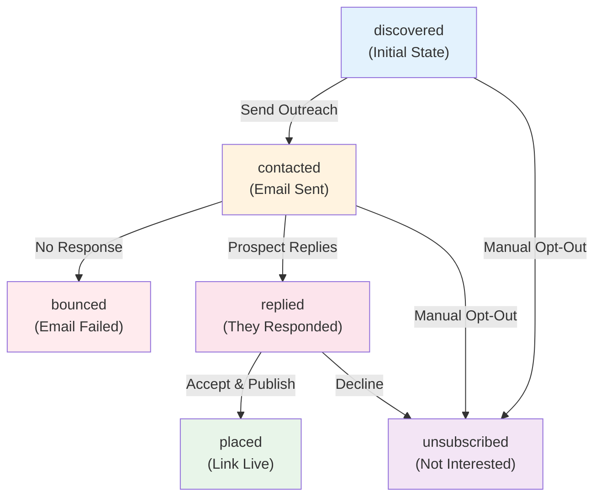

# Prospect Management

Prospects (also called "leads") are individual backlink opportunities discovered through search or imported manually. This guide covers the complete prospect lifecycle from discovery through placement tracking.

## What is a Prospect?

A prospect is a potential website or contact that might accept a guest post from you. Each prospect record includes:

| Field | Purpose | Example |
|---|---|---|
| **URL** | The target website or contact page | https://example.com/write-for-us |
| **Domain** | Extracted domain name | example.com |
| **Page Title** | Title of the page where the prospect was found | "Write for Us - Example Blog" |
| **Email** | Contact email for outreach | editor@example.com |
| **Confidence Score** | AI-calculated likelihood of accepting guest posts (0-1) | 0.85 |
| **Discovery Source** | How the prospect was found | `duckduckgo`, `exa`, `manual` |
| **Status** | Current stage in the lifecycle | `discovered`, `contacted`, `replied`, `placed` |
| **Notes** | Custom notes added manually | "High DA, but slow response" |

## Prospect Lifecycle

Every prospect progresses through a lifecycle of states, each representing a phase in your outreach journey:



### Status Definitions

#### **discovered** (Initial state)
- Prospect found through discovery or imported manually
- No outreach attempt yet
- **Next action**: Review details, then compose and send outreach email
- **Duration**: Until you decide to reach out

#### **contacted** (Email sent)
- Outreach email has been sent to the prospect
- Waiting for reply
- **Next action**: Monitor for replies, optionally schedule follow-up
- **Duration**: Typically 7-30 days depending on your follow-up strategy

#### **replied** (Prospect responded)
- Prospect sent you a reply email
- Could be interested, asking questions, or declining
- **Next action**: Review reply, negotiate, or move to `placed` if accepted
- **Duration**: Until you finalize agreement

#### **placed** (Link live)
- Guest post has been published on their site with your backlink
- Success! Link is now contributing to your SEO
- **Next action**: Monitor link health, document in SEO dashboard
- **Duration**: Permanent (until link is removed)

#### **bounced** (Email failed)
- Email delivery failed (invalid address, domain doesn't exist)
- Prospect likely not reachable via that email
- **Next action**: Manually find contact email or mark as not viable
- **Duration**: Terminal state (unsuccessful outreach)

#### **unsubscribed** (Opted out)
- Prospect explicitly declined or opted out of future emails
- Respect their preference; don't re-contact
- **Next action**: None — remove from future campaigns
- **Duration**: Terminal state (respect preference)

## Discovering Prospects

Prospects can be discovered automatically or imported manually.

### Automatic Discovery

Use AI-powered search to find prospects in your niche:

**API Endpoint:**
```
POST /api/backlink-outreach/discover/deep
```

**Request:**
```json
{
  "keyword": "AI marketing",
  "campaign_id": "bl_abc123def456",
  "max_results": 20
}
```

**What happens:**
1. Multiple search queries are generated from your keyword
2. Exa neural search + DuckDuckGo are queried in parallel
3. Results are deduplicated and ranked by quality
4. Full pages are scraped for contact emails and guest guidelines
5. Confidence and quality scores are calculated
6. Prospects are auto-saved to your campaign

**Response includes:**
```json
{
  "keyword": "AI marketing",
  "total_found": 18,
  "saved_to_campaign": 18,
  "opportunities": [
    {
      "url": "https://example.com/write-for-us",
      "domain": "example.com",
      "page_title": "Write for Us - Example Blog",
      "email": "editor@example.com",
      "confidence_score": 0.87,
      "quality_score": 0.79,
      "discovery_source": "duckduckgo"
    }
  ]
}
```

**Confidence Score Factors:**
- "Write for us" page detected → +0.30
- Guest post guidelines found → +0.20
- Contact email extracted → +0.15
- Previous guest posts detected → +0.10
- Blog section exists → +0.05

### Manual Import

Add a single prospect manually:

**API Endpoint:**
```
POST /api/backlink-outreach/campaigns/{campaign_id}/leads
```

**Request:**
```json
{
  "url": "https://example.com/contact",
  "domain": "example.com",
  "page_title": "Contact Us - Example.com",
  "email": "hello@example.com",
  "confidence_score": 0.75,
  "notes": "Found via Twitter mention"
}
```

**Use cases for manual import:**
- Prospect you found via networking
- Referral from a colleague
- Broker outreach list
- Prior relationship history
- Cold email list you purchased

### Bulk Import

Import multiple prospects at once via CSV:

**CSV Format:**
```csv
url,domain,email,page_title,confidence_score,notes
https://example.com/write-for-us,example.com,editor@example.com,Write for Us,0.85,Found on Google
https://blog.sample.org/contribute,sample.org,submit@sample.org,Contribute,0.72,Referred by Jane
```

**UI:** Campaigns → [Campaign Name] → Leads → **Import CSV**

## Reviewing Prospects

When prospects are discovered, they're scored on relevance and likelihood of accepting guest posts.

### Quality Score (0-1)

**What it measures:** How relevant is this site for your keyword?

| Factor | Weight | Indicators |
|---|---|---|
| Domain Authority | High | Established domain, indexed content |
| Keyword Relevance | High | Site topic matches your keyword |
| Content Freshness | Medium | Recent posts (< 6 months) |
| Blog Structure | Medium | Organized blog section |
| SEO Health | Low | Clean markup, no technical issues |

**Interpretation:**
- **> 0.75**: High-quality site, likely good for backlink value
- **0.50–0.75**: Medium quality, check manually
- **< 0.50**: Lower quality, may not be worth your effort

### Confidence Score (0-1)

**What it measures:** How likely is this site to accept guest posts?

| Factor | Weight | Indicators |
|---|---|---|
| "Write for us" page | Very High | Explicit call to action |
| Guest post guidelines | High | Clear submission process |
| Contact email found | High | Easy to reach out |
| Prior guest posts | Medium | History of accepting external content |
| Blog exists | Low | Baseline signal |

**Interpretation:**
- **> 0.80**: Very high likelihood, prioritize these
- **0.60–0.80**: Good candidates, reasonable chance
- **0.40–0.60**: Lower confidence, manual review recommended
- **< 0.40**: Low priority, research further before outreach

## Filtering & Sorting Prospects

Find the prospects most likely to convert.

### By Status

Filter prospects by current lifecycle stage:

```
GET /api/backlink-outreach/campaigns/{campaign_id}/leads?status=discovered
```

Common workflows:
- **`status=discovered`**: Find new prospects ready for outreach
- **`status=contacted`**: Monitor pending outreach
- **`status=replied`**: Triage responses
- **`status=placed`**: Track successful placements

### By Quality/Confidence

Focus on the highest-value prospects:

**UI:** Sort by **Confidence Score ↓**

**Priority tiers:**
1. **Tier 1 (Confidence > 0.80)**: Send first — highest conversion rate
2. **Tier 2 (Confidence 0.60–0.80)**: Send second
3. **Tier 3 (Confidence 0.40–0.60)**: Send if time permits
4. **Tier 4 (Confidence < 0.40)**: Manual review or skip

### By Discovery Source

Track which discovery methods work best:

```
Prospects discovered via:
- duckduckgo: 45 prospects, 18% conversion
- exa: 32 prospects, 28% conversion (higher quality)
- manual: 12 prospects, 42% conversion (pre-qualified)
```

**Recommendation:** Focus on `exa` and `manual` sources for higher ROI.

## Managing Individual Prospects

### Update Prospect Status

Move a prospect through the lifecycle as your outreach progresses:

**API:**
```
PATCH /api/backlink-outreach/leads/{lead_id}
{
  "status": "replied",
  "notes": "Editor interested, awaiting final approval"
}
```

**UI:** Lead card → Status dropdown → Select new status

**Common transitions:**
- `discovered` → `contacted`: After sending email
- `contacted` → `replied`: When you receive their response
- `replied` → `placed`: After guest post is published
- Any status → `unsubscribed`: If they opt out

### Add Notes

Capture important context about a prospect:

```
"High DA (45), but slow response times (avg 2-3 weeks)"
"Editor mentioned they prefer video content"
"Referred by Sarah Chen — warm introduction possible"
```

Notes are visible to all team members and helpful for:
- Remembering context before follow-up
- Flagging red flags or warnings
- Recording personalization details
- Tracking previous interactions

### Suppress a Prospect

Stop targeting a prospect permanently:

```
POST /api/backlink-outreach/suppressions
{
  "email": "no-reply@example.com",
  "reason": "Opted out, respect preference"
}
```

**Effects:**
- Prospect will never receive emails from you again
- Idempotency key prevents duplicate sends
- GDPR-compliant opt-out record
- Appears in suppression list for compliance audits

## Bulk Operations

Manage prospects in batches.

### Bulk Status Update

Update multiple prospects at once:

**API:**
```
PATCH /api/backlink-outreach/leads/bulk-status
{
  "lead_ids": ["lead_123", "lead_456", "lead_789"],
  "status": "contacted",
  "campaign_id": "bl_abc123"
}
```

**Response:**
```json
{
  "updated": 3,
  "failed": 0,
  "message": "Successfully updated 3 leads to 'contacted'"
}
```

**UI:** Leads tab → Select multiple → Bulk actions → Change status

### Export Prospects

Download prospect data for external tools or reporting:

**Formats:**
- **CSV**: Leads table with all fields
- **JSON**: Full prospect data with relationships

**What to export:**
- Before sending outreach: prospect list for review
- After outreach: tracking data for analytics
- Monthly reports: conversion metrics and ROI

**Exported fields:**
- URL, domain, email, page title, confidence score
- Status, created_at, contacted_at, replied_at
- Notes, tags, campaign ID

## Prospect Scoring Deep Dive

ALwrity uses a multi-factor scoring system to rank prospects.

### How Confidence Score is Calculated

```
Base score: 0.35

+ 0.13 × (number of positive signals detected)
  - "write for us" → +0.13
  - "guest post" → +0.13
  - "submit" → +0.13
  - "contributor" → +0.13
  - "guest blogger" → +0.13

Final: min(1.0, base + signal_bonuses)
```

**Example:**
- Base: 0.35
- Signals found: "write for us" + "guest post" + "submit" = 3 signals
- Calculation: 0.35 + (0.13 × 3) = 0.74
- Final confidence score: **0.74**

### Improving Prospect Scoring

Want higher-quality prospects discovered automatically?

1. **Use more specific keywords**: "AI SaaS marketing blogs" vs. "AI marketing"
2. **Review past placements**: Identify patterns in high-confidence converts
3. **Adjust discovery sources**: Exa neural search often finds higher-quality sites
4. **Manually tag successful prospects**: Helps your team identify patterns

## Integration with Outreach

Once prospects are in your campaign, use them to:

1. **Generate outreach emails** — Personalized by prospect details
2. **Send campaign** — Track open rates and replies
3. **Monitor replies** — Auto-classify interested vs. not interested
4. **Schedule follow-ups** — Automatically remind about inactive prospects
5. **Track analytics** — See conversion rate by prospect source

See **[Email Composer](email-composer.md)** and **[Outreach Operations](outreach-operations.md)** for next steps.

## Best Practices

### ✅ Do

- **Regularly review new prospects** — Catch issues before outreach
- **Personalize by confidence score** — Higher confidence = priority
- **Use notes for context** — Help your team and future self
- **Track status changes** — Accurate data = better analytics
- **Respect opt-outs** — Add uninterested prospects to suppression list

### ❌ Don't

- **Send to low-confidence prospects first** — Lower conversion rate
- **Ignore email validation** — Bounces hurt sender reputation
- **Re-contact suppressed prospects** — Violates preferences and legal requirements
- **Let prospects age without follow-up** — Most opportunities decline after 2 weeks
- **Mix campaigns** — Keep similar niches together for consistent messaging

## Related Documentation

- **[Discovery](discovery.md)** — How prospects are found
- **[Email Composer](email-composer.md)** — How to compose outreach emails
- **[Outreach Operations](outreach-operations.md)** — Sending and follow-ups
- **[Analytics](analytics.md)** — Tracking prospect conversion rates

---

*Next: [Email Composer](email-composer.md) — Generate personalized outreach emails for your prospects.*
