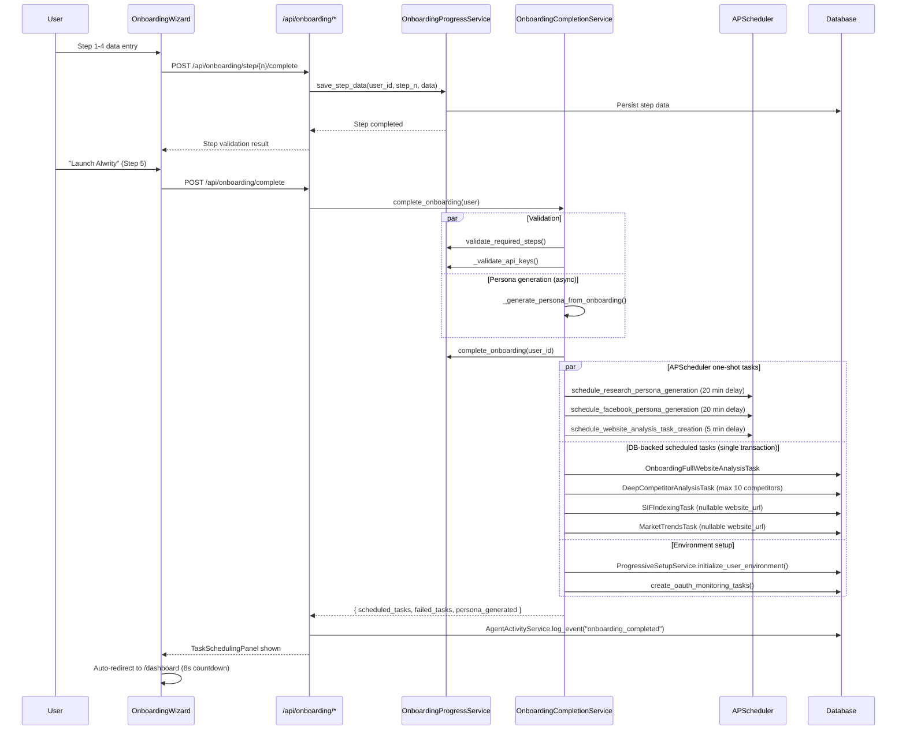

# Onboarding System Overview

The **Onboarding System** guides new ALwrity users through a 5-step wizard that configures their AI marketing workspace. It validates inputs at each step, schedules background tasks on completion, and emits real-time progress via the agent activity feed.

## Architecture

## Key Services

| Service | File | Responsibility |
|---------|------|----------------|
| `OnboardingProgressService` | `backend/services/onboarding/progress_service.py` | Step tracking, validation, session management, `reset_onboarding()` |
| `OnboardingCompletionService` | `backend/api/onboarding_utils/onboarding_completion_service.py` | Final validation, persona generation, task scheduling, transactional DB writes |
| `OnboardingControlService` | `backend/api/onboarding_utils/onboarding_control_service.py` | HTTP endpoints for step completion, reset, summary |
| `OnboardingDataIntegrationService` | `backend/api/content_planning/services/content_strategy/onboarding/` | SSOT data aggregation from all steps |

## Onboarding Steps

| Step | Name | What it collects | Key validation |
|------|------|-----------------|----------------|
| 1 | Website Analysis | URL, writing style detection | `website_url` must be provided (or skipped for business-without-website) |
| 2 | Research Preferences | Competitors, content types, research depth | `research_depth` or `content_types` must exist |
| 3 | Persona Generation | Writing persona, brand voice | `corePersona` or `platformPersonas` must exist; auto-passes if user has reached step 3 but persona not yet generated |
| 4 | Integrations | OAuth tokens, social accounts | Always passes (integrations are optional) |
| 5 | Review & Launch | Confirmation, task scheduling | All steps 1-4 must be validated |

## Related Pages

- [Onboarding Steps](steps.md) — detailed step-by-step flow and validation rules
- [Scheduled Tasks](scheduler-tasks.md) — post-completion task creation and scheduling
- [Technical Reference](technical-reference.md) — service APIs, upsert patterns, error handling