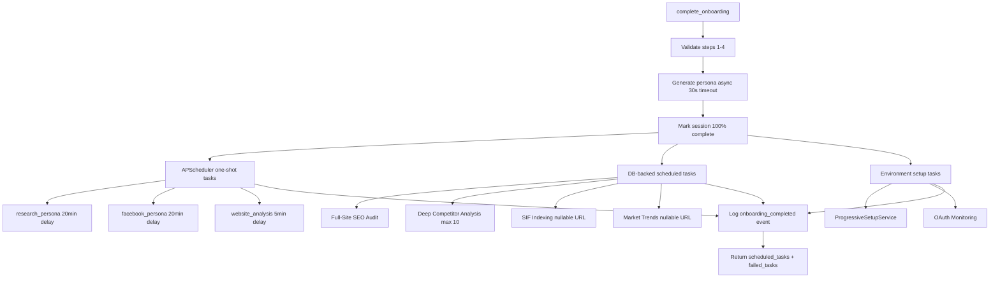

# Onboarding Scheduled Tasks

When a user completes onboarding, `OnboardingCompletionService.complete_onboarding()` creates multiple background tasks. These tasks power the initial SEO audit, competitor intelligence, persona generation, and ongoing content intelligence.

## Task Creation Flow

All tasks are created in a single DB transaction. If any task fails, its error is recorded in `failed_tasks` but the transaction still commits for all others. The frontend `TaskSchedulingPanel` shows which tasks scheduled successfully vs. failed.



## APScheduler One-Shot Tasks

These are fire-and-forget delayed jobs that run once:

| Task | Delay | Executor | Purpose |
|------|-------|----------|---------|
| Research Persona | 20 min | `research_persona_scheduler.py` | Deep persona generation from onboarding data |
| Facebook Persona | 20 min | `facebook_persona_scheduler.py` | Facebook-specific persona extraction |
| Website Analysis | 5 min | `website_analysis_monitoring_service.py` | Initial full-site crawl and style detection |

**Race condition safety:** The persona generation in `complete_onboarding()` is async with a 30s timeout. If it completes within timeout, the persona is available immediately. If it times out, the 20-minute delayed scheduler job serves as a fallback.

## DB-Backed Scheduled Tasks

These are created as rows in the database with a `status`, `next_execution`, and `frequency_hours`:

| Task Model | Frequency | Requires Website? | Purpose |
|------------|-----------|-------------------|---------|
| `OnboardingFullWebsiteAnalysisTask` | One-time | Yes | Full-site SEO audit (500 URLs max) |
| `DeepCompetitorAnalysisTask` | One-time | Yes | Deep competitor analysis (max 10 competitors) |
| `SIFIndexingTask` | 48 hours | Nullable | SIF content indexing and re-indexing |
| `MarketTrendsTask` | 72 hours | Nullable | Market trend monitoring and signals |

### Business-Without-Website Support

When `website_url` is null (user has no website), the system:

1. Skips `OnboardingFullWebsiteAnalysisTask` and `DeepCompetitorAnalysisTask` (require URL)
2. Creates `SIFIndexingTask` and `MarketTrendsTask` with `website_url = None`
3. Special `idx_*_user_only` indexes enable efficient lookups for null-URL tasks

### Upsert Pattern

All DB-backed tasks use `_upsert_task()` — a static method that queries by filter columns, updates if found, or inserts if not. This prevents race-condition duplicates when onboarding is retried or reset.

```python
@staticmethod
def _upsert_task(db, model_cls, user_id, filters, defaults):
    existing = db.query(model_cls).filter_by(**filters).first()
    if existing:
        for k, v in defaults.items():
            setattr(existing, k, v)
        return existing
    else:
        row = model_cls(**filters, **defaults)
        db.add(row)
        return row
```

## Environment Setup Tasks

| Service | Purpose |
|---------|---------|
| `ProgressiveSetupService` | Initializes user workspace, features, and default settings |
| `create_oauth_monitoring_tasks` | Creates DB tasks for monitoring OAuth token freshness |

## Completion Response

The `/api/onboarding/complete` endpoint returns:

```json
{
  "message": "Onboarding completed successfully",
  "completed_at": "2025-05-31T12:00:00+00:00",
  "completion_percentage": 100.0,
  "persona_generated": true,
  "scheduled_tasks": [
    "research_persona",
    "facebook_persona",
    "website_analysis",
    "full_site_seo_audit",
    "deep_competitor_analysis",
    "sif_indexing",
    "market_trends",
    "progressive_setup",
    "oauth_monitoring"
  ],
  "failed_tasks": null
}
```

The `scheduled_tasks` array lists all successfully scheduled task names. The `failed_tasks` array (or `null` if none) contains objects with `task` and `error` fields for any failures.

The frontend `TaskSchedulingPanel` displays this response with a progress bar, expandable task details, persona generation status, and an 8-second auto-redirect to the dashboard.

## Deep Competitor Analysis

The `DeepCompetitorAnalysisExecutor` has two safety guards:

- **Timeout:** 5-minute hard limit via `asyncio.wait_for(executor, timeout=300)`
- **Competitor cap:** Maximum 10 competitors (reduced from 25) to prevent runaway analysis

If the timeout is hit, the task is marked `failed` and retried after 30 minutes.

## Reset Behavior

When onboarding is reset:

1. **APScheduler jobs removed:** `research_persona_{user_id}`, `facebook_persona_{user_id}`
2. **DB tasks paused:** All task rows for the user are set to `status='paused'`
3. **Session reset:** `current_step=1`, `completion_percentage=0`

The scheduler will not execute paused tasks until they are explicitly reactivated.