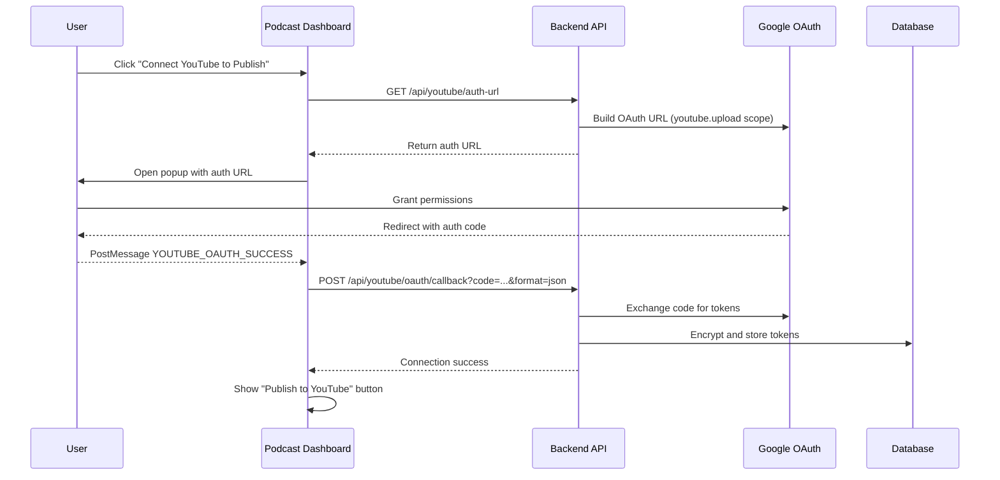
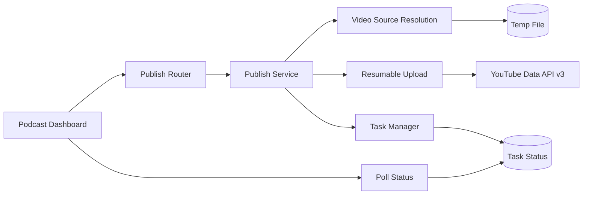

# YouTube Publishing for Podcasts

Seamlessly publish your finished podcast episodes directly to YouTube from the Podcast Dashboard. Uses OAuth 2.0 authentication and resumable uploads via the YouTube Data API v3.

**Status**: ✅ Production Ready (May 27, 2026)
**API Endpoints**:
- `POST /api/youtube/publish` — Start publish as background task
- `GET /api/youtube/publish/{task_id}` — Poll publish status

---

## What is YouTube Publishing?

YouTube Publishing lets you push your final combined podcast video straight to YouTube without leaving ALwrity:

- **One-click publish** from the Render Queue after video combination
- **Background task** — upload runs asynchronously; you can navigate away
- **Resumable upload** — handles large files with chunked upload (50 MB chunks)
- **Status polling** — real-time progress with video ID and URL on completion
- **Secure OAuth 2.0** — your YouTube channel is connected via Google OAuth with encrypted token storage

---

## Prerequisites

Before publishing, the following must be in place:

| Requirement | Details |
|---|---|
| **YouTube Data API v3** | Enabled in Google Cloud Console |
| **OAuth Consent Screen** | Configured with `youtube.upload` scope |
| **OAuth Client ID/Secret** | Set as `YOUTUBE_CLIENT_ID` and `YOUTUBE_CLIENT_SECRET` in backend `.env` |
| **Encryption Key** | `YOUTUBE_TOKEN_ENCRYPTION_KEY` set in backend `.env` (32-byte Fernet key) |
| **Connected YouTube Channel** | User must connect via the OAuth flow in the Podcast Dashboard |

---

## Connection Flow



The token is encrypted at rest using Fernet symmetric encryption. If the encryption key is missing, the service returns a clear 500 error — no plaintext fallback.

---

## Publishing Workflow

### 1. Generate and Combine Your Podcast

Follow the standard Podcast Maker workflow:
1. Create a project and approve the analysis
2. Select research queries and generate the script
3. Approve scenes and generate audio
4. Generate scene images and videos
5. Click **Combine Videos** to produce the final episode

### 2. Connect YouTube (First Time Only)

In the **Render Queue**, if you haven't connected YouTube yet:
1. Click **Connect YouTube to Publish**
2. A popup opens to Google's OAuth consent screen
3. Grant the `youtube.upload` permission
4. The popup closes automatically — the button changes to **Publish to YouTube**

### 3. Publish Your Episode

1. In the Render Queue, click **Publish to YouTube** next to the "Download Final Podcast" button
2. The button shows a progress state while the upload runs in the background
3. On success, the **YouTube URL** appears as a clickable link
4. On failure, an error alert displays with details

### Status States

| State | UI Indicator | Description |
|---|---|---|
| `idle` | Button shows "Publish to YouTube" | Ready to publish |
| `publishing` | Progress spinner on button | Upload in progress |
| `success` | Green alert with YouTube URL | Published successfully |
| `error` | Red alert with error message | Publish failed |

---

## API Reference

### Start Publish

```bash
curl -X POST https://api.alwrity.com/api/youtube/publish \
  -H "Authorization: Bearer YOUR_TOKEN" \
  -H "Content-Type: application/json" \
  -d '{
    "video_source": "/path/to/final_episode.mp4",
    "title": "My Podcast Episode",
    "description": "Check out our latest episode!",
    "tags": ["podcast", "interview", "technology"],
    "privacy_status": "public"
  }'
```

**Response**:
```json
{
  "success": true,
  "task_id": "yt_pub_abc123",
  "message": "Publish started"
}
```

### Check Publish Status

```bash
curl https://api.alwrity.com/api/youtube/publish/yt_pub_abc123 \
  -H "Authorization: Bearer YOUR_TOKEN"
```

**Response (in progress)**:
```json
{
  "success": true,
  "status": "processing",
  "task_id": "yt_pub_abc123",
  "progress": 45
}
```

**Response (completed)**:
```json
{
  "success": true,
  "status": "completed",
  "task_id": "yt_pub_abc123",
  "video_id": "dQw4w9WgXcQ",
  "video_url": "https://youtube.com/watch?v=dQw4w9WgXcQ"
}
```

---

## Use Cases

### Use Case 1: Publish After Video Combination

The primary flow — publish your combined podcast to YouTube:

```python
import httpx

# Start publish
resp = httpx.post(
    "https://api.alwrity.com/api/youtube/publish",
    json={
        "video_source": final_video_path,
        "title": episode_title,
        "description": episode_description,
        "privacy_status": "public"
    },
    headers={"Authorization": f"Bearer {token}"}
)
task_id = resp.json()["task_id"]

# Poll until complete
while True:
    status = httpx.get(
        f"https://api.alwrity.com/api/youtube/publish/{task_id}",
        headers={"Authorization": f"Bearer {token}"}
    )
    result = status.json()
    if result["status"] == "completed":
        print(f"Published: {result['video_url']}")
        break
    elif result["status"] == "error":
        print(f"Failed: {result.get('error')}")
        break
    time.sleep(3)
```

### Use Case 2: Connect New YouTube Channel

Disconnect and reconnect with a different channel:

```python
# Check current connection
status = httpx.get(
    "https://api.alwrity.com/api/youtube/status",
    headers={"Authorization": f"Bearer {token}"}
)

# If connected, disconnect first
if status.json().get("connected"):
    httpx.post(
        "https://api.alwrity.com/api/youtube/disconnect",
        headers={"Authorization": f"Bearer {token}"}
    )

# Get new auth URL
auth = httpx.get(
    "https://api.alwrity.com/api/youtube/auth-url",
    headers={"Authorization": f"Bearer {token}"}
)
print(f"Open in browser: {auth.json()['auth_url']}")
```

---

## Architecture



Key components:
- **`youtube_publish_service.py`** — Core upload logic: resolves video source (local path or URL download), performs resumable upload with 3 retries and 50 MB chunks, cleans up temp files
- **`publish_router.py`** — API endpoints that create background tasks and expose status
- **`TaskManager`** — Same background task system used by video rendering; stores task state for polling
- **`RenderQueue.tsx`** — UI integration with publish button, poll loop, and success/error feedback

---

## Configuration

Add these to your `backend/.env`:

```env
# YouTube OAuth (required for publishing)
YOUTUBE_CLIENT_ID=your_client_id.apps.googleusercontent.com
YOUTUBE_CLIENT_SECRET=your_client_secret
YOUTUBE_TOKEN_ENCRYPTION_KEY=your_32_byte_fernet_key

# Backend URL for OAuth redirect
OAUTH_REDIRECT_URI=https://api.alwrity.com/api/youtube/oauth/callback
```

The encryption key must be a valid 32-byte URL-safe base64 Fernet key. Generate one with:

```python
from cryptography.fernet import Fernet
print(Fernet.generate_key().decode())
```

---

## FAQ

**Q: What video formats are supported?**
A: Any format accepted by YouTube (MP4, MOV, AVI, etc.). MP4 with H.264 codec is recommended.

**Q: Is there a file size limit?**
A: YouTube supports up to 256 GB or 12 hours. The upload uses 50 MB chunks with retry.

**Q: Can I publish to multiple channels?**
A: One channel at a time. You can disconnect and reconnect to switch channels.

**Q: Are tokens stored securely?**
A: Yes. Tokens are encrypted at rest using Fernet symmetric encryption. The encryption key is mandatory and checked at startup.

**Q: What happens if the upload fails mid-way?**
A: The resumable upload protocol allows YouTube to resume from the last completed chunk. If all 3 retries fail, the task is marked as `error` with details.

**Q: Can I set the video privacy (public/unlisted/private)?**
A: Yes. Set `privacy_status` in the publish request to `public`, `unlisted`, or `private`.

---

*Last Updated: May 27, 2026*
*Phase: 2 (Production)*
*Status: Complete*
