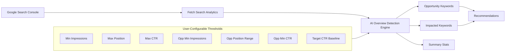
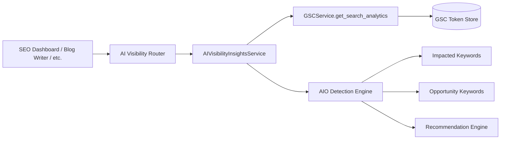

# AI Overview Insights

Detect Google AI Overview impact signals from your Google Search Console data. Identify keywords where AI Overviews are citing your content (or your competitors') and uncover optimization opportunities to capture AI-generated traffic.

**Status**: ✅ Production Ready (May 27, 2026)
**API Endpoint**:
- `POST /api/ai-visibility/overview-insights` — Run AI Overview analysis

---

## What is AI Overview Insights?

AI Overview Insights analyzes your GSC search performance data using configurable heuristics to detect two signal categories:

### Impacted Keywords
Keywords where Google's AI Overviews are likely citing your content. These show:
- **High impressions** — You have visibility
- **High position (< 4)** — You rank near the top
- **Low CTR (< 2%)** — Users aren't clicking because AI Overviews provide the answer inline

The estimated traffic loss assumes a healthy top-3 CTR baseline of 8%.

### Opportunity Keywords
Keywords where your content could be optimized for AI Overview citation:
- **Moderate impressions** — Some visibility exists
- **Position 4–10** — Close to the top but not yet featured
- **High CTR (> 5%)** — Users are clicking, so the content is relevant

---

## How It Works



### Default Thresholds

| Parameter | Default | Description |
|---|---|---|
| `min_impressions_impacted` | 500 | Min impressions to flag as AIO-impacted |
| `max_position_impacted` | 4.0 | Max avg position to flag as AIO-impacted |
| `max_ctr_impacted` | 0.02 (2%) | Max CTR to flag as AIO-impacted |
| `min_impressions_opportunity` | 300 | Min impressions for opportunity detection |
| `min_position_opportunity` | 4.0 | Min avg position for opportunity |
| `max_position_opportunity` | 10.0 | Max avg position for opportunity |
| `min_ctr_opportunity` | 0.05 (5%) | Min CTR for opportunity flag |
| `target_ctr` | 0.08 (8%) | Healthy top-3 CTR for traffic loss estimation |

All thresholds are adjustable via slider controls in the UI.

---

## Using AI Overview Insights

### In the SEO Dashboard

1. **Connect GSC** — If not already connected, click "Connect GSC for AI Overview Insights"
2. **Open Enterprise Analysis** — Navigate to the SEO Dashboard and run an analysis
3. **Switch to AI Overview Insights tab** — The 4th tab in the Enterprise Analysis panel
4. **Adjust thresholds** — Use the sliders to tune detection sensitivity
5. **Click Run Analysis** — Processes your GSC data and shows results

### Results Panel

The analysis returns three sections:

#### Summary Cards
- **Keywords in AI Overview** — Count of impacted keywords
- **Zero-Click Impressions** — Total impressions lost to AI Overviews
- **Estimated Traffic Lost** — Calculated traffic loss vs. healthy 8% CTR baseline

#### Keyword Tables
- **Top 10 Impacted Keywords** — Sorted by estimated traffic loss (descending)
- **Top 10 Opportunity Keywords** — Sorted by impressions (descending)

Each keyword row shows: keyword, impressions, clicks, CTR, position, and estimated traffic loss.

#### Recommendations
Per-keyword content format suggestions generated by pattern matching:
- **How/What/Why keywords** → Step-by-step guides or tutorials
- **Vs/Comparison keywords** → Comparison tables or pro/con lists
- **Best keywords** → Curated lists with TL;DR summaries
- **Price/Cost keywords** → Pricing breakdowns with FAQ schema
- **Example keywords** → Case studies or walkthroughs

---

## API Reference

### Run AI Overview Analysis

```bash
curl -X POST https://api.alwrity.com/api/ai-visibility/overview-insights \
  -H "Authorization: Bearer YOUR_TOKEN" \
  -H "Content-Type: application/json" \
  -d '{
    "site_url": "https://example.com",
    "start_date": "2026-03-01",
    "end_date": "2026-05-27",
    "thresholds": {
      "min_impressions_impacted": 500,
      "max_position_impacted": 4.0,
      "max_ctr_impacted": 0.02,
      "min_impressions_opportunity": 300,
      "min_position_opportunity": 4.0,
      "max_position_opportunity": 10.0,
      "min_ctr_opportunity": 0.05,
      "target_ctr": 0.08
    }
  }'
```

**Response**:

```json
{
  "success": true,
  "summary": {
    "impacted_count": 12,
    "zero_click_impressions": 45200,
    "estimated_traffic_lost": 3616
  },
  "impacted_keywords": [
    {
      "keyword": "what is seo",
      "impressions": 12500,
      "clicks": 180,
      "ctr": 0.014,
      "position": 2.3,
      "estimated_traffic_loss": 820,
      "recommendation": "Step-by-step guide: Create a structured tutorial with clear headings"
    }
  ],
  "opportunity_keywords": [
    {
      "keyword": "seo best practices",
      "impressions": 5800,
      "clicks": 348,
      "ctr": 0.06,
      "position": 5.1,
      "recommendation": "Curated list format with TL;DR summary"
    }
  ],
  "recommendations": [
    "**what is seo** — Step-by-step guide: Restructure content as a tutorial with clear numbered steps and actionable takeaways",
    "**seo vs sem** — Comparison table: Add a pro/con comparison section with a clear winner summary"
  ]
}
```

---

## Use Cases

### Use Case 1: Recover Lost AI Overview Traffic

Identify keywords where AI Overviews are cannibalizing clicks and restructure content:

```python
import httpx

result = httpx.post(
    "https://api.alwrity.com/api/ai-visibility/overview-insights",
    json={
        "site_url": "https://mysite.com",
        "thresholds": {"min_impressions_impacted": 1000}
    },
    headers={"Authorization": f"Bearer {token}"}
).json()

impacted = result["impacted_keywords"][:5]
for kw in impacted:
    print(f"{kw['keyword']}: {kw['estimated_traffic_loss']} clicks lost")
    print(f"  → {kw['recommendation']}")
```

### Use Case 2: Optimize Content for AI Overview Citation

Find keywords just outside the top 3 that already show user interest:

```python
opportunities = result["opportunity_keywords"]
for kw in opportunities:
    print(f"{kw['keyword']} (pos {kw['position']}, CTR {kw['ctr']:.1%})")
    print(f"  Format suggestion: {kw['recommendation']}")
```

### Use Case 3: Custom Thresholds for Competitive Niche

Tune sensitivity for a competitive niche with lower search volumes:

```python
tuned = httpx.post(
    "https://api.alwrity.com/api/ai-visibility/overview-insights",
    json={
        "site_url": "https://mysite.com",
        "thresholds": {
            "min_impressions_impacted": 200,
            "max_position_impacted": 3.0,
            "max_ctr_impacted": 0.03,
            "min_impressions_opportunity": 100,
            "min_ctr_opportunity": 0.04
        }
    },
    headers={"Authorization": f"Bearer {token}"}
).json()

print(f"Found {tuned['summary']['impacted_count']} impacted, "
      f"{len(tuned['opportunity_keywords'])} opportunities")
```

---

## Architecture



The service is designed as **common infrastructure** — not coupled to the SEO Dashboard:

- **Backend**: `AIVisibilityInsightsService` is a standalone service callable by any backend module
- **Frontend**: `useAIVisibilityInsights` hook is importable by Blog Writer, GSC Brainstorm, Podcast Maker, or any other feature
- **UI**: `AIVisibilitySection` component is the first consumer; additional UIs can be built on the same hook

---

## Configuration

The detection engine uses heuristics based on published Google AI Overview behavior. The default thresholds align with observed patterns:

| Signal | Impacted | Opportunity |
|---|---|---|
| **Impressions** | High (500+) | Moderate (300+) |
| **Position** | Top 3 (≤4.0) | Near top (4.0–10.0) |
| **CTR** | Low (≤2%) | High (≥5%) |
| **Interpretation** | AI Overview likely showing answer inline | Content ready for AI Overview optimization |

### When to Adjust Thresholds

- **Lower impression thresholds** if your site has lower traffic but high relevance
- **Raise position thresholds** if you compete in SERPs where AI Overviews appear at different positions
- **Lower CTR thresholds** for informational queries where AI Overviews are more common
- **Raise target CTR** for high-intent commercial queries

---

## FAQ

**Q: How does ALwrity detect AI Overview impact?**
A: It uses a heuristic: keywords with high impressions, high position (top 3), and low CTR are likely impacted by AI Overviews citing your content inline — reducing the need to click.

**Q: Is this 100% accurate?**
A: No. AI Overviews don't expose a public API. The detection uses statistical signals from GSC data. Accuracy improves with larger data sets and can be tuned via thresholds.

**Q: How is traffic loss calculated?**
A: `max(0, impressions × target_ctr - actual_clicks)`. Target CTR defaults to 8% (healthy top-3 average) but is user-configurable.

**Q: Can I use this without connecting GSC?**
A: No. GSC search performance data is required. The UI shows a connect prompt if GSC isn't linked.

**Q: Can Blog Writer or other tools use this?**
A: Yes. The `useAIVisibilityInsights` hook is a standalone export with no dashboard dependency. Import it in any component.

**Q: What date range does the analysis cover?**
A: Defaults to the last 90 days. Custom `start_date` and `end_date` can be passed via the API or the hook.

---

*Last Updated: May 27, 2026*
*Phase: 2 (Production)*
*Status: Complete*
