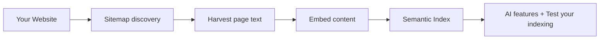

# SIF Semantic Indexing

**Semantic Indexing** is how ALwrity builds a memory of *your* website. Once your content is indexed, ALwrity's AI features — content planning, persona generation, SEO insights, and the agent team — can retrieve and reason about *your* business rather than generic marketing advice.

## What gets indexed

When you complete the **Research** step of onboarding, ALwrity indexes:

| Content | What it captures |
|---|---|
| **Your website pages** | The text from your most important pages (homepage, product, pricing, features, use cases). |
| **Sitemap URLs** | Your `sitemap.xml` is used to discover which pages exist and prioritise them. |
| **Website analysis** | Brand voice, SEO issues, and social presence discovered during onboarding. |
| **Competitor analysis** | Summaries of the competitors you identified. |

## How indexing works

Indexing is a **semantic** process, not keyword matching. Each page is converted into a mathematical representation (an *embedding*) that captures its *meaning*, so ALwrity can find related content even when exact words differ.

Indexing is **cost-free** — ALwrity reads your pages directly (no external search APIs) and respects your site by pausing between requests.

## How many pages are indexed?

ALwrity indexes a limited number of pages per run, prioritising your most important ones (homepage first, then shallower, more central pages). Higher subscription tiers index more pages. The SIF panel shows both numbers side by side:

- **Pages indexed** — how many of your pages are actually in the semantic index.
- **Sitemap URLs found** — how many total URLs your sitemap lists.

If "Pages indexed" is much lower than "Sitemap URLs found", only a subset was indexed — which is expected, but worth knowing when evaluating answer quality.

## When does indexing run?

- **Automatically** during onboarding's Research step.
- **Incrementally on re-runs** — only *new* pages are added; pages that are already indexed are skipped (no duplicate work, no re-crawling).
- **On demand** — the **"Retry Analysis"** button re-runs indexing any time (for example, after you publish new content).

## The SIF panel

After indexing, the SIF panel on the Research step shows:

| Stat | Meaning |
|---|---|
| **Pages indexed** | How many pages are in your semantic index. |
| **Sitemap URLs found** | How many URLs your sitemap lists. |
| **Pillars found** | The content topic clusters ALwrity detected on your site. |
| **Last indexed** | When your index was last refreshed (date and time). |
| **Activity log** | A step-by-step record of the last indexing run. |
| **Test your indexing** | Sample questions to validate your index — see [Test Your Indexing](test-your-indexing.md). |

## Where the index is used

Your semantic index powers several ALwrity features behind the scenes:

- **Content Strategy** — understands your existing topics and finds gaps.
- **Persona System** — grounds personas in your real brand voice.
- **SEO insights** — connects your content to your competitors and search data.
- **AI Agents** — the committee agents query your index when proposing daily tasks.

## Related pages

- **[Test Your Indexing](test-your-indexing.md)** — verify your index is working correctly.
- **[SIF & AI Agents Overview](overview.md)** — the agent team that consumes the index.
- **[Onboarding System](../onboarding/overview.md)** — where indexing is triggered.
