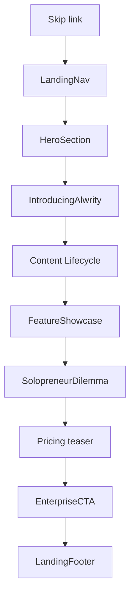

# Mobile ALwrity Landing Page — Review Plan (Plan Only)

**Scope:** Public marketing landing page on phones only (375px–430px width).  
**Test URL:** `https://www.alwrity.com/home` (or local `http://localhost:3000/home` in a **private/incognito window**, signed out).  
**Do not use `/` if already signed in** — signed-in users are redirected away.  
**Primary files:** [`frontend/src/components/Landing/Landing.tsx`](../frontend/src/components/Landing/Landing.tsx) and section components under [`frontend/src/components/Landing/`](../frontend/src/components/Landing/).

**Reference docs already in repo:**
- Full prior audit: [`docs/AUDIT_Alwrity-Landing-Page_Jul2026.md`](AUDIT_Alwrity-Landing-Page_Jul2026.md) (40 test cases, many fixed July 4, 2026)
- External framework: `Alwrity_Master_Mobile_Audit_Framework.docx` (Modules 1–3 + Four Growth Pillars: **Time-to-Value**, **Engagement/CTR**, **Core Web Vitals**, **Trust/E-E-A-T**)

---

## How QA should test (every section)

1. Open Chrome → Toggle device toolbar → set width to **375px** (iPhone SE size).
2. Use a **private window** and confirm you are **signed out**.
3. Load `/home` and scroll the full page top to bottom once before judging any section.
4. For each test case: record **Pass / Fail / Already Fixed** and a one-line note.
5. Optional slow-network check (Section 11): DevTools → Network → **Slow 4G** → reload once.

**Estimated full mobile pass:** ~60–75 minutes.

---

## Page map (top → bottom)

---

## Executive summary (mobile)

**What works well today (already improved):**
- Mobile hero sign-up button appears **above the stats panel** (no scroll needed for first CTA).
- Hero chips scroll to **Lifecycle** and **Features** instead of forcing sign-in.
- Top menu has a **floating “Menu” pill** when the bar hides on scroll.
- **Pricing** in the menu scrolls to the in-page plan section.
- Feature carousel shows **one card at a time** on mobile with **large arrow buttons below**.
- Lifecycle cards show **full descriptions** on mobile (not cut off).
- Footer includes **Contact** and a single clean copyright block.

**What still hurts mobile experience (priority themes):**
1. **Too much moving text** (rotating headlines, buttons, chips) — confusing on small screens and weak for thought-leader clarity.
2. **Text too small to read** in hero stats, lifecycle chips, and carousel dots.
3. **Trust claims** (GitHub stars, speed, privacy) not easy to verify on a phone.
4. **Long vertical scroll** with repeated sign-up prompts — needs clearer “why ALwrity is different” (AI-first + HITL + SME) without fatigue.
5. **Performance on slow mobile networks** — large background images can delay first readable content.

**Brand positioning gap on mobile:** The page looks premium, but the **unique ALwrity story** (AI-first copilot, human stays in control, built for SMEs/solopreneurs, LinkedIn Studio as the flagship example) should be **stable and readable within the first 2 screens**, not buried below animations.

---

## Section 0 — Skip to main content

| ID | Severity | Finding | Recommendation |
|----|----------|---------|----------------|
| M-001 | Low | Skip link exists but is mainly for keyboard users, not touch. | **No change required for mobile touch QA.** Optional: note in checklist for accessibility retest. |

**Test case M-001**
- On mobile, this is **N/A for touch**.
- If testing with a Bluetooth keyboard: first **Tab** should reveal “Skip to main content” at top-left; **Enter** jumps to main hero.

---

## Section 1 — Top navigation ([`LandingNav.tsx`](../frontend/src/components/Landing/LandingNav.tsx))

| ID | Severity | Pillar | Finding | Recommendation |
|----|----------|--------|---------|----------------|
| M-002 | Medium | Time-to-Value | Top bar **still hides** after scrolling; hamburger disappears with it. | **Keep** the floating **Menu** pill (already added). Verify it always appears when the top bar is hidden. |
| M-003 | Medium | Time-to-Value | Sign-in button label **“👋 Welcome”** inside the drawer is unclear for first-time visitors. | Change to **“Sign in free”** (signed out) or **“Go to dashboard”** (signed in). File: [`NavAuthButton.tsx`](../frontend/src/components/Landing/NavAuthButton.tsx). |
| M-004 | Low | Trust | Logo area shows tagline under **ALwrity** — can feel crowded next to hamburger at 375px. | Shorten mobile tagline to one line, e.g. **“AI marketing OS for SMEs”**. File: [`BrandMark.tsx`](../frontend/src/components/Landing/BrandMark.tsx). |
| M-005 | Low | Core UX | Floating **Menu** pill is slightly **smaller than 44px** touch target. | Increase pill height/padding so the tap area is at least **44×44px**. |

**Test case M-002**
1. Open `/home` on 375px width.
2. Scroll down past the hero until the top bar is gone.
3. **Pass** if a purple **Menu** button appears bottom-right.
4. Tap **Menu** → drawer opens with Home, Lifecycle, Features, Pricing.

**Test case M-003**
1. Open the drawer (hamburger or Menu pill).
2. Read the sign-in button label.
3. **Fail** if a new visitor would not understand it starts sign-up.

**Test case M-004 (Pricing nav — should already pass)**
1. In the drawer, tap **Pricing**.
2. **Pass** if the page scrolls to **Choose Your Plan** without leaving `/home`.

---

## Section 2 — Hero ([`HeroSection.tsx`](../frontend/src/components/Landing/HeroSection.tsx))

| ID | Severity | Pillar | Finding | Recommendation |
|----|----------|--------|---------|----------------|
| M-006 | High | Trust + SEO | Main title **(H1) still rotates** every ~12 seconds (“Content Planning”, etc.). | Use **one stable H1** on mobile: **“AI Copilot for Your Content Lifecycle — You Stay in Control.”** Move rotating phrases to a **non-H1 subtitle** or remove on mobile. |
| M-007 | Medium | Time-to-Value | Hero **button label still rotates** every 6 seconds. | Use one label on mobile: **“Start free”** (no animation on the button). |
| M-008 | Medium | Readability | Stat labels and footnote are still **very small** (~10px). | Raise minimum text to **12px** on mobile; place footnote directly under stats in plain language. |
| M-009 | Medium | Trust | Stats (70%, 65%, etc.) feel like guarantees; footnote is easy to miss. | Change to **“Up to 70% time saved*”** and footnote: **“*Based on ALwrity beta survey, 2025.”** Add sample size when available. |
| M-010 | Low | Trust | Trust badge row under hero (“Hyper Personalization”, etc.) is tiny on mobile. | Increase badge text size OR collapse to **3 short bullets** with icons. |
| M-011 | Low | Engagement | Hero is long; stats glass panel adds scroll before secondary content. | Acceptable if first CTA is visible without scroll (**should pass** after July fix). |

**Test case M-011 (first CTA above fold — should pass)**
1. Load `/home` at 375×812; **do not scroll**.
2. **Pass** if a purple **Start free / Get Started / Try AI Copilot** button is fully visible under the subhead.

**Test case M-012 (chips — should pass)**
1. Tap **AI Marketing Platform** → page scrolls to **Content Lifecycle**.
2. Tap **AI-First Copilot** → page scrolls to **Experience the Platform** section.

**Test case M-006**
1. Stay on hero 15 seconds without scrolling.
2. **Fail** if the **biggest headline** keeps changing (hurts clarity and thought-leader tone on mobile).

**Test case M-008**
1. Hold phone at normal reading distance.
2. Try to read **“Time Savings”** and the footnote under the stats without zoom.
3. **Fail** if you need pinch-zoom.

**Positioning note:** Hero should say **HITL** in plain words above the fold, e.g. **“AI drafts. You approve. Nothing goes live without you.”**

---

## Section 3 — Welcome / Why ALwrity ([`IntroducingAlwrity.tsx`](../frontend/src/components/Landing/IntroducingAlwrity.tsx))

| ID | Severity | Pillar | Finding | Recommendation |
|----|----------|--------|---------|----------------|
| M-013 | High | Trust | Social proof numbers (**1K+ GitHub Stars**, etc.) are **not tappable** and hard to verify on phone. | Either add a **GitHub link** or soften copy to **“Open-source community”** until numbers are verified. |
| M-014 | Medium | Trust | **Privacy First** card body still says **“No tracking”** while badge says **“Privacy-first design”** — inconsistent. | Align body copy with [`/privacy`](../frontend/src/components/Landing/PrivacyPolicyPage.tsx): **“We don’t sell your data. See Privacy Policy.”** |
| M-015 | Medium | Trust | **“Sub-second Response”** sets unrealistic expectations for AI generation on mobile networks. | Change to **“Fast, focused workflows”** or **“Quick drafts, your final edit.”** |
| M-016 | Low | Time-to-Value | Second sign-up button was replaced with **“See how it works ↓”** (good). | **Verify** it scrolls to Lifecycle smoothly. |
| M-017 | Medium | Thought leadership | Section explains features but not **why ALwrity leads** for SMEs. | Add one short line under the title: **“One workspace for plan → create → publish → measure — built for founders and small teams, not enterprise IT.”** |

**Test case M-013**
1. Scroll to **Welcome to ALwrity**.
2. Tap each stat (GitHub stars, satisfaction, etc.).
3. **Fail** if nothing happens and numbers cannot be verified elsewhere on the page.

**Test case M-016 (should pass)**
1. Tap **See how it works ↓**.
2. **Pass** if view scrolls to **ALwrity Content Lifecycle**.

---

## Section 4 — Content Lifecycle ([`Landing.tsx`](../frontend/src/components/Landing/Landing.tsx) lifecycle block)

| ID | Severity | Pillar | Finding | Recommendation |
|----|----------|--------|---------|----------------|
| M-018 | Medium | Readability | Phase chips (Plan, Generate, …) use **very small text** in a 3×2 grid; words **scramble/animate**. | On mobile: **static labels** (no scramble) and **12px+** text. |
| M-019 | Low | Time-to-Value | Card descriptions show in full on mobile (**fixed**). | Re-verify only. |
| M-020 | Medium | Time-to-Value | **“Sign in to explore →”** links are small text buttons — hard to tap. | Turn into full-width **44px-tall buttons** on mobile, e.g. **“Explore Plan →”**. |
| M-021 | Medium | Thought leadership | Lifecycle is ALwrity’s core story but HITL message is only in small body text. | Add a single bold line under the subtitle: **“Human-in-the-loop at every step — AI suggests, you decide.”** |

**Test case M-018**
1. Find the six phase chips under **ALwrity Content Lifecycle**.
2. **Fail** if labels are hard to read or keep changing words without user action.

**Test case M-019 (should pass)**
1. Open any lifecycle card (e.g. **Generate**).
2. **Pass** if the full description is visible without hover.

**Test case M-020**
1. Try tapping **Sign in to explore →** on the **Publish** card with your thumb.
2. **Fail** if you miss the link on first try.

---

## Section 5 — Experience the Platform ([`FeatureShowcase.tsx`](../frontend/src/components/Landing/FeatureShowcase.tsx))

| ID | Severity | Pillar | Finding | Recommendation |
|----|----------|--------|---------|----------------|
| M-022 | Low | Engagement | One card per page on mobile (**fixed**); arrows below (**fixed**). | Re-verify carousel navigation. |
| M-023 | Medium | Time-to-Value | Carousel **dots are only 8px tall** — hard to tap. | Enlarge dots to **12px** with **44px tap padding**, or hide dots on mobile and rely on arrows + “1 of 6” text. |
| M-024 | Medium | Engagement | **No swipe gesture** — users expect to swipe carousels on phones. | Add left/right swipe on mobile (optional but high impact). |
| M-025 | Medium | Thought leadership | LinkedIn is mentioned in copy but **LinkedIn Studio is not named as the flagship app**. | On the **AI-First Copilot** card, add: **“Start with LinkedIn Studio — our reference workspace for professional content.”** |

**Test case M-022 (should pass)**
1. In **Experience the Platform**, confirm **only one feature card** shows at a time.
2. Use **left/right arrow buttons below** the card to move through all **6** cards.

**Test case M-023**
1. Try tapping the small dots under the carousel.
2. **Fail** if dots are difficult to hit on first try.

**Test case M-024**
1. Swipe left on a feature card image.
2. **Fail** if nothing happens (document as enhancement opportunity).

---

## Section 6 — Solopreneur struggle ([`SolopreneurDilemma.tsx`](../frontend/src/components/Landing/SolopreneurDilemma.tsx))

| ID | Severity | Pillar | Finding | Recommendation |
|----|----------|--------|---------|----------------|
| M-026 | Medium | Engagement | Pain point titles **still scramble** on mobile (e.g. “Content Overwhelm” → “Content Chaos”). | Use **fixed titles** on mobile; keep motion on desktop only if desired. |
| M-027 | Medium | Time-to-Value | Bottom CTA button text **rotates** (“End the Struggle Today”, etc.). | Single mobile label: **“See how ALwrity helps →”** scrolling to Features or Pricing. |
| M-028 | Low | SME positioning | Section fits SME story well (before/after cards). | Add one line tying to HITL: **“You’re not replacing your voice — you’re getting an AI teammate.”** |

**Test case M-026**
1. Scroll to **The Solopreneur’s Dilemma**.
2. Watch the first “Before ALwrity” card title for 10 seconds.
3. **Fail** if the title keeps changing on its own.

**Test case M-028 (layout — should pass)**
1. Scroll through Before (3 cards) and After (3 cards).
2. **Pass** if all cards are full width with **no horizontal scrolling**.

---

## Section 7 — Choose Your Plan ([`Landing.tsx`](../frontend/src/components/Landing/Landing.tsx) + [`landingPricingTeaser.ts`](../frontend/src/components/Landing/landingPricingTeaser.ts))

| ID | Severity | Pillar | Finding | Recommendation |
|----|----------|--------|---------|----------------|
| M-029 | Low | Time-to-Value | Plan cards stack on mobile; per-plan buttons added (**fixed**). | Re-verify tap targets. |
| M-030 | Medium | Trust | Subtitle may wrap awkwardly on narrow screens. | Allow normal wrapping on mobile (remove forced single-line behavior if still present). |
| M-031 | Medium | SME clarity | Plans should speak to **solo / small team** workflows, not enterprise seats. | Review plan feature bullets for plain SME language. |

**Test case M-029 (should pass)**
1. Scroll to **Choose Your Plan**.
2. **Pass** if each plan card has its own button (e.g. **Start free** on Free tier).
3. Tap **Start free** → sign-in modal opens.

**Test case M-030**
1. Read the line under **Choose Your Plan** at 375px width.
2. **Fail** if text is cut off or overflows sideways.

---

## Section 8 — Final sign-up panel ([`EnterpriseCTA.tsx`](../frontend/src/components/Landing/EnterpriseCTA.tsx))

| ID | Severity | Pillar | Finding | Recommendation |
|----|----------|--------|---------|----------------|
| M-032 | Low | Trust | Copy updated away from “Join thousands…” (**fixed**); includes **Human-in-the-loop** bullet (**fixed**). | Re-verify readability. |
| M-033 | Low | Layout | Image stacks above text on mobile — acceptable. | **Pass** if copilot screenshot is not cropped oddly. |

**Test case M-032 (should pass)**
1. Scroll to the final dark panel before the footer.
2. **Pass** if you see a bullet mentioning **Human-in-the-loop** (or similar plain wording).
3. Tap **Start creating now** → sign-in opens.

---

## Section 9 — Footer ([`LandingFooter.tsx`](../frontend/src/components/Landing/LandingFooter.tsx))

| ID | Severity | Pillar | Finding | Recommendation |
|----|----------|--------|---------|----------------|
| M-034 | Low | Trust | Privacy, Code of Conduct, Terms, **Contact** links stack on mobile (**fixed**). | Re-verify all four links open correct pages. |
| M-035 | Low | Trust | Open-source mention still lacks **GitHub link**. | Add **GitHub** link next to open-source text (same as Section 3). |

**Test case M-034 (should pass)**
1. At page bottom, tap **Privacy**, **Terms**, **Contact** one by one.
2. **Pass** if each opens the correct page without error.

---

## Section 10 — Global mobile SEO and performance

| ID | Severity | Pillar | Finding | Recommendation |
|----|----------|--------|---------|----------------|
| M-036 | Medium | Accessibility | Animated/scrambling text runs even when phone has **Reduce Motion** on. | Respect system setting: show **static text** when reduce-motion is enabled. Files: [`ScrambleText.tsx`](../frontend/src/components/ScrambleText.tsx) + landing sections. |
| M-037 | Medium | Core Web Vitals | Multiple large **background images** (hero, lifecycle, features, solopreneur) hurt slow mobile loads. | Serve **smaller mobile crops** or WebP; defer below-fold backgrounds (partially done — re-test on Slow 4G). |
| M-038 | Low | SEO | Canonical URL for `/home` points to `https://www.alwrity.com/` (**fixed** via [`useLandingCanonical.ts`](../frontend/src/components/Landing/useLandingCanonical.ts)). | Re-verify in page source on staging/production. |
| M-039 | Low | SEO | One stable H1 on mobile helps Google and social previews (ties to M-006). | Same fix as hero H1 recommendation. |

**Test case M-036**
1. On iPhone: Settings → Accessibility → Motion → **Reduce Motion ON** (or Android equivalent).
2. Reload `/home`.
3. **Fail** if headline/chips/buttons still scramble or rotate constantly.

**Test case M-037**
1. DevTools → Network → **Slow 4G** → reload `/home`.
2. Note seconds until hero headline is readable.
3. **Fail** if blank/black screen lasts more than **3–4 seconds** on a typical connection.

---

## Priority roadmap (for approval before any coding)

### Phase A — Quick wins (copy + sizing, low risk)
- M-003 Welcome → **Sign in free**
- M-007 Single hero CTA label on mobile
- M-008 / M-010 Increase smallest text to 12px
- M-014 Privacy card wording alignment
- M-015 Soften speed claim
- M-023 Larger carousel dots or dot removal on mobile

### Phase B — Clarity and thought-leader positioning
- M-006 Stable mobile H1 + HITL line above fold
- M-017 / M-021 / M-025 / M-028 SME + LinkedIn Studio + HITL messaging
- M-018 Static lifecycle chips on mobile
- M-020 Full-width explore buttons on lifecycle cards

### Phase C — Trust and polish
- M-013 Verifiable GitHub / softened social proof
- M-036 Reduce-motion support
- M-024 Swipe on feature carousel (optional)
- M-037 Mobile-optimized background images

---

## What NOT to change in this mobile pass (unless you approve)

- Desktop layout and animations (can stay richer than mobile).
- Pricing page `/pricing` content (only the in-page teaser on `/home` is in scope).
- Sign-in flow itself (Clerk) — only **labels and entry points** on the landing page.

---

## Deliverable after your approval

Once you approve this plan (whole or by phase), implementation can be split into small PRs mirroring the LinkedIn Studio mobile work: **layout/navigation**, **hero/trust copy**, **carousel/lifecycle polish**, **performance/accessibility**.

**No code will be written until you explicitly approve.**
