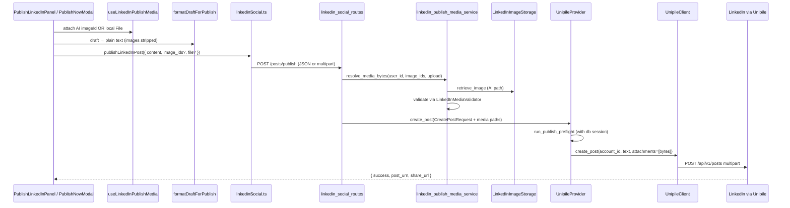
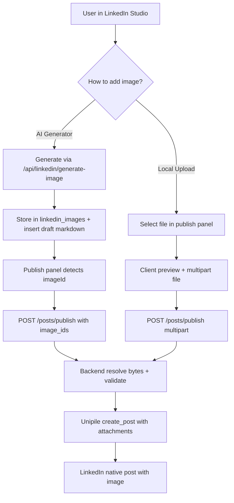

# LinkedIn Studio — Image Post Publishing

## Implementation Plan

**Status:** Planning only (no code changes yet)  
**Last updated:** 2026-07-16  
**GitHub issue:** [#105 — Image-format post publishing from LinkedIn Studio](https://github.com/ALwrity/ALwrity-prod/issues/105)  
**Related:** [#104 — Selection image insert + preview](https://github.com/ALwrity/ALwrity-prod/issues/104) (completed on branch `fix/linkedin-selection-image-insert-preview`)

---

## 1. Feature Summary

### 1.1 Problem

LinkedIn Studio currently supports **text-only publishing**. Users can draft posts, generate AI images, and preview them in the editor — but when they click **Publish**, image markdown is stripped and only plain text is sent to LinkedIn via Unipile.

### 1.2 Goal

Enable **image-format post publishing** directly from LinkedIn Studio so a draft preview (text + image) can be published to the user's connected LinkedIn personal profile.

### 1.3 User-facing media paths (v1)

Users must have **two ways** to attach an image before publishing:

| Path | Description | Status today |
|------|-------------|--------------|
| **A — AI generator** | Highlight text → Generate Image (selection flow) or open generator from publish panel | Implemented in editor (#104); **not wired to publish** |
| **B — Local upload** | Upload image from device (PNG, JPEG, GIF, WebP) | **Not implemented** |

### 1.4 Out of scope (v1)

- Company page / organization posting
- First comment on publish
- Scheduled publish with media
- Multi-image carousel (LinkedIn allows multiple images; v1 targets **single image + text**)
- Video or PDF document posts
- Native LinkedIn Marketing API (`ugcPosts`, `registerUpload`) — we extend the **existing Unipile provider** only

---

## 2. Codebase Analysis (Golden Rule)

### 2.1 What already exists — reuse, do not duplicate

| Piece | Location | Reuse for |
|-------|----------|-----------|
| Compact publish bar | `frontend/src/components/LinkedInWriter/components/PublishLinkedInPanel.tsx` | Add media preview + publish payload |
| Publish wedge modal | `frontend/src/components/LinkedInWriter/components/dashboard/PublishWedgeModals.tsx` (`PublishNowModal`) | Same media UX in dashboard flow |
| Publish API client | `frontend/src/api/linkedinSocial.ts` → `publishLinkedInPost()` | Extend request/response types |
| Publish text formatter | `frontend/src/components/LinkedInWriter/utils/linkedInPublishFormatters.ts` | Keep stripping image markdown from **text body**; send images separately |
| Draft image utilities | `frontend/src/components/LinkedInWriter/utils/linkedInImageDraftUtils.ts` | `extractLinkedInImageId()`, `splitDraftByImageMarkdown()` at publish time |
| AI image service | `frontend/src/services/linkedInImageService.ts` | Resolve stored image IDs |
| Selection image hook + modal | `useLinkedInSelectionImage.ts`, `LinkedInSelectionImageModal.tsx` | Reuse generator UX; open from publish panel |
| Authenticated image preview | `LinkedInAuthenticatedImage.tsx`, `LinkedInDraftPreview.tsx` | Thumbnail in publish confirmation |
| Connection gating | `useLinkedInSocialConnection.ts` | Already blocks publish when disconnected / org target |
| Publish route | `backend/api/linkedin_social_routes.py` → `POST /posts/publish` | **Extend** — do not create parallel publish endpoint |
| Publish request models | `backend/models/linkedin_social_models.py` | Add optional `image_ids`, media metadata |
| Provider contract | `backend/services/integrations/linkedin/protocol.py` | `create_post`, `upload_media` |
| Unipile text publish | `unipile_client.py` → `create_post(account_id, text)` | Add optional `attachments` multipart files |
| Unipile provider | `unipile_provider.py` → `create_post()` | Wire media bytes into client |
| Post request type | `types.py` → `CreatePostRequest.media_urls` | Already has `media_urls: list[str]` — use for temp file paths |
| Media validator | `media_validator.py` → `LinkedInMediaValidator` | Validate before Unipile upload (8MB, min 552×276, PNG/JPEG/GIF/WebP) |
| Publish preflight | `publish_preflight.py` | H4 duplicate check + H5 media validation (already supports `media_urls`) |
| AI image storage | `linkedin_image_storage.py` | `retrieve_image(image_id, user_id)` → bytes/path for publish |
| Image generation API | `backend/api/linkedin_image_generation.py` | No change required for v1 publish |
| FormData upload pattern | Video Studio (`TransformVideo.tsx`, `useFaceSwap.ts`) | Reference for local file upload UX |
| Publish tests | `test_linkedin_publish_route.py`, `test_linkedin_unipile_publish.py` | Extend with image cases |

### 2.2 Current text-only publish flow

```
User draft (may contain  markdown)
    ↓
formatDraftForPublish()  → strips image markdown, citations → plain text
    ↓
publishLinkedInPost({ content, account_id? })
    ↓
POST /api/linkedin-social/posts/publish
    ↓
UnipileProvider.create_post() → run_publish_preflight() → UnipileClient.create_post()
    ↓
Unipile POST /api/v1/posts  (multipart: account_id + text only)
    ↓
LinkedIn personal profile post (text only)
```

**Critical gap:** Draft images and publish pipeline are **not connected**.

### 2.3 Provider reality

| Provider | Text publish | Media publish |
|----------|--------------|---------------|
| **Unipile** (`LINKEDIN_PROVIDER=unipile`) | Working | `attachments` supported in API but **deliberately omitted** in client |
| Zernio | Not implemented | Not implemented |
| Native LinkedIn API | Not implemented | Not implemented |

**v1 implementation target:** Unipile only. Document env requirement: `LINKEDIN_PROVIDER=unipile`, `UNIPILE_API_KEY`, connected account.

### 2.4 Unipile attachment contract (v1 API in use today)

Current client uses **Unipile v1** `POST /api/v1/posts` with `multipart/form-data`:

| Field | Required | Notes |
|-------|----------|-------|
| `account_id` | Yes | Connected LinkedIn account |
| `text` | Yes | Post body (can be empty for image-only in theory; v1 requires text — keep text from draft) |
| `attachments` | No | Array of image files; LinkedIn max resolution 6012×6012 px |

> **Future note:** Unipile v2 uses JSON + base64 attachments. Migration is out of v1 scope but should be tracked as tech debt when upgrading the client.

### 2.5 Architectural constraints

- **Extend** `POST /api/linkedin-social/posts/publish` — never duplicate publish orchestration.
- **Business logic** in backend services (`linkedin_publish_media_service` or extend `unipile_provider`), not in React components or routes.
- **No mock/fallback data** — if image resolve or upload fails, return a clear error.
- Keep every new file **under 500 lines**; split UI by concern (media picker, publish preview, upload hook).
- **Start from UI (Phase 1)** so each step is testable through the user experience.
- Blog Writer and other modules must not regress.

---

## 3. UI / UX Brainstorm

### 3.1 Where media controls live

Publishing is triggered from **two entry points** today. Both must gain identical media support:

1. **Compact bar** — `PublishLinkedInPanel` in `LinkedInWriter.tsx` header row  
2. **Dashboard wedge** — `PublishNowModal` in publish workflow

**Recommended approach:** Extract shared logic into a reusable hook + presentational components, then compose into both entry points.

```
PublishMediaSection (shared)
├── MediaPreviewStrip     — thumbnails of attached image(s)
├── AddMediaActions
│   ├── [Generate with AI]  → opens LinkedInSelectionImageModal or compact generator
│   └── [Upload image]      → hidden <input type="file" accept="image/*">
└── MediaValidationHints  — size/format warnings before publish
```

### 3.2 Publish panel layout (compact bar)

```
[Connected ●]  [Publish ▼]
                  └── optional expanded panel:
                      ┌─────────────────────────────────────┐
                      │ Publish to LinkedIn                 │
                      │ Text: 133 words · 1 image attached  │
                      │ ┌─────────┐                         │
                      │ │ [thumb] │  AI image · Remove      │
                      │ └─────────┘                         │
                      │ [+ Generate image] [+ Upload image] │
                      │ [ Publish text + image ]            │
                      └─────────────────────────────────────┘
```

### 3.3 PublishNowModal preflight (dashboard wedge)

Extend existing preflight phase:

| Row | Today | After #105 |
|-----|-------|------------|
| Character count | Yes | Yes |
| Duplicate check | Claimed (backend often skipped — fix in Phase 2) | Yes, with DB session |
| Media row | Missing | Show thumbnail + source badge (`AI` / `Upload`) |
| Validation | Text only | Text + image specs (8MB, min dimensions) |
| Confirm CTA | "Confirm & Publish" | "Confirm & Publish" (text + image) |

### 3.4 Image source priority at publish time

When user clicks Publish, resolve media in this order:

1. **Explicit publish attachment state** (uploaded file or user-picked AI image in publish panel)
2. **Auto-detect from draft** — parse `splitDraftByImageMarkdown(draft)` and use the **last** image segment (matches #104 append behavior)
3. **No image** — fall back to current text-only publish (backward compatible)

This lets users who already generated an image in the editor publish without re-attaching, while still supporting explicit upload.

### 3.5 Local upload UX

- Accept: `.png`, `.jpg`, `.jpeg`, `.gif`, `.webp`
- Max size: **8 MB** (matches `LinkedInMediaValidator`)
- Client-side pre-check before upload (dimensions optional in browser; server is source of truth)
- Show filename + preview thumbnail immediately
- Allow **Remove** and replace before publish
- One image in v1 (disable second upload until first removed)

### 3.6 AI generator from publish flow

Reuse existing components — do not rebuild generator:

- Open `LinkedInSelectionImageModal` / `ImageGenerationModal` from publish panel
- On success, set `publishMedia` state with `{ source: 'ai', imageId, imageUrl }`
- Optionally also append to draft (existing #104 behavior) for editor consistency

### 3.7 Error & success states

| Scenario | UI message |
|----------|------------|
| Image too large | "Image must be under 8 MB." |
| Unsupported format | "Use PNG, JPEG, GIF, or WebP." |
| Resolution too small | "Image must be at least 552×276 pixels." |
| Unipile upload failed | Surface `getLinkedInSocialErrorMessage(err)` |
| Publish success (with image) | "Published to LinkedIn with image." + optional `share_url` link |
| Connected but org target | Keep existing block — personal profile only |

### 3.8 Design tokens

Match existing LinkedIn Studio (`#0A66C2`, `#004182`, `#f8fafc` panels). Media chips: `AI Generated` (blue), `Uploaded` (green).

---

## 4. Target Architecture



---

## 5. Implementation Phases

---

### Phase 1 — Frontend UI (no backend changes required to build UI)

**Objective:** Ship all publish-flow UI components and client-side state management. Use mocked/disabled publish calls or feature flag until Phase 3.

#### 5.1 New frontend files (estimated)

| File | Lines (est.) | Responsibility |
|------|--------------|----------------|
| `hooks/useLinkedInPublishMedia.ts` | ~120 | Attachment state: `source`, `imageId`, `localFile`, `previewUrl`, add/remove/reset |
| `utils/linkedInPublishMediaUtils.ts` | ~80 | Detect draft images, validate file client-side, build publish payload |
| `components/LinkedInPublishMediaSection.tsx` | ~180 | Thumbnail strip, Generate/Upload buttons, validation hints |
| `components/LinkedInPublishMediaPreview.tsx` | ~60 | Single image thumbnail with remove action |

> Create new files if extending `PublishLinkedInPanel.tsx` or `PublishWedgeModals.tsx` would exceed 500 lines.

#### 5.2 Modify existing frontend files

| File | Changes |
|------|---------|
| `PublishLinkedInPanel.tsx` | Integrate `LinkedInPublishMediaSection`; update copy ("text + image"); pass media in publish handler |
| `PublishWedgeModals.tsx` (`PublishNowModal`) | Same media section in preflight; show media row |
| `linkedinSocial.ts` | Extend `LinkedInPublishPostRequest` / `Response` types (types only in Phase 1) |
| `linkedInPublishFormatters.ts` | Add `extractPublishImageIds(draft)` helper (thin wrapper over `linkedInImageDraftUtils`) |
| `ContentEditor.tsx` | Optional: expose callback so publish panel can open AI generator with current draft context |

#### 5.3 Phase 1 UI tasks

- [ ] **P1.1** Create `useLinkedInPublishMedia` hook with state machine: `idle` → `attached` → `publishing`
- [ ] **P1.2** Build `LinkedInPublishMediaSection` with two CTAs: **Generate with AI** and **Upload image**
- [ ] **P1.3** Hidden file input + drag-and-drop zone (optional nice-to-have) for local upload
- [ ] **P1.4** Client-side file validation (type, 8MB) with inline error alerts
- [ ] **P1.5** Auto-detect image from draft on mount (last `` segment)
- [ ] **P1.6** Render `LinkedInAuthenticatedImage` thumbnail for AI images; `URL.createObjectURL` for local files
- [ ] **P1.7** Update `PublishLinkedInPanel` compact + expanded layouts
- [ ] **P1.8** Update `PublishNowModal` preflight with media row
- [ ] **P1.9** Remove "media support coming soon" copy; replace with live media UX
- [ ] **P1.10** Feature flag `LINKEDIN_PUBLISH_MEDIA_ENABLED` (env or constant) to hide publish button media until Phase 3

#### 5.4 Phase 1 manual test checklist

- [ ] Upload PNG/JPEG → preview appears → remove → preview clears
- [ ] Generate AI image in editor → publish panel auto-detects draft image
- [ ] Invalid file (PDF, 20MB) → client error, publish disabled
- [ ] Org target selected → publish still blocked (unchanged)
- [ ] UI identical in compact bar and PublishNowModal

---

### Phase 2 — Backend foundation

**Objective:** Extend existing publish endpoint and Unipile integration to accept and upload image bytes. Reuse text publish path — no parallel publish API.

#### 2.1 API contract (extend existing endpoint)

**Endpoint (unchanged path):** `POST /api/linkedin-social/posts/publish`

**Option A — Recommended for v1:** JSON body with optional `image_ids`, plus separate multipart upload for local files.

| Approach | Endpoint | Body |
|----------|----------|------|
| AI-generated image | `POST /posts/publish` | `{ content, account_id?, image_ids: ["da1c4d32..."] }` |
| Local upload | `POST /posts/publish` | `multipart/form-data`: `content`, `account_id?`, `file` (image) |

**Option B (alternative):** Two-step — `POST /posts/upload-media` returns `media_ref`, then publish with `media_refs: []`. More complex; defer unless multipart single-call proves difficult.

#### 2.2 Extended request/response models

```python
# backend/models/linkedin_social_models.py

class LinkedInPublishPostRequest(BaseModel):
    content: str
    account_id: Optional[str] = None
    image_ids: Optional[List[str]] = None  # AI-generated stored image IDs

class LinkedInPublishPostResponse(BaseModel):
    success: bool
    post_id: Optional[str] = None
    post_urn: Optional[str] = None
    share_url: Optional[str] = None  # from Unipile raw response
    provider: str
    message: str
    debug_id: str
    has_media: bool = False
```

#### 2.3 New backend service (recommended new file)

| File | Responsibility |
|------|----------------|
| `backend/services/integrations/linkedin/linkedin_publish_media_service.py` | Resolve AI `image_ids` → bytes via `LinkedInImageStorage`; accept upload bytes; write temp file; run `LinkedInMediaValidator`; return list of paths for preflight |

Keep under 500 lines. Routes call this service — no business logic in `linkedin_social_routes.py`.

#### 2.4 Backend file changes

| File | Changes |
|------|---------|
| `linkedin_social_routes.py` | Accept JSON + multipart; detect `Content-Type`; call media service; pass `media_urls` into `CreatePostRequest`; pass `db` session to preflight |
| `linkedin_social_models.py` | Extend publish request/response |
| `unipile_client.py` | `create_post(account_id, text, attachment_paths: list[str] | None)` — add `attachments` files to multipart |
| `unipile_provider.py` | If `request.media_urls` non-empty, pass files to client; implement or inline `upload_media` |
| `publish_preflight.py` | No schema change — already validates `media_urls` |
| `media_validator.py` | No change expected — already aligned with LinkedIn specs |
| `linkedin_image_storage.py` | Reuse `retrieve_image()` — verify user scoping |

#### 2.5 Phase 2 backend tasks

- [ ] **P2.1** Extend `LinkedInPublishPostRequest` with `image_ids: Optional[List[str]]`
- [ ] **P2.2** Add multipart handler on same route (FastAPI: overload or `Request` content-type branch)
- [ ] **P2.3** Create `linkedin_publish_media_service.py`:
  - `resolve_ai_image_paths(user_id, image_ids) -> list[str]`
  - `persist_uploaded_image(user_id, file_bytes, filename) -> str`
  - Validate each path via `LinkedInMediaValidator`
- [ ] **P2.4** Enforce v1 rule: **max 1 image** per post (400 if `len(image_ids) > 1` or file + image_ids together)
- [ ] **P2.5** Extend `UnipileClient.create_post` to attach image file(s) in multipart `attachments` field
- [ ] **P2.6** Extend `UnipileProvider.create_post` to pass `request.media_urls` to client after preflight
- [ ] **P2.7** Pass SQLAlchemy `db` session into `run_publish_preflight` so duplicate detection works (fixes existing gap)
- [ ] **P2.8** Map Unipile errors to `HTTPException` with safe messages (reuse existing error mapping)
- [ ] **P2.9** Loguru logging at: media resolve, validation, Unipile request metadata (never log bytes/tokens)
- [ ] **P2.10** Temp file cleanup after publish (success or failure)
- [ ] **P2.11** Extend tests:
  - `test_linkedin_publish_route.py` — publish with `image_ids`
  - `test_linkedin_unipile_publish.py` — multipart with attachment
  - New: media validation failure → 400

#### 2.6 Media resolution rules

| Source | Resolution steps |
|--------|------------------|
| `image_ids[]` | `LinkedInImageStorage.retrieve_image(id, user_id)` → read PNG bytes → temp path → preflight |
| Multipart `file` | Save to `data/media/linkedin_publish_uploads/{user_id}/{uuid}.png` → preflight |
| Neither | Text-only publish (current behavior) |

**Security:**
- Verify `image_id` belongs to requesting `user_id`
- Reject path traversal in filenames
- Delete temp uploads after publish attempt

---

### Phase 3 — Wire frontend to backend

**Objective:** Connect Phase 1 UI to Phase 2 API; show real publish results including media confirmation.

#### 3.1 API client changes

```typescript
// frontend/src/api/linkedinSocial.ts

export interface LinkedInPublishPostRequest {
  content: string;
  account_id?: string;
  image_ids?: string[];  // AI-generated
}

export async function publishLinkedInPost(payload: LinkedInPublishPostRequest): Promise<...>

export async function publishLinkedInPostWithFile(
  payload: LinkedInPublishPostRequest,
  file: File,
): Promise<...>  // multipart FormData
```

#### 3.2 Publish handler logic

```typescript
async function handlePublish() {
  const content = formatDraftForPublish(draft);
  const media = publishMedia.resolve(); // from useLinkedInPublishMedia

  if (media.source === 'upload' && media.localFile) {
    await publishLinkedInPostWithFile({ content, account_id }, media.localFile);
  } else if (media.source === 'ai' && media.imageId) {
    await publishLinkedInPost({ content, account_id, image_ids: [media.imageId] });
  } else {
    await publishLinkedInPost({ content, account_id }); // text-only fallback
  }
}
```

#### 3.3 Phase 3 tasks

- [ ] **P3.1** Implement `publishLinkedInPostWithFile` in `linkedinSocial.ts` (FormData + `aiApiClient`)
- [ ] **P3.2** Wire `PublishLinkedInPanel` publish handler to media-aware API
- [ ] **P3.3** Wire `PublishNowModal` confirm handler similarly
- [ ] **P3.4** Remove feature flag `LINKEDIN_PUBLISH_MEDIA_ENABLED`
- [ ] **P3.5** Success UI: show `has_media` / "Published with image" + `share_url` link when returned
- [ ] **P3.6** Error UI: map `LinkedInMediaValidationError` to user-friendly strings
- [ ] **P3.7** Loading state: "Publishing text + image…" when media attached
- [ ] **P3.8** End-to-end manual test on `LINKEDIN_PROVIDER=unipile` staging account

#### 3.4 Phase 3 manual test checklist

- [ ] AI image in draft → publish → post appears on LinkedIn with image
- [ ] Local upload → publish → post appears with uploaded image
- [ ] Text-only draft → publish → unchanged behavior
- [ ] Invalid image → 400 with clear error in UI
- [ ] Disconnected account → publish blocked
- [ ] Duplicate content → preflight blocks with message

---

## 6. Asset Workflow Summary



---

## 7. Dependencies & Requirements

### 7.1 Current packages — sufficient for v1

These are already present in `backend/requirements.txt` and `backend/requirements-linkedin.txt`:

| Package | Purpose |
|---------|---------|
| `httpx>=0.28.1` | Unipile multipart publish |
| `python-multipart>=0.0.6` | FastAPI file upload |
| `Pillow>=10.0.0` | Image validation + dimension checks |
| `aiofiles>=23.2.0` | Async temp file writes |
| `fastapi`, `pydantic`, `loguru` | API layer |

**No new required packages for v1 image post publishing.**

### 7.2 Optional additions (document only — add if needed during implementation)

| Package | When to add | File to update |
|---------|-------------|----------------|
| `python-magic` or `filetype` | If MIME sniffing beyond extension is required | `requirements.txt`, `requirements-linkedin.txt` |
| `pypdf` | If PDF carousel publishing is added later (validator already references optionally) | `requirements.txt` |

### 7.3 Environment variables (no new secrets)

| Variable | Required for media publish |
|----------|---------------------------|
| `LINKEDIN_PROVIDER=unipile` | Yes |
| `UNIPILE_API_KEY` | Yes |
| `UNIPILE_DSN` | Yes (existing) |
| Clerk auth | Yes (existing) |

---

## 8. Testing Strategy

### 8.1 Backend unit tests

| Test | File |
|------|------|
| Media service resolves `image_id` for correct user | `test_linkedin_publish_media_service.py` (new) |
| Rejects other user's `image_id` | same |
| `LinkedInMediaValidator` rejects < 552×276 | existing / extend |
| Unipile client sends `attachments` in multipart | `test_linkedin_unipile_publish.py` |
| Route returns 400 on empty content + no media | `test_linkedin_publish_route.py` |

### 8.2 Frontend tests

| Test | File |
|------|------|
| `extractPublishImageIds` from draft markdown | `linkedInPublishMediaUtils.test.ts` (new) |
| Client file validation rejects oversize file | same |
| Publish payload builder selects correct API method | same |

### 8.3 Manual QA (user-driven)

Follow Phase 1, 3 checklists above on a real Unipile-connected LinkedIn test account.

---

## 9. Risks & Open Questions

| Risk | Mitigation |
|------|------------|
| Unipile `attachments` field name differs by DSN version | Verify against live Unipile docs + integration test before Phase 3 release |
| AI images stored as PNG may exceed 8MB | Validate before publish; offer resize via Pillow in media service if needed |
| Auth-only image URLs unusable by Unipile | Always send **bytes**, never `/api/linkedin/images/{id}` URL to Unipile |
| Duplicate detection ignored today (no DB in preflight) | Fix in Phase 2 as part of this work |
| Unipile v1 → v2 migration | Track separately; v2 uses JSON base64 attachments |
| Carousel (multi-image) demand | v1 single image; extend `image_ids` to list in v2 |

### Open questions for product owner

1. **Image-only posts** — Allow publish when `content` is empty but image is attached? (Unipile requires `text` field — may need minimal placeholder text.)
2. **Multiple draft images** — Publish all images in draft or only the last one? (Plan assumes **last image** in v1.)
3. **Asset library** — Should published images also be saved to content asset library automatically?

---

## 10. File Change Map (summary)

### New files

| Path | Phase |
|------|-------|
| `frontend/.../hooks/useLinkedInPublishMedia.ts` | 1 |
| `frontend/.../utils/linkedInPublishMediaUtils.ts` | 1 |
| `frontend/.../components/LinkedInPublishMediaSection.tsx` | 1 |
| `frontend/.../components/LinkedInPublishMediaPreview.tsx` | 1 |
| `backend/.../linkedin_publish_media_service.py` | 2 |
| `backend/tests/test_linkedin_publish_media_service.py` | 2 |
| `frontend/.../__tests__/linkedInPublishMediaUtils.test.ts` | 3 |

### Modified files

| Path | Phase |
|------|-------|
| `PublishLinkedInPanel.tsx` | 1, 3 |
| `PublishWedgeModals.tsx` | 1, 3 |
| `linkedinSocial.ts` | 1 (types), 3 (API) |
| `linkedInPublishFormatters.ts` | 1 |
| `linkedin_social_models.py` | 2 |
| `linkedin_social_routes.py` | 2, 3 |
| `unipile_client.py` | 2 |
| `unipile_provider.py` | 2 |
| `test_linkedin_publish_route.py` | 2 |
| `test_linkedin_unipile_publish.py` | 2 |

---

## 11. Suggested Delivery Order

| Sprint step | Deliverable | User-visible outcome |
|-------------|-------------|----------------------|
| 1 | Phase 1 complete | Upload + AI attach UI in publish panel (publish still text-only behind flag) |
| 2 | Phase 2 complete | API accepts image via Postman / tests |
| 3 | Phase 3 complete | Full text + image publish from LinkedIn Studio |
| 4 | Polish | `share_url` link, duplicate check fix, copy updates |

---

## 12. References

- GitHub issue: https://github.com/ALwrity/ALwrity-prod/issues/105
- Prior art (image in editor): branch `fix/linkedin-selection-image-insert-preview`
- Unipile v1 posts: `POST /api/v1/posts` multipart (`account_id`, `text`, `attachments`)
- Unipile v2 LinkedIn posts: https://developer.unipile.com/v2.0/docs/linkedin-create-posts
- Internal search plan template: `docs/linkedin/LINKEDIN_STUDIO_SEARCH_IMPLEMENTATION_PLAN.md`
