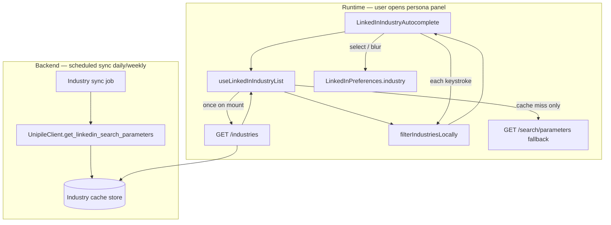

# LinkedIn Studio — Industry Auto-Suggest (Content Preferences & Persona)

## Implementation Plan

**Status:** Planning only (no code changes yet)  
**Last updated:** 2026-07-29  
**Architecture:** **Hybrid** — backend-cached LinkedIn industry list + frontend local filtering, with live API fallback  
**Scope:** Replace the free-text **Industry** field in **Content Preferences & Persona** with LinkedIn-native-style auto-suggestions, while preserving freestyle typing when suggestions are unavailable.

---

## 1. Feature Summary

### 1.1 Problem

| Reference | Current behavior |
|-----------|------------------|
| **Native LinkedIn** (Image 1) | When the user types in the **Industry** field (e.g. `"Art"`), LinkedIn shows a searchable dropdown of matching official industry names (`Retail Art Supplies`, `Performing Arts`, `Artificial Intelligence`, etc.). |
| **ALwrity LinkedIn Studio** (Image 2) | In **Content Preferences & Persona**, the **Industry** field is a plain text `<input>`. Users must type the full industry name manually with no suggestions. |

This creates friction, inconsistent industry naming, and weaker alignment with the user’s actual LinkedIn profile taxonomy.

### 1.2 Proposed Solution (Hybrid Architecture)

When the user types in the **Industry** field inside **Content Preferences & Persona**:

1. **Primary path (fast, no per-keystroke API):** Frontend loads the **full LinkedIn industry list once** from ALwrity’s backend cache, then **filters locally** as the user types — instant suggestions, no network call per character.
2. **Backend cache:** A scheduled job refreshes the industry list from LinkedIn (via Unipile) **once per day/week**. The list is stored server-side (file or DB), not hardcoded mock data.
3. **Fallback if cache is empty/stale:** Call the existing live Unipile keyword API (`GET /search/parameters?type=INDUSTRY&keywords=...`) for that session, or allow **freestyle typing** if both cache and live API fail.
4. **No suggestions match:** User keeps typing freely — existing behavior preserved.

### 1.3 Why Hybrid (vs live API-only)

| Concern | Live API on every keystroke | Hybrid (chosen) |
|---------|----------------------------|-----------------|
| Speed while typing | 300ms+ network delay per query | Instant local filter |
| API rate limits | Risk with many users typing | One fetch per user session + one sync job per day/week |
| LinkedIn connection required | Yes, per user | **No** — suggestions work for all users if cache is warm |
| Data accuracy | Always current | Refreshed on schedule; live API as fallback |
| Maintenance | Low | Moderate (sync job + cache storage) |
| Golden rule #5 | OK (real Unipile data) | OK — cache is **synced from Unipile**, not invented mock data |

### 1.4 Non-Goals (v1)

- Changing HITL forms (`PostHITL`, `ArticleHITL`, etc.) that use the separate `VALID_INDUSTRIES` dropdown.
- Persisting LinkedIn industry IDs in user preferences (optional future enhancement; v1 stores display **title** string only).
- Hardcoding a static industry list in frontend source code without Unipile sync.

---

## 2. Codebase Analysis (Golden Rule)

### 2.1 What already exists (reuse — do not duplicate)

| Piece | Location | Reuse for |
|-------|----------|-----------|
| **Industry input (target)** | `frontend/src/components/LinkedInWriter/components/ContentPersonaPreferencesBody.tsx` (lines 191–207) | Replace plain `<input>` with autocomplete component |
| **Persona modal shell** | `frontend/src/components/LinkedInWriter/components/Header.tsx` | Hosts `ContentPersonaPreferencesBody` — no structural change needed |
| **Preferences model** | `frontend/src/components/LinkedInWriter/utils/storageUtils.ts` → `LinkedInPreferences.industry: string` | Keep storing industry as string title in `localStorage` |
| **Live Unipile fallback** | `frontend/src/api/linkedinSocial.ts` → `getLinkedInSearchParameters()` | Fallback when cache missing |
| **Live backend fallback** | `backend/api/linkedin_search_routes.py` → `GET /search/parameters?type=INDUSTRY` | Fallback keyword lookup |
| **Unipile client** | `backend/services/integrations/linkedin/unipile_client.py` → `get_linkedin_search_parameters()` | **Cache sync source** — fetch industries from LinkedIn |
| **Search service** | `backend/services/integrations/linkedin/linkedin_search_service.py` → `get_search_parameters()` | Used by sync job and live fallback |
| **App-wide TTL cache** | `backend/services/analytics_cache_service.py` | Pattern reference for in-memory hot cache |
| **Growth cache wrapper** | `backend/services/linkedin/growth/cache.py` | Pattern for prefixed cache keys + TTL |
| **Scheduler** | `backend/services/scheduler/` + APScheduler | Register daily/weekly industry sync job |
| **Industry mapping util** | `frontend/.../linkedInWriterUtils.ts` → `mapIndustry()` | Update pass-through for native titles (Phase 3) |
| **HITL dropdowns** | `PostHITL.tsx`, etc. | Use `VALID_INDUSTRIES` — **do not modify** in v1 |

### 2.2 Architectural constraints

- **Extend** existing Unipile search-parameter infrastructure — do **not** create a second Unipile HTTP client.
- **Business logic** (sync, cache read/write, dedupe) stays in backend services; React components only handle UI + local filter.
- **No invented mock data** — cached list must originate from Unipile/LinkedIn sync; freestyle typing when cache and API both unavailable.
- Keep every new file **under 500 lines**.
- **Start from UI (Phase 1)** so autocomplete shell is testable before backend cache exists.
- **Do not break** existing preference persistence, copilot guidance, content generation, or Current Context chips.

### 2.3 Data flow (hybrid target state)



---

## 3. UI / UX Specification

### 3.1 Visual design (match native LinkedIn — Image 1)

| Element | Spec |
|---------|------|
| Input | Single-line text field with **search icon** on the left |
| Label | `Industry` (unchanged) |
| Dropdown | Appears below input when local filter returns matches |
| Dropdown items | Industry **title** from cached list (e.g. `Retail Art Supplies`, `Performing Arts`) |
| Highlight | Bold/accent matching substring (optional v1.1) |
| Scroll | Vertical scroll, max height ~240px |
| Styling | Match existing persona panel inline styles |

### 3.2 Interaction behavior

| Event | Behavior |
|-------|----------|
| **Persona panel opens** | Fetch full industry list from backend **once** (if not already in session memory) |
| **Focus + empty** | No dropdown |
| **Type ≥ 1 character** | Filter cached list **locally** (instant — no debounced API) |
| **Suggestions found** | Show dropdown; highlight first match |
| **Click suggestion** | Set value to `item.title`; save via `onPreferenceChange("industry", title)` |
| **Enter / Arrow keys** | Standard combobox keyboard navigation |
| **Escape** | Close dropdown; keep typed text |
| **Blur** | Close dropdown; save typed value (freestyle) |
| **No local matches** | Hide dropdown; user continues freestyle typing |
| **Cache loading** | Subtle spinner in field area on first load only |
| **Cache empty + live fallback** | One live API call with typed keywords (requires connected LinkedIn); else freestyle |
| **All failures** | Plain text input — identical to current behavior |

### 3.3 Filtering rules (frontend — local only)

| Rule | Value |
|------|-------|
| Filter function | Case-insensitive substring match on `title` |
| Min keyword length | **1 character** (local filter is cheap) |
| Max results shown | **20** (match native LinkedIn dropdown density) |
| Sort | Preserve cache order; optional: prefix matches first, then contains |
| Debounce | **None** for local filter (instant) |
| Live API debounce | 300ms — **only when cache fallback path is active** |

### 3.4 Current Context chip

No change — purple industry chip continues to display `userPreferences.industry`.

---

## 4. Backend Cache Design

### 4.1 Cache storage (recommended v1)

**Primary store:** JSON file on backend filesystem

```
backend/data/linkedin_industries_cache.json
```

**Schema:**

```json
{
  "version": 1,
  "synced_at": "2026-07-29T12:00:00Z",
  "source": "unipile",
  "item_count": 412,
  "items": [
    { "id": "123", "title": "Retail Art Supplies" },
    { "id": "456", "title": "Performing Arts" }
  ]
}
```

**Why file v1:** Simple, survives restarts, easy to inspect/debug, no migration required.  
**Future v2:** Move to DB table if multi-instance deployments need shared cache.

**Hot cache:** In-memory copy via `analytics_cache.raw_set("linkedin:industries:global", ...)` with TTL aligned to sync interval — avoids disk read on every request.

### 4.2 Sync job — how the full list is built

Unipile’s parameters endpoint is keyword-based and paginated. The sync job must **aggregate** results:

| Step | Action |
|------|--------|
| 1 | Resolve a **sync account** — any connected Unipile LinkedIn account (see §4.3) |
| 2 | Fetch industries using **alphabet prefix strategy**: keywords = `a`, `b`, … `z`, plus common seeds (`tech`, `art`, `health`, etc.) OR empty/broad queries if Unipile supports them |
| 3 | Use `limit=100` per request (Unipile max) |
| 4 | **Dedupe** by `id` across all responses |
| 5 | Write merged list to cache file + refresh in-memory hot cache |
| 6 | Log `item_count`, `synced_at`, duration, errors |

**Schedule:** Daily at off-peak (e.g. 04:00 UTC) via existing APScheduler in `backend/services/scheduler/`.  
**TTL:** Treat cache as stale after **7 days**; live API fallback still works if sync fails temporarily.

### 4.3 Sync account requirement

Industry sync requires **at least one** connected LinkedIn account in the system to call Unipile.

| Option | Recommendation |
|--------|----------------|
| Use first available connected account | **v1 default** — simplest |
| Dedicated ALwrity service account | Better long-term for production |
| Skip sync if no account | Cache stays empty; users get live API fallback or freestyle |

If no account is connected anywhere, log a warning and serve empty cache — frontend falls back gracefully.

### 4.4 New backend API endpoint

```
GET /api/linkedin-social/industries
```

| Property | Value |
|----------|-------|
| Auth | `get_current_user` (authenticated ALwrity user) |
| Response | `{ success, items: [{ id, title }], synced_at, item_count, cache_status: "warm" \| "stale" \| "empty" }` |
| Does NOT require | User’s personal LinkedIn to be connected |
| Source | Read from hot cache → file cache → return |

**Do not** expose Unipile account IDs or API keys in this response.

### 4.5 Live API fallback (existing — reuse)

When cache is empty or user’s query finds no local matches and product wants deeper search:

```
GET /api/linkedin-social/search/parameters?type=INDUSTRY&keywords={query}&limit=20
```

Requires user’s LinkedIn connected. Used sparingly — not on every keystroke.

---

## 5. Phase Plan

### Phase 1 — Frontend UI components

**Goal:** Build autocomplete UI with **local filtering** against sample data — no backend dependency yet.

#### Step 1.1 — Create autocomplete component

**New file:** `frontend/src/components/LinkedInWriter/components/LinkedInIndustryAutocomplete.tsx`

| Responsibility | Details |
|----------------|---------|
| Controlled input | `value`, `onChange`, `placeholder` |
| Suggestions | `suggestions: { id: string; title: string }[]`, `isLoading`, `isOpen` |
| Events | `onSelect`, keyboard nav, blur handling |
| Freestyle | Always allow free typing |

#### Step 1.2 — Create local filter utility

**New file:** `frontend/src/components/LinkedInWriter/utils/filterLinkedInIndustries.ts`

```typescript
export function filterLinkedInIndustries(
  items: { id: string; title: string }[],
  query: string,
  limit = 20,
): { id: string; title: string }[]
```

Pure function — case-insensitive match, cap at 20 results. Unit-testable.

#### Step 1.3 — Integrate into persona body

**Modify:** `ContentPersonaPreferencesBody.tsx`

- Replace Industry `<input>` with `<LinkedInIndustryAutocomplete />`.
- Phase 1: pass a **small sample list** (5–10 items) for UI/keyboard QA.

#### Phase 1 exit criteria

- [ ] Search icon + dropdown UI matches native LinkedIn layout.
- [ ] Local filter works instantly as user types (sample data).
- [ ] Keyboard navigation (Up/Down/Enter/Escape) works.
- [ ] Freestyle typing saves via `onPreferenceChange`.
- [ ] Mobile + desktop persona modals render correctly.
- [ ] No regression to other persona fields.

---

### Phase 2 — Backend foundation (cache + sync + API)

**Goal:** Backend stores LinkedIn’s industry list, refreshes on schedule, and serves it via a dedicated endpoint. Live Unipile API remains available as fallback.

#### Step 2.1 — Industry cache service

**New file:** `backend/services/integrations/linkedin/linkedin_industry_cache_service.py`

| Function | Responsibility |
|----------|----------------|
| `load_cache()` | Read JSON file + populate hot cache |
| `get_industries()` | Return cached items + metadata (`synced_at`, `cache_status`) |
| `save_cache(items)` | Write JSON file + update hot cache |
| `is_cache_stale()` | True if older than 7 days or missing |
| `sync_industries_from_unipile(account_id)` | Orchestrate Unipile fetch + dedupe + save |

Reuse `get_search_parameters()` / `UnipileClient` — do not duplicate HTTP logic.

#### Step 2.2 — Industry sync job

**New file:** `backend/services/integrations/linkedin/linkedin_industry_sync_job.py`

- Entry point: `sync_linkedin_industries_scheduled()`
- Register in `backend/services/scheduler/__init__.py` as daily cron (04:00 UTC)
- Resolve sync account from connected OAuth credentials
- Log with prefix `[LinkedInIndustrySync]`

#### Step 2.3 — API route

**Modify or extend:** `backend/api/linkedin_search_routes.py` (or sibling route file if >500 lines)

| Method | Path | Handler |
|--------|------|---------|
| `GET` | `/api/linkedin-social/industries` | Return cached industry list |
| `POST` | `/api/linkedin-social/industries/sync` | **Admin/dev only** — manual cache refresh trigger (optional) |

#### Step 2.4 — Pydantic models

**Modify:** `backend/models/linkedin_search_models.py`

Add:

- `LinkedInIndustryItem` (`id`, `title`)
- `LinkedInIndustriesCacheResponse` (`success`, `items`, `synced_at`, `item_count`, `cache_status`)

#### Step 2.5 — Initial cache seed

On first deploy / empty cache:

1. Run manual sync script: `backend/scripts/sync_linkedin_industries.py` (new, optional)
2. Or trigger sync on app startup **if cache file missing** (lazy bootstrap — log clearly)

**No hardcoded industry titles in code** — seed must come from Unipile.

#### Step 2.6 — Backend tests

**New file:** `backend/tests/functional/linkedin/test_linkedin_industry_cache.py`

| Test case | Expected |
|-----------|----------|
| `GET /industries` with warm cache | 200 + items array |
| Empty cache file | 200 + `cache_status: "empty"`, `items: []` |
| Sync job dedupes by id | Unit test with mocked Unipile responses |
| Stale cache detection | `is_cache_stale()` after 7 days |
| Sync with no connected account | Warning log; cache unchanged |

#### Phase 2 exit criteria

- [ ] `GET /api/linkedin-social/industries` returns cached list for authenticated users.
- [ ] Scheduled sync job registered and runnable manually.
- [ ] Cache file written after successful sync.
- [ ] Live `/search/parameters?type=INDUSTRY` still works as fallback.
- [ ] Tests added (user runs manually per project rule).

---

### Phase 3 — Wire frontend ↔ backend

**Goal:** Replace sample data with cached industry list; filter locally on keystroke; live API fallback only when needed.

#### Step 3.1 — Frontend API client

**Modify:** `frontend/src/api/linkedinSocial.ts`

Add:

```typescript
export async function getLinkedInIndustries(): Promise<LinkedInIndustriesCacheResponse>
```

#### Step 3.2 — Industry list hook

**New file:** `frontend/src/components/LinkedInWriter/hooks/useLinkedInIndustryList.ts`

| Responsibility | Details |
|----------------|---------|
| On mount | Call `getLinkedInIndustries()` **once** per session |
| Session cache | Hold list in React state; optional `sessionStorage` with `synced_at` for tab refresh |
| Output | `{ industries, isLoading, cacheStatus, error }` |
| Fallback | If `cacheStatus === "empty"`, expose `fetchLiveSuggestions(keywords)` using existing `getLinkedInSearchParameters` |

**Rename note:** Hook is `useLinkedInIndustryList` (loads full list), not per-keystroke suggestions.

#### Step 3.3 — Wire autocomplete

**Modify:** `LinkedInIndustryAutocomplete.tsx` + `ContentPersonaPreferencesBody.tsx`

```
user types → filterLinkedInIndustries(industries, query) → show dropdown
```

- Remove Phase 1 sample data.
- Live API fallback: only when `industries.length === 0` AND user connected AND query length ≥ 2 (debounced 300ms).

#### Step 3.4 — Update `mapIndustry` pass-through

**Modify:** `frontend/src/components/LinkedInWriter/utils/linkedInWriterUtils.ts`

1. Exact match in `VALID_INDUSTRIES` → return as today.
2. Heuristic keyword match → return as today.
3. **Else if** non-empty trimmed input → **return trimmed input as-is**.
4. Only default to `"Technology"` when input is empty.

#### Step 3.5 — Verify downstream consumers

Manual QA on: `LinkedInWriter.tsx`, `RegisterLinkedInActions.tsx`, `useLinkedInWriter.ts`, `QuickCreate.tsx`, `CopilotActions.tsx`.

#### Phase 3 exit criteria

- [ ] Typing `"Art"` filters cached list instantly (no per-keystroke network call).
- [ ] Industry list loaded once when persona panel opens.
- [ ] Selecting suggestion updates Current Settings + Current Context chip.
- [ ] Preference persists across reload.
- [ ] Freestyle typing works when no matches.
- [ ] Empty cache → live API fallback (if connected) or freestyle.
- [ ] **LinkedIn not connected:** suggestions still work if backend cache is warm.

---

### Phase 4 — Exception handling and debugging logs

**Goal:** Production-ready observability and graceful degradation.

#### Step 4.1 — Frontend error handling

| Scenario | UX |
|----------|-----|
| `GET /industries` fails | Freestyle input; optional subtle "Suggestions unavailable" |
| Empty cache | Try live API if connected; else freestyle |
| Live fallback fails | Freestyle silently |
| Session list already loaded | Do not refetch on every panel open (use in-memory cache) |

#### Step 4.2 — Backend logging

**Prefix:** `[LinkedInIndustryCache]` for read/serve; `[LinkedInIndustrySync]` for sync job.

| Log point | Level | Fields |
|-----------|-------|--------|
| Cache read hit | DEBUG | `item_count`, `cache_status` |
| Cache miss / empty | WARNING | — |
| Sync start | INFO | `account_id` (masked), strategy |
| Sync complete | INFO | `item_count`, `duration_ms`, `synced_at` |
| Sync failure | ERROR | `error_type` (no secrets) |
| Dedupe stats | INFO | `raw_count`, `deduped_count` |
| Live fallback call | INFO | `[LinkedInIndustrySuggest]` `keywords_len` |

#### Step 4.3 — Edge cases

| Case | Expected |
|------|----------|
| Rapid typing | Local filter only — no request storm |
| Modal close/reopen | Reuse session-cached list |
| Cache updated while user typing | Accept stale list until next session (acceptable v1) |
| User edits after selecting suggestion | Freestyle override |
| Special characters in query | Local string match handles normally |
| Very long input (>100 chars) | Stop filtering; allow freestyle save |

#### Phase 4 exit criteria

- [ ] All error paths fall back to freestyle without breaking persona modal.
- [ ] Logs searchable by `[LinkedInIndustryCache]` / `[LinkedInIndustrySync]`.
- [ ] No secrets in logs.
- [ ] Manual QA on edge-case checklist.

---

## 6. Files Summary

### 6.1 New files

| File | Phase | Reason |
|------|-------|--------|
| `frontend/.../LinkedInIndustryAutocomplete.tsx` | 1 | Autocomplete UI component |
| `frontend/.../utils/filterLinkedInIndustries.ts` | 1 | Pure local filter function |
| `frontend/.../hooks/useLinkedInIndustryList.ts` | 3 | Load cached list once per session |
| `backend/.../linkedin_industry_cache_service.py` | 2 | Cache read/write + sync orchestration |
| `backend/.../linkedin_industry_sync_job.py` | 2 | Scheduled Unipile sync |
| `backend/data/linkedin_industries_cache.json` | 2 | Persisted cache (gitignore or committed after first sync — team decision) |
| `backend/scripts/sync_linkedin_industries.py` | 2 | Manual sync trigger (optional) |
| `backend/tests/functional/linkedin/test_linkedin_industry_cache.py` | 2 | Cache + sync tests |

### 6.2 Modified files

| File | Phase | Change |
|------|-------|--------|
| `ContentPersonaPreferencesBody.tsx` | 1, 3 | Swap Industry input for autocomplete |
| `linkedinSocial.ts` | 3 | Add `getLinkedInIndustries()` |
| `linkedInWriterUtils.ts` | 3 | `mapIndustry()` pass-through |
| `linkedin_search_models.py` | 2 | New response models |
| `linkedin_search_routes.py` | 2 | Add `GET /industries` |
| `backend/services/scheduler/__init__.py` | 2 | Register daily sync job |

### 6.3 Reused unchanged (fallback only)

| File | Role |
|------|------|
| `unipile_client.py` | Sync source + live fallback |
| `linkedin_search_service.py` | `get_search_parameters()` for sync + fallback |
| `GET /search/parameters` | Live keyword fallback when cache empty |

### 6.4 Explicitly not modified (v1)

| File | Reason |
|------|--------|
| HITL forms (`PostHITL`, etc.) | Separate UX surface |
| `storageUtils.ts` | `industry: string` unchanged |

---

## 7. Backward Compatibility

| Area | Risk | Mitigation |
|------|------|------------|
| Existing saved preferences | Low | Still a string; `"Technology"` etc. still work |
| `mapIndustry()` change | Medium | Pass-through for unknown non-empty strings |
| HITL forms | None | Untouched |
| Users without LinkedIn connected | **Improved** | Suggestions work from server cache |
| Copilot / generation | Low | Better industry fidelity with native titles |

---

## 8. Manual Test Plan

### 8.1 Warm cache (primary path)

1. Ensure backend cache is populated (run sync script or wait for scheduled job).
2. Open **Content Preferences & Persona**.
3. Type `Art` → dropdown appears **instantly** with matches.
4. Open Network tab → confirm **no API call per keystroke** (only initial `GET /industries`).
5. Select a suggestion → Current Settings + chip update.
6. Reload → value persists.

### 8.2 Empty cache (fallback path)

1. Delete/rename cache file; restart backend.
2. Open persona panel → `GET /industries` returns empty.
3. With LinkedIn connected: type `Art` → live API fallback may show results (debounced).
4. Without LinkedIn connected: freestyle typing only, no errors.

### 8.3 Disconnected LinkedIn (improved UX)

1. Disconnect LinkedIn (or use account without connection).
2. With warm server cache: type in Industry → suggestions still appear locally.
3. Confirm no "Connect LinkedIn" blocking message for suggestions.

### 8.4 Regression + error simulation

1. Other persona fields unchanged.
2. Stop backend → freestyle works, no crash.
3. Mobile modal layout intact.

---

## 9. Implementation Order Recap

```
Phase 1  →  Autocomplete UI + local filter utility (sample data)
Phase 2  →  Backend cache store + sync job + GET /industries endpoint
Phase 3  →  Load cache once in frontend + local filter + live API fallback + mapIndustry
Phase 4  →  Exception handling + Loguru logging polish
```

---

## 10. Resolved Decisions

| # | Decision | Choice |
|---|----------|--------|
| 1 | Architecture | **Hybrid** — cached list + local filter |
| 2 | Per-keystroke API | **No** — filter locally; live API only as fallback |
| 3 | Cache refresh | **Daily** sync (04:00 UTC); stale after 7 days |
| 4 | Cache storage v1 | **JSON file** + in-memory hot cache |
| 5 | Min keyword length (local) | **1 character** |
| 6 | Max dropdown results | **20** |
| 7 | Store LinkedIn `id` in preferences | **Defer** — v1 title only |
| 8 | Requires user LinkedIn connected for suggestions | **No** (if server cache warm) |

---

## 11. References

- Native LinkedIn industry autocomplete (user-provided Image 1)
- Current ALwrity Industry field (user-provided Image 2)
- Related plan: `docs/linkedin/LINKEDIN_STUDIO_SEARCH_IMPLEMENTATION_PLAN.md`
- Golden rule: `.cursor/rules/golden-rule.mdc`
