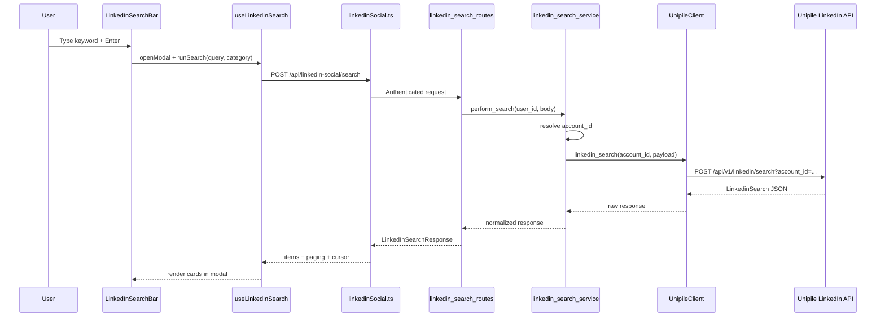

# LinkedIn Studio — Native Search Feature

## Implementation Plan

**Status:** Planning only (no code changes yet)  
**Last updated:** 2026-07-04  
**Scope:** Add a LinkedIn-style search bar in the LinkedIn Studio header that opens a results popup with category filters, powered by two new Unipile API endpoints.

---

## 1. Feature Summary

End users will see a search bar to the right of the **LinkedIn Studio** title in the header (see reference UI). When they type a keyword and press Enter:

1. A full-screen modal opens (similar to native LinkedIn search results).
2. A horizontal filter bar at the top lets them switch between the **4 supported result types**: Posts, Jobs, People, and Companies.
3. Results are fetched from Unipile and rendered in a type-specific card layout.
4. Users can load more results via cursor-based pagination.
5. Advanced filters (location, industry, company, etc.) can be added in a secondary filter panel using the **Retrieve LinkedIn search parameters** endpoint.

This feature is **read-only discovery** — it does not change posting, profile optimization, or any existing LinkedIn Studio workflows.

---

## 2. Codebase Analysis (Golden Rule)

### 2.1 What already exists (reuse — do not duplicate)

| Piece | Location | Reuse for |
|-------|----------|-----------|
| LinkedIn Studio header shell | `frontend/src/components/LinkedInWriter/components/Header.tsx` | Insert search bar between title block and center tools |
| Modal / portal pattern | `frontend/src/components/LinkedInWriter/components/dashboard/DashboardActionModal.tsx` | Base pattern for search results popup (extend or compose) |
| LinkedIn connection state | `frontend/src/hooks/useLinkedInSocialConnection.ts` | Gate search behind `connected` + resolve `account_id` |
| Social API client | `frontend/src/api/linkedinSocial.ts` | Add `searchLinkedIn()` and `getLinkedInSearchParameters()` |
| Unipile HTTP client | `backend/services/integrations/linkedin/unipile_client.py` | **Extend** with `linkedin_search()` and `get_search_parameters()` |
| Provider factory | `backend/services/integrations/linkedin/factory.py` | Search only works when `LINKEDIN_PROVIDER=unipile` |
| Social API routes | `backend/api/linkedin_social_routes.py` | Reuse `_resolve_user_account_id()`, auth, error mapping patterns |
| Pydantic models | `backend/models/linkedin_social_models.py` | Extend or add sibling search models |
| Router registration | `backend/alwrity_utils/router_manager.py` | Register new search router (if split) |
| Error types | `UnipileAPIError`, `LinkedInNotConnectedError` | Map to user-friendly HTTP responses |

### 2.2 Architectural constraints

- **Extend** `UnipileClient` — never create a second Unipile HTTP client.
- **Business logic** lives in a new service, not in routes or React components.
- **No mock/fallback data** — if Unipile returns an error or the account is disconnected, show a clear message.
- Keep every new file **under 500 lines**; split UI cards by result type.
- **Start from UI (Phase 1)** so each step is testable through the user experience.

### 2.3 Supported search categories (v1 scope)

Unipile **Classic Search** supports **4 categories**. The filter bar will include **only these 4 tabs** — no additional native LinkedIn tabs (Groups, Products, Schools, Courses, Events, Services) in v1.

| UI filter tab | Unipile Classic `category` | Result `type` |
|---------------|---------------------------|---------------|
| Posts | `posts` | `POST` |
| Jobs | `jobs` | `JOB` |
| People | `people` | `PEOPLE` |
| Companies | `companies` | `COMPANY` |

**Default active tab:** Posts (first tab, selected on modal open).

**Rate limits (Unipile):** Classic search should not exceed `limit=50` per request. Default to `limit=10` in UI, load more via `cursor`.

---

## 3. UI / UX Brainstorm

### 3.1 Header search bar placement

```
[ALwrity logo] [LinkedIn Studio / ALwrity]  [ 🔍 Search LinkedIn...          ]  [Optimise Profile] [Persona] ...
                                              ↑ insert here (marked box in UI mockup)
```

**Design tokens (match existing header):**

- Background: `#ffffff`
- Border: `1px solid rgba(10, 102, 194, 0.15)`
- Focus ring: `#0a66c2` (NAV_TITLE_COLOR)
- Border radius: `24px` (pill shape, like native LinkedIn)
- Max width: `280px` on desktop; collapses to icon on narrow screens
- Placeholder: `Search`
- Magnifying glass icon on the left inside the input

**Behaviour:**

- `Enter` → open modal and run search with active category (default: **Posts**, the first of the 4 supported tabs).
- `Escape` → close modal if open; clear input optional.
- Disabled + tooltip when LinkedIn not connected: *"Connect LinkedIn to search"*.

### 3.2 Search results modal layout

```
┌─────────────────────────────────────────────────────────────────────────────┐
│  🔍  AI digital marketing                                          [✕]      │
├─────────────────────────────────────────────────────────────────────────────┤
│  [Posts] [Jobs] [People] [Companies]                                        │  ← 4 category pills only
├─────────────────────────────────────────────────────────────────────────────┤
│  [All filters ▾]  Location ▾  Industry ▾  ...          (Phase 1.5)         │
├─────────────────────────────────────────────────────────────────────────────┤
│                                                                             │
│  ┌─ Result card ─────────────────────────────────────────────────────┐     │
│  │  (type-specific layout — see §3.3)                                 │     │
│  └────────────────────────────────────────────────────────────────────┘     │
│  ┌─ Result card ─────────────────────────────────────────────────────┐     │
│  └────────────────────────────────────────────────────────────────────┘     │
│                                                                             │
│  [ Load more ]                         Showing 10 of 4,433,432 results       │
└─────────────────────────────────────────────────────────────────────────────┘
```

**Modal specs:**

- Full viewport overlay (`position: fixed; inset: 0`)
- White content panel, max-width `960px`, centered, `min(92vh, 800px)` height
- Reuse portal pattern from `DashboardActionModal` but wider (`maxWidth: 960`)
- Backdrop click closes modal
- `aria-modal`, `role="dialog"`, focus trap on open

### 3.3 Result card designs by `type`

#### PEOPLE card

```
┌──────────────────────────────────────────────────────────┐
│ [Avatar]  Jane Doe  ·  2nd                           [↗] │
│           Headline text (truncated 2 lines)              │
│           Location · Industry                            │
│           Current: Role at Company                       │
│           500+ connections · 1.2K followers              │
│           ○ Verified  ○ Premium  ○ Open profile          │
└──────────────────────────────────────────────────────────┘
```

**Fields used:** `profile_picture_url`, `name`, `headline`, `location`, `industry`, `current_positions[0].role`, `current_positions[0].company`, `connections_count`, `followers_count`, `verified`, `premium`, `network_distance`, `public_profile_url` (open in new tab on click).

#### COMPANY card

```
┌──────────────────────────────────────────────────────────┐
│ [Logo]   Acme Corp                                    [↗] │
│          Software Development · San Francisco, CA         │
│          1,234 followers · 12 job offers                  │
│          Summary text (truncated 3 lines)...              │
└──────────────────────────────────────────────────────────┘
```

**Fields used:** `name`, `industry`, `location`, `followers_count`, `job_offers_count`, `headcount`, `summary`, `profile_url`.

#### POST card

```
┌──────────────────────────────────────────────────────────┐
│ [Author avatar]  Author Name                              │
│                  Headline · 2h                            │
│  Post text (truncated 4 lines, "see more" expand)         │
│  [Image thumbnail if attachments type=img]                │
│  👍 24   💬 5   ↗ 2                    [Open on LinkedIn]│
└──────────────────────────────────────────────────────────┘
```

**Fields used:** `author.profile_picture_url`, `author.name`, `author.headline`, `date` / `parsed_datetime`, `text`, first `attachments` image, `reaction_counter`, `comment_counter`, `repost_counter`, `share_url`.

#### JOB card

```
┌──────────────────────────────────────────────────────────┐
│ [Company logo]  Senior Software Engineer                  │
│                 Acme Corp · Remote · Posted 3d ago        │
│                 Easy Apply · Promoted                     │
│                 Benefits: medical_insurance, 401(k)       │
│                                              [View job ↗] │
└──────────────────────────────────────────────────────────┘
```

**Fields used:** `title`, `company.name`, `company.profile_picture_url`, `location`, `posted_at`, `easy_apply`, `promoted`, `benefits`, `url`.

### 3.4 States to design

| State | UI treatment |
|-------|--------------|
| Initial (no search yet) | Modal opens with empty state: "Enter a keyword to search LinkedIn" |
| Loading | Skeleton cards (3–5 shimmer rows) |
| Empty results | "No results for '{keyword}' in {category}. Try another filter." |
| Error — not connected | Banner: "Connect your LinkedIn account to search." + Connect CTA |
| Error — Unipile rate limit | "Search limit reached. Try again in a few minutes." |
| Error — generic | Show safe error message from backend; log details server-side |
| Pagination loading | "Load more" button shows spinner; append results below |

### 3.5 Advanced filters (Phase 1.5 — optional within Phase 1 UI shell)

Use **Retrieve search parameters** for autocomplete chips:

| Filter label | Parameter `type` | Applied to search as |
|--------------|------------------|----------------------|
| Location | `LOCATION` | `location: ["<id>"]` |
| Industry | `INDUSTRY` | `industry: ["<id>"]` |
| Company | `COMPANY` | `company: ["<id>"]` |
| School | `SCHOOL` | `school: ["<id>"]` |
| Service | `SERVICE` | `service: ["<id>"]` |

Flow: user types in filter autocomplete → `GET /search/parameters?type=LOCATION&keywords=los+angeles` → show dropdown of `{ id, title, picture_url }` → on select, add chip and re-run search.

---

## 4. API Contract (ALwrity backend → frontend)

All routes under existing prefix **`/api/linkedin-social`** (keeps social features together) or new prefix **`/api/linkedin-social/search`** (preferred — avoids bloating the 2,300-line routes file).

### 4.1 Perform search

```
POST /api/linkedin-social/search
```

**Request body:**

```json
{
  "keywords": "AI digital marketing",
  "category": "posts",
  "api": "classic",
  "limit": 10,
  "cursor": null,
  "filters": {
    "location": [],
    "industry": [],
    "company": [],
    "past_company": [],
    "school": [],
    "service": [],
    "network_distance": [],
    "sort_by": "relevance",
    "date_posted": null
  }
}
```

**Response:** Normalized wrapper around Unipile payload:

```json
{
  "success": true,
  "object": "LinkedinSearch",
  "items": [ /* typed result objects */ ],
  "paging": { "start": 0, "page_count": 10, "total_count": 4433432 },
  "cursor": "eyJ...",
  "active_category": "posts",
  "provider": "unipile"
}
```

**Backend responsibilities:**

- Resolve `account_id` from stored user credentials (same as publish/profile routes).
- Inject `keywords` into Unipile POST body.
- Pass `cursor` / `limit` as query params to Unipile.
- Validate `category` is one of supported v1 values.
- Return `503` if `LINKEDIN_PROVIDER != unipile`.
- Map `UnipileAPIError` → appropriate HTTP status + safe message.

### 4.2 Retrieve search parameters

```
GET /api/linkedin-social/search/parameters?type=LOCATION&keywords=los%20angeles&limit=20
```

**Response:**

```json
{
  "success": true,
  "object": "LinkedinSearchParametersList",
  "items": [
    { "id": "102277331", "title": "Los Angeles, California", "picture_url": null }
  ],
  "paging": { "page_count": 5 }
}
```

---

## 5. File Plan

### 5.1 Files to modify

| File | Reason |
|------|--------|
| `frontend/src/components/LinkedInWriter/components/Header.tsx` | Add `LinkedInSearchBar` next to title block |
| `frontend/src/api/linkedinSocial.ts` | Add search API functions + TypeScript interfaces |
| `backend/services/integrations/linkedin/unipile_client.py` | Add `linkedin_search()` and `get_linkedin_search_parameters()` |
| `backend/models/linkedin_social_models.py` | Add request/response Pydantic models (or import from new module) |
| `backend/alwrity_utils/router_manager.py` | Register search routes if split to new file |

### 5.2 New files to create

| File | Reason |
|------|--------|
| `frontend/src/components/LinkedInWriter/components/search/LinkedInSearchBar.tsx` | Pill search input in header |
| `frontend/src/components/LinkedInWriter/components/search/LinkedInSearchModal.tsx` | Full results popup shell |
| `frontend/src/components/LinkedInWriter/components/search/LinkedInSearchFilterBar.tsx` | Horizontal category pills |
| `frontend/src/components/LinkedInWriter/components/search/LinkedInSearchResultsList.tsx` | Scrollable results + pagination |
| `frontend/src/components/LinkedInWriter/components/search/cards/PeopleResultCard.tsx` | PEOPLE layout |
| `frontend/src/components/LinkedInWriter/components/search/cards/CompanyResultCard.tsx` | COMPANY layout |
| `frontend/src/components/LinkedInWriter/components/search/cards/PostResultCard.tsx` | POST layout |
| `frontend/src/components/LinkedInWriter/components/search/cards/JobResultCard.tsx` | JOB layout |
| `frontend/src/components/LinkedInWriter/components/search/cards/SearchResultCard.tsx` | Dispatcher by `type` |
| `frontend/src/components/LinkedInWriter/components/search/linkedinSearchTypes.ts` | Shared TS types |
| `frontend/src/components/LinkedInWriter/components/search/linkedinSearchConstants.ts` | Category labels, API mapping |
| `frontend/src/components/LinkedInWriter/hooks/useLinkedInSearch.ts` | Search state, pagination, filter logic |
| `backend/services/integrations/linkedin/linkedin_search_service.py` | Business logic: validate, call Unipile, normalize |
| `backend/api/linkedin_search_routes.py` | Thin FastAPI routes (keeps `linkedin_social_routes.py` slim) |
| `backend/tests/services/integrations/linkedin/test_linkedin_search_service.py` | Service unit tests |
| `backend/tests/api/test_linkedin_search_routes.py` | Route integration tests |

---

## 6. Requirements / Dependencies

### 6.1 `requirements.txt`

**No new packages required.** Existing dependencies cover this feature:

| Need | Already in `requirements.txt` |
|------|-------------------------------|
| HTTP calls to Unipile | `httpx` |
| API framework | `fastapi`, `uvicorn` |
| Validation | `pydantic` |
| Logging | `loguru` |

### 6.2 Environment variables (already used)

| Variable | Purpose |
|----------|---------|
| `LINKEDIN_PROVIDER` | Must be `unipile` for search to work |
| `UNIPILE_API_KEY` | Unipile authentication |
| `UNIPILE_DSN` | Unipile host (e.g. `api1.unipile.com:13111`) |

### 6.3 Frontend dependencies

**No new npm packages required.** Build with existing React, `createPortal`, inline styles (matching LinkedIn Writer patterns). Optional later: debounce utility already available via existing hooks/lodash if used elsewhere.

---

## 7. Implementation Phases

---

### Phase 1 — Frontend UI (no live API yet)

**Goal:** User can see and interact with the full search experience using UI shell and typed mock-free empty/loading states. Wire to stub handlers that return "not implemented" until Phase 2.

#### Step 1.1 — Search bar in header

- [ ] Create `LinkedInSearchBar.tsx` (pill input, magnifying glass, Enter key handler).
- [ ] Insert into `Header.tsx` left section, after title `<div>`, before center tools.
- [ ] Accept `disabled` prop from `useLinkedInSocialConnection().connected`.
- [ ] Responsive: hide placeholder text on very narrow widths.

#### Step 1.2 — Search modal shell

- [ ] Create `LinkedInSearchModal.tsx` with portal, backdrop, close button, keyword display in header.
- [ ] Manage open/close state in `useLinkedInSearch` hook or local `Header` state.

#### Step 1.3 — Filter bar (category pills)

- [ ] Create `LinkedInSearchFilterBar.tsx` with **4 tabs only**: Posts, Jobs, People, Companies.
- [ ] Define tab order and `category` mapping in `linkedinSearchConstants.ts`.
- [ ] Active pill style: filled `#0a66c2` background, white text.
- [ ] Inactive: white background, `#666` border (match native LinkedIn pill style).

#### Step 1.4 — Result cards (static layout)

- [ ] Build all 4 card components using the field mapping in §3.3.
- [ ] Create `SearchResultCard.tsx` dispatcher on `item.type`.
- [ ] Create `LinkedInSearchResultsList.tsx` with scrollable list area.

#### Step 1.5 — UI states

- [ ] Loading skeleton component.
- [ ] Empty state component.
- [ ] Error banner component (not connected, generic error).
- [ ] "Load more" footer button (disabled until Phase 3).

#### Step 1.6 — Hook scaffold

- [ ] Create `useLinkedInSearch.ts` with state: `query`, `category`, `items`, `cursor`, `loading`, `error`, `paging`.
- [ ] Expose `runSearch()`, `setCategory()`, `loadMore()`, `reset()`.

**Phase 1 test checklist (manual, no backend):**

- [ ] Search bar visible in correct header position on Dashboard, Growth Engine, Post Analytics tabs.
- [ ] Enter opens modal with keyword shown in modal header.
- [ ] Filter pills switch active state visually.
- [ ] Escape / backdrop / ✕ closes modal.
- [ ] Disabled state when LinkedIn disconnected.
- [ ] Layout does not break existing header controls on 1280px and 768px widths.

---

### Phase 2 — Backend foundation

**Goal:** ALwrity backend can proxy search and parameter lookup to Unipile for authenticated users with a connected account.

#### Step 2.1 — Extend Unipile client

Add to `unipile_client.py`:

```python
async def linkedin_search(
    self,
    account_id: str,
    payload: dict[str, Any],
    *,
    cursor: str | None = None,
    limit: int = 10,
) -> dict[str, Any]:
    """POST /api/v1/linkedin/search"""

async def get_linkedin_search_parameters(
    self,
    account_id: str,
    parameter_type: str,
    *,
    keywords: str | None = None,
    limit: int = 10,
    service: str = "CLASSIC",
) -> dict[str, Any]:
    """GET /api/v1/linkedin/search/parameters"""
```

- Log request metadata (account_id, category, keywords — never log API key).
- Use existing `_auth_headers`, `_raise_for_error`, `_get_full_url`.

#### Step 2.2 — Search service

Create `linkedin_search_service.py`:

| Function | Responsibility |
|----------|----------------|
| `perform_search(user_id, request)` | Resolve account, build Unipile payload, call client, return normalized dict |
| `get_search_parameters(user_id, type, keywords, limit)` | Resolve account, call parameters endpoint |
| `_build_unipile_payload(request)` | Map ALwrity request → Unipile JSON body |
| `_validate_category(category)` | Allow only v1 categories |
| `_ensure_unipile_provider()` | Raise clear error if provider != unipile |

#### Step 2.3 — Pydantic models

Add models (in `linkedin_social_models.py` or `linkedin_search_models.py`):

- `LinkedInSearchRequest`
- `LinkedInSearchFilters`
- `LinkedInSearchResponse`
- `LinkedInSearchParameterItem`
- `LinkedInSearchParametersResponse`
- `LinkedInSearchResultItem` (flexible `Dict[str, Any]` or typed union for known types)

#### Step 2.4 — API routes

Create `linkedin_search_routes.py`:

| Method | Path | Handler |
|--------|------|---------|
| `POST` | `/api/linkedin-social/search` | `perform_linkedin_search` |
| `GET` | `/api/linkedin-social/search/parameters` | `get_linkedin_search_parameters` |

- Auth: `Depends(get_current_user)` (same as other social routes).
- Error mapping: reuse pattern from `linkedin_social_routes.py` (`_resolve_user_account_id`, `LinkedInNotConnectedError` → 403, `UnipileAPIError` → 502/429).

#### Step 2.5 — Router registration

- [ ] Add `linkedin_search` entry to `CORE_ROUTER_REGISTRY` in `router_manager.py`.

#### Step 2.6 — Tests

- [ ] Unit test: payload builder maps `keywords` + `category` correctly.
- [ ] Unit test: invalid category rejected.
- [ ] Unit test: non-unipile provider returns clear error.
- [ ] Route test: 401 without auth, 403 when not connected (mocked).

**Phase 2 test checklist:**

- [ ] `POST /api/linkedin-social/search` returns real Unipile results for connected test account.
- [ ] `GET /api/linkedin-social/search/parameters?type=LOCATION&keywords=india` returns parameter list.
- [ ] Cursor pagination returns next page when `cursor` passed.
- [ ] Logs appear in backend for search entry, Unipile response metadata, completion.

---

### Phase 3 — Wire frontend to backend

**Goal:** End-to-end search from header → modal → live Unipile results.

#### Step 3.1 — API client functions

Add to `linkedinSocial.ts`:

```typescript
export async function searchLinkedIn(request: LinkedInSearchRequest): Promise<LinkedInSearchResponse>
export async function getLinkedInSearchParameters(params: LinkedInSearchParametersQuery): Promise<LinkedInSearchParametersResponse>
export function getLinkedInSearchErrorMessage(error: unknown): string
```

#### Step 3.2 — Connect hook to API

- [ ] `runSearch()` calls `searchLinkedIn()` on Enter and on category change.
- [ ] `loadMore()` passes `cursor` from previous response.
- [ ] Debounce rapid filter switches (300ms) to avoid Unipile rate limits.
- [ ] Cancel in-flight request on new search (AbortController).

#### Step 3.3 — Render live data

- [ ] Pass `items` from API into `LinkedInSearchResultsList`.
- [ ] Show `paging.total_count` in footer ("Showing X of Y results").
- [ ] Enable "Load more" when `cursor` is present.
- [ ] External link buttons open `public_profile_url` / `share_url` / `url` in new tab.

#### Step 3.4 — Error handling

- [ ] Map backend errors to user-friendly strings.
- [ ] Not connected → show connect CTA linking to existing connect flow.
- [ ] Provider not unipile → admin-facing message in logs; user sees generic "Search unavailable".

#### Step 3.5 — (Optional Phase 1.5) Advanced filter chips

- [ ] Autocomplete dropdown calling `getLinkedInSearchParameters`.
- [ ] Selected chips appended to `filters` in search request.
- [ ] "Clear all filters" resets chips and re-runs search.

**Phase 3 test checklist (end-to-end):**

- [ ] Search "AI digital marketing" → Posts tab shows post cards with author, text, engagement counts.
- [ ] Switch to People → new API call, people cards render.
- [ ] Switch to Companies → company cards render.
- [ ] Switch to Jobs → job cards render.
- [ ] Load more appends results without duplicating.
- [ ] Click result opens correct LinkedIn URL in new tab.
- [ ] Works on Dashboard, Growth Engine, and Post Analytics views (header is shared).
- [ ] No regression to existing header actions (Optimise Profile, Persona, Library).

---

## 8. Data Flow Diagram



---

## 9. Risk Register

| Risk | Impact | Mitigation |
|------|--------|------------|
| Fewer filter tabs than native LinkedIn (4 vs 10) | User may expect Groups, Events, etc. | v1 ships only Unipile-supported tabs; document in release notes; expand in future if API adds categories |
| Unipile rate limits / LinkedIn account restrictions | Search fails intermittently | Debounce, show retry, log `error_type` from Unipile |
| `LINKEDIN_PROVIDER` not set to `unipile` | Feature silently unavailable | Explicit 503 + clear error in UI |
| Large `linkedin_social_routes.py` | Hard to maintain | New routes in dedicated `linkedin_search_routes.py` |
| Post text / images from LinkedIn CDN | Broken images if URLs expire | Show placeholder on image error; link out to LinkedIn |
| Header layout crowding on mobile | Search bar overlaps controls | Collapse to icon-only search on `< 900px` |

---

## 10. Out of Scope (v1)

- Additional native LinkedIn filter tabs not supported by Unipile Classic (Groups, Products, Schools, Courses, Events, Services).
- Saving search history inside ALwrity.
- Exporting results to CSV.
- In-app actions (connect, message, apply to job) — link out to LinkedIn only.
- Sales Navigator / Recruiter API modes (only `api: "classic"` in v1).
- AI summarization of search results.
- Search from Growth Engine workflows (e.g. auto-add to outreach) — future integration.

---

## 11. Future Enhancements (post-v1)

1. **Additional filter tabs** if Unipile adds Classic categories (Groups, Events, Courses, etc.) or via URL-based / Sales Navigator search.
2. **Sales Navigator** mode for premium users (`api: "sales_navigator"`).
3. **"Add to Growth Engine"** — save people/posts to engagement lists.
4. **Recent searches** chips below the search bar.
5. **Keyboard shortcut** (`Ctrl+K` / `/`) to focus search from anywhere in LinkedIn Studio.

---

## 12. References

- [Unipile — Perform LinkedIn search](https://developer.unipile.com/reference/linkedincontroller_search)
- [Unipile — Retrieve LinkedIn search parameters](https://developer.unipile.com/reference/linkedincontroller_getsearchparameterslist)
- [Unipile — LinkedIn search guide](https://developer.unipile.com/docs/linkedin-search)
- ALwrity header: `frontend/src/components/LinkedInWriter/components/Header.tsx`
- ALwrity Unipile client: `backend/services/integrations/linkedin/unipile_client.py`

---

## 13. Approval Checklist (before coding)

- [x] v1 filter tabs locked: **Posts, Jobs, People, Companies** only (4 tabs).
- [x] Default active tab: **Posts**.
- [ ] Confirm `LINKEDIN_PROVIDER=unipile` in target environments.
- [ ] Test LinkedIn account available for QA.
- [ ] Phase 1 UI review sign-off before Phase 2 backend work begins.
