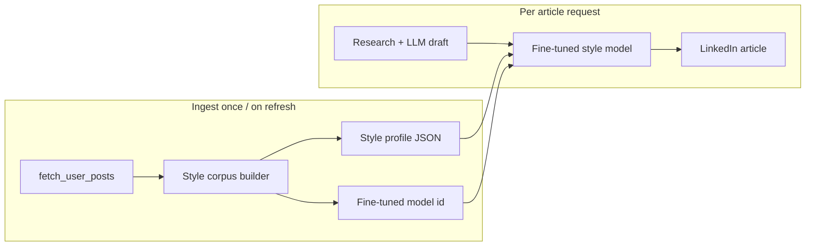

## Writing style from LinkedIn posts → stylized articles

**Assumption:** You already have a fine-tuned “style” model. This plan covers everything before and after that model in ALwrity.

**High-level pipeline:**



---

## 1. What you already have (reuse)

| Piece | Location | Reuse for |
|-------|----------|-----------|
| Post fetch + normalize | `linkedin_posts_service.py` | Corpus input |
| Persist posts | `linkedin_posts_storage.py` + asset library | Stable text samples |
| Article LLM draft | `LinkedInService.generate_linkedin_article` → `generate_grounded_article_content` | **Content** (facts, structure) |
| Persona in prompts | `ArticlePromptBuilder` + `PersonaAnalysisService` | Optional; **don’t replace** style model |
| Deterministic style metrics | `EnhancedLinguisticAnalyzer.analyze_writing_style` | Style **profile** features |
| Style detection API | `/style-detection/analyze` | Optional LLM style summary |

**Design choice:** LLM draft = substance; fine-tuned model = voice. Persona can stay as a weak prior or be disabled when “use my LinkedIn style” is on.

---

## 2. New modules (recommended layout)

All new files under `backend/services/integrations/linkedin/` (no edits to Unipile client):

| Module | Responsibility |
|--------|----------------|
| `linkedin_style_corpus.py` | Build corpus from fetched posts |
| `linkedin_style_profile.py` | Extract + store `LinkedInWritingStyleProfile` |
| `linkedin_style_types.py` | Dataclasses / JSON schema |
| `linkedin_style_stylizer.py` | Call fine-tuned model on LLM draft |
| `linkedin_style_service.py` | Orchestrate refresh + get profile + stylize |

Optional API: `backend/api/linkedin_style_routes.py`  
CLI: `backend/scripts/linkedin_build_style_profile.py`

---

## 3. Phase A — Style corpus from posts

### 3.1 Fetch & select samples

Use existing `fetch_user_posts()` with `fetch_all=True`, `include_article_body=True`.

**Filter rules** (pure functions, unit-testable):

- Drop `content_kind == "repost"` or empty `text`
- Prefer `post` + `article` with `len(text) >= 80`
- Cap corpus: e.g. 30–50 posts, newest first
- Optional: weight articles higher (longer, more “writing style” signal)

### 3.2 Corpus storage

**Option A (recommended v1):** JSON in user workspace  
`workspace/.../linkedin/style_corpus.json` with `social_id`, `text`, `parsed_datetime`, `content_kind`

**Option B:** Re-read from asset library (`content_origin=unipile_fetch`, tag `fetched`)

Store `corpus_content_hash` (SHA-256 of canonical texts) to know when to refresh profile.

### 3.3 API / CLI

- `POST /api/linkedin-social/style/refresh` — fetch + rebuild corpus + profile  
- CLI: `linkedin_build_style_profile.py --user-id ... --refresh-posts`

---

## 4. Phase B — Style profile extraction (pre–fine-tune + runtime metadata)

Even with a fine-tuned model, keep a **structured profile** for UI, gating, and fallbacks.

### 4.1 Deterministic layer

Feed post texts into existing analyzer:

```python
EnhancedLinguisticAnalyzer().analyze_writing_style(text_samples)
```

Produces: sentence length, vocabulary, readability, rhetorical patterns, tone signals, consistency across posts.

### 4.2 Optional LLM summary layer

Small structured prompt → JSON:

- `voice_summary` (2–3 sentences)
- `signature_phrases`, `opening_patterns`, `cta_style`
- `formality`, `uses_questions`, `uses_lists`, `emoji_frequency`

Can reuse patterns from `StyleDetectionLogic` / persona prompts.

### 4.3 `LinkedInWritingStyleProfile` shape

```json
{
  "user_id": "...",
  "corpus_content_hash": "...",
  "sample_count": 42,
  "extracted_at": "...",
  "linguistic_analysis": { ... },
  "llm_style_summary": { ... },
  "fine_tuned_model_id": "linkedin-style-raj-v1",
  "min_samples_met": true
}
```

### 4.4 Persistence

SQLite table in per-user DB (alongside `linkedin_oauth_tokens`):

`linkedin_writing_style` — `profile_json`, `corpus_hash`, `updated_at`

Or JSON file in workspace if you want zero schema migration.

**Gate:** require `min_samples_met` (e.g. ≥ 10 usable posts) before enabling stylization.

---

## 5. Phase C — Fine-tuned model integration (assumed ready)

### 5.1 Adapter interface

```python
class LinkedInStyleModelAdapter(Protocol):
    async def stylize(
        self,
        *,
        draft: str,           # LLM article body (markdown)
        title: str,
        style_profile: LinkedInWritingStyleProfile | None,
        user_id: str,
    ) -> StylizeResult:  # { content, title?, metadata }
        ...
```

**Implementation:** thin wrapper around your hosted endpoint (OpenAI fine-tune, custom HF endpoint, etc.).

Config:

```env
LINKEDIN_STYLE_MODEL_ID=your-fine-tuned-model
LINKEDIN_STYLE_MODEL_BASE_URL=...   # if self-hosted
```

Register in LLM gateway or a dedicated client — **do not** hardcode inside `content_generator.py`.

### 5.2 Stylization prompt contract (fixed template)

Fine-tuned model input should be stable:

```
SYSTEM: Rewrite the draft in the author's LinkedIn writing style. Preserve facts, structure, and citations. Do not invent new claims.

USER:
DRAFT TITLE: ...
DRAFT BODY:
...

STYLE METADATA (optional):
{compact profile JSON}
```

Output: full article markdown (or JSON `{title, content, sections}` to match `LinkedInArticleOutput`).

### 5.3 Where it plugs into generation

Extend `LinkedInArticleRequest`:

```python
apply_linkedin_writing_style: bool = False
style_model_id: Optional[str] = None  # override default env model
```

In `LinkedInService.generate_linkedin_article` after `generate_grounded_article_content`:

```python
if request.apply_linkedin_writing_style:
    profile = await style_service.get_or_build_profile(user_id)
  stylized = await stylizer.stylize(draft=content_result["content"], ...)
  content_result["content"] = stylized.content
  content_result["style_applied"] = True
  content_result["style_model_id"] = ...
```

Keep research, citations, and quality metrics on the **draft** or re-run quality on stylized output (config flag).

---

## 6. Phase D — API & UX

| Endpoint | Purpose |
|----------|---------|
| `GET /api/linkedin-social/style` | Current profile + `ready: bool` |
| `POST /api/linkedin-social/style/refresh` | Fetch posts → corpus → profile |
| `POST /api/linkedin/generate-article` | Add `apply_linkedin_writing_style=true` |

Response metadata:

```json
"generation_metadata": {
  "style_applied": true,
  "style_model_id": "...",
  "corpus_sample_count": 35,
  "corpus_content_hash": "..."
}
```

Frontend: toggle “Write in my LinkedIn voice” (disabled until `ready`).

---

## 7. Testing strategy

| Layer | Tests |
|-------|--------|
| `linkedin_style_corpus.py` | Filter reposts, min length, cap count (fixture posts JSON) |
| `linkedin_style_profile.py` | Analyzer output shape; `min_samples_met` |
| `linkedin_style_stylizer.py` | Mock adapter; draft in → stylized out |
| `linkedin_style_service.py` | Injected fetch + adapter; cache hit on same `corpus_hash` |
| Integration | `generate_linkedin_article` with `apply_linkedin_writing_style` mocked |

No network; no real fine-tuned model in CI.

---

## 8. Implementation order

1. **Types + corpus builder** + fixture tests  
2. **Profile extractor** (reuse `EnhancedLinguisticAnalyzer`) + storage  
3. **Style refresh orchestrator** (calls `fetch_user_posts` + persist optional)  
4. **`LinkedInStyleModelAdapter`** stub + env config  
5. **Stylizer + hook in `generate_linkedin_article`**  
6. **API routes + CLI**  
7. **Frontend toggle** (optional)

---

## 9. Risks & mitigations

| Risk | Mitigation |
|------|------------|
| Too few posts | `min_samples_met`; show “connect LinkedIn & publish more” |
| Reposts dilute style | Filter in corpus builder |
| Style model changes facts | Prompt: preserve facts/citations; optional diff check vs draft |
| Double persona + style conflict | When style on, slim or skip persona block in draft prompt |
| Corpus stale | Refresh on connect, manual refresh, or weekly job if hash changed |
| Long articles expensive | Stylize once on full body; or section-by-section with same model |

---

## 10. Relation to persona (today)

Articles already inject persona in `ArticlePromptBuilder` and `generate_grounded_article_content`. Recommended split:

| Stage | Job |
|-------|-----|
| **LLM draft** | Topic, research, structure, expertise |
| **Fine-tuned style model** | Sentence rhythm, word choice, openings, tone |
| **Persona** | Fallback when no style profile / style toggle off |

---

## 11. Minimal v1 scope

If you want the smallest useful slice:

1. Corpus + profile from fetched posts (no new DB table — workspace JSON)  
2. `LinkedInStyleModelAdapter` with env `LINKEDIN_STYLE_MODEL_ID`  
3. One flag on article generation: `apply_linkedin_writing_style`  
4. `POST /style/refresh` + tests  

Fine-tuning itself stays outside the repo; you only need the adapter contract and training export format aligned with `linkedin_style_corpus` output.

---

If you want this implemented in the repo next, switch to Agent mode and we can start with Phase A (corpus + profile) without touching the existing article LLM path until the stylizer hook is ready.