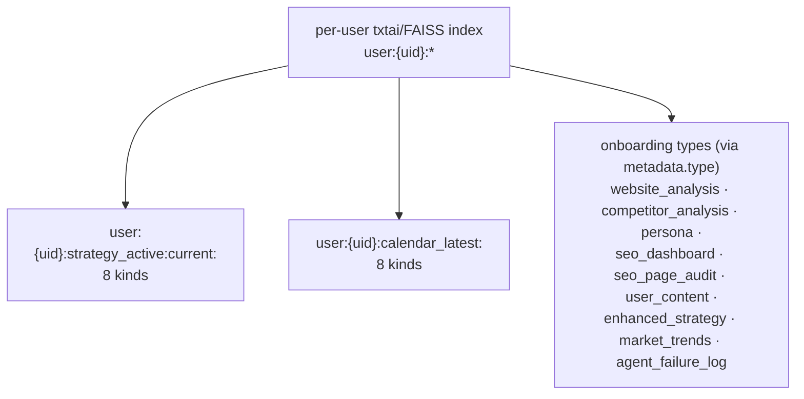
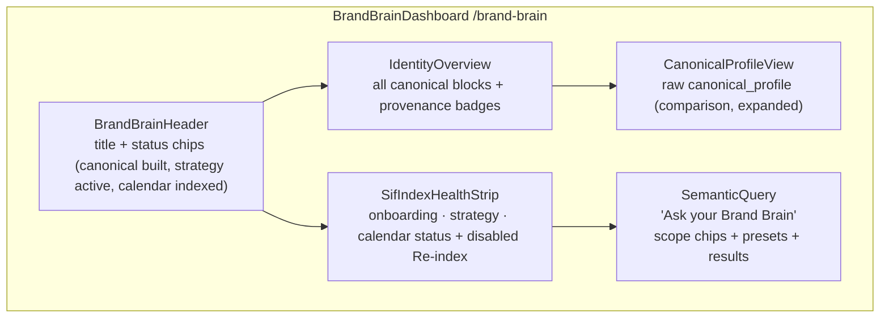
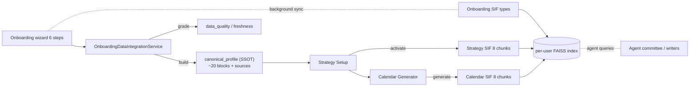

# Brand Brain Dashboard — Design & Phased Implementation Plan

> **Status:** Approved for phased implementation.
> **Progress:** **All phases 0–6 shipped.** Backend: dashboard aggregate, unified semantic search, onboarding-data fix, feature flags, and now end-to-end flag gating (brand-brain backend suites green — 36 tests incl. 3 new Phase 6 gate tests). Frontend: `/brand-brain` shell, routing, Brand Brain nav chip, Identity Overview + canonical raw viewer + quality strip, SIF health strip + unified semantic query, and the feature-flag disabled state (brand-brain frontend suites green — 57 tests incl. 4 new Phase 6 tests; adjacent SemanticIndexCard/CalendarSifStatusCard suites green).
> **Scope:** A new full-page dashboard dedicated to the user's Brand Brain — the structural SSOT (`canonical_profile`) plus the SIF semantic memory — ending with a unified "Ask your Brand Brain" semantic query over onboarding, strategy, and calendar.

---

## 1. What is the Brand Brain? (verified against code)

The "Brand Brain" is **two complementary artifacts**, not one:

| # | Artifact | What it is | Where it lives | Build/Feed |
|---|---|---|---|---|
| 1 | **Structural SSOT** | `canonical_profile` JSON — source-tracked brand identity contract (~20 top-level blocks) | `OnboardingDataIntegration.canonical_profile` (model `backend/models/enhanced_strategy_models.py:277`) | `OnboardingDataIntegrationService.get_integrated_data_sync(user_id, db, force_rebuild=False)` → `canonical_profile_builder.build_canonical_profile(...)` |
| 2 | **Semantic memory** | The per-user SIF index — embeddings of onboarding + strategy + calendar docs; "the per-user brand brain" | Per-user txtai/FAISS index on disk (`TxtaiIntelligenceService`) | Onboarding sync tasks, strategy-activation hook, calendar-generation hook (all fire-and-forget, watermark-deduped) |

### 1.1 The 20 canonical blocks (structural SSOT)

Built by `backend/api/content_planning/services/content_strategy/onboarding/canonical_profile_builder.py`:

`industry` · `target_audience` · `writing_tone` · `writing_voice` · `writing_complexity` · `writing_engagement` · `content_types` · `brand_colors` · `brand_values` · `visual_style` · `strategy_insights` · `seo_profile` (homepage_seo_audit, full_site_seo_summary, sitemap_strategy_insights, competitor_seo_benchmarks) · `competitive_intelligence` · `platform_preferences` · `research_depth` · `auto_research` · `factual_content` · `business_info` · `persona` · `brand_voice`

(`sources` is **metadata** — per-block provenance strings like `website_analysis` / `research_preferences` / `persona_core` — never a display card itself.)

### 1.2 SIF document namespaces (the semantic memory)

Everything is namespaced by **doc-id prefix**, which is the key that makes a unified scoped semantic search possible:



**Strategy kinds (8):** `form_summary`, `base_strategy`, `strategic_insights`, `competitive_analysis`, `performance_predictions`, `implementation_roadmap`, `risk_assessment`, `user_persona_digest`

**Calendar kinds (8):** `calendar_overview`, `daily_schedule`, `weekly_themes`, `content_recommendations`, `performance_predictions`, `ai_insights`, `strategy_alignment`, `calendar_events`

---

## 2. How SIF is integrated today (verified in this checkout)

### 2.1 Integration map

| Flow | Index trigger | Status / search endpoints (existing) | Frontend surface today |
|---|---|---|---|
| **Onboarding** | `SIFIndexingTask` scheduled at step-2 completion; persona sync at step-4; manual `POST /api/onboarding/sif/retrigger` | `GET /api/onboarding/sif/search` — **whole-index, unscoped**; `GET /api/onboarding/sif/retrigger` | `SifIndexingPanel.tsx` (OnboardingWizard) |
| **Strategy** | Activation hook → `dispatch_activation_indexing` → `strategy_indexer` builds 8 chunks | `GET /…/enhanced-strategies/strategy/sif-status` · `GET /…/strategy/sif-search` (**prefix-scoped**) | `SemanticIndexCard.tsx` inside the "Semantic Dashboard" drawer of `ContentPlanningDashboard.tsx` |
| **Calendar** | Calendar-generation hook → `calendar_sif_indexer` builds 8 chunks | `GET /…/calendar-generation/calendar/sif-status` · `GET /…/calendar/sif-search` (**prefix-scoped**) | `CalendarSifStatusCard.tsx` in `CalendarTab.tsx` |

### 2.2 Existing surfaces we will reuse/mirror

| Surface | Path | Role |
|---|---|---|
| Main dashboard (page) | `frontend/src/components/MainDashboard/MainDashboard.tsx` | Pattern for a full dashboard page (route `/dashboard`, header + status chips + guarded content) |
| **SIF health chip** | `MainDashboard.tsx` (SIF health fetch; chip block — `sifPrefix = brandBrainEnabled ? 'Brand Brain' : 'SIF Index'`) | **To be renamed to "Brand Brain" and made the entry chip to the new dashboard** |
| Brand Brain read-only view | `frontend/src/components/StrategySetupWizard/BrandBrainView.tsx` | Card-grid rendering of canonical blocks — the seed of the Identity view |
| Semantic query card | `frontend/src/components/ContentPlanningDashboard/components/SemanticIndexCard.tsx` | The "Ask SIF" input + preset queries + pretty-passage rendering (`parsePassage`/`renderPassage`) to replicate for the unified query panel |
| Semantic education dialog | `…/SemanticIndexEducationDialog.tsx` | Education dialog pattern to replicate |
| Status hooks | `hooks/useStrategySifStatus.ts`, `hooks/useCalendarSifStatus.ts` | Poll-while-pending pattern for the health strip |
| Terminal styling template | `frontend/src/components/SchedulerDashboard/terminalTheme.ts` (+ billing `terminalTheme?: boolean` prop pattern, `BillingPage.tsx`/`SchedulerDashboard.tsx` inline `styled()` parity) | The visual template explicitly chosen for this dashboard |
| Routing pattern | `frontend/src/App.tsx` | Lazy `React.lazy` route + `ProtectedRoute` (+ optional `FeatureRoute`) |
| Empty/error states | `frontend/src/components/shared/{ErrorDisplay,EmptyState}.tsx`, ComponentErrorBoundary | Honest no-data states |

---

## 3. Design

### 3.1 Decisions (confirmed)

1. **Full page first**, embed on MainDashboard later.
2. **New backend APIs** for the dashboard are approved.
3. **Identity view shows all ~20 blocks** (full canonical_profile), with provenance/source badges.
4. **"Re-index SIF" action** is included in the SIF health strip but **rendered disabled** for now (the onboarding `sif/retrigger` endpoint already exists; wiring is a later phase).
5. **Nav placement:** repurpose the main-dashboard **SIF chip → "Brand Brain"**, clicking it navigates to the new page.
6. The dashboard **displays the raw `canonical_profile` too** (a JSON/structured comparison view alongside the curated identity cards).
7. **Known limitation (fixed later):** onboarding data is **not SIF-indexable as one cohesive doc/collection** today — it is spread across many `metadata.type` docs and the onboarding search is unscoped. The unified semantic search will still label onboarding hits by `metadata.type`, and a dedicated "onboarding-as-one-doc" indexing fix is tracked as a later workstream (§8.2).

### 3.2 Target page

Route: **`/brand-brain`** — lazy-loaded, `ProtectedRoute`, optional `FeatureRoute feature="brand-brain"`.



Layout, left→right / top→bottom on a terminal-themed scaffold (`terminalTheme.ts` tokens):

1. **Header** (`BrandBrainHeader`) — title, subtitle, and status chips (mirroring `DashboardHeader` + MainDashboard chips).
2. **Identity Overview** — the ~20 canonical blocks as an icon-card grid (seed: `BrandBrainView`), each with its provenance **source badge** from `canonical_profile.sources`.
3. **Raw `canonical_profile`** — collapsible JSON/structured viewer for direct comparison (the user explicitly wants canonical_profile visible for comparison).
4. **SIF Health Strip** — three mini status cards (Onboarding / Strategy / Calendar) drawn from the existing status payloads; a disabled **"Re-index SIF"** button (mapped to onboarding `sif/retrigger` later).
5. **Semantic Query ("Ask your Brand Brain")** — the content-planning-equivalent, but unified:
   - **Scope chips:** `All · Onboarding · Strategy · Calendar`
   - Free-text input + preset question chips per scope
   - Results with **domain badge + kind label + score + pretty passage** (reuse `parsePassage`/`renderPassage`)
   - Education dialog; honest empty/error/loading states; no fabricated results.

### 3.3 Backend design (approved)

New router **`backend/api/brand_brain/`** (registered like sibling routers; per-user via `Depends(get_current_user)`):

| Endpoint | Purpose | Composition |
|---|---|---|
| `GET /api/brand-brain/dashboard` | One aggregate payload for the page (mirrors `/scheduler-dashboard`, `/subscription/dashboard/{id}` aggregate convention) | `canonical_profile` + `data_quality` (via `OnboardingDataIntegrationService.get_integrated_data_sync`), strategy SIF status (reuse `build_strategy_sif_status_payload`), calendar SIF status (reuse calendar status builder), onboarding SIF task/watermark health (reuse `SIFIndexingTask`/health rows), plus per-block `sources` |
| `GET /api/brand-brain/semantic-search?query&scope=all\|onboarding\|strategy\|calendar&limit` | Unified scoped search; the honest superset of the three existing searches | `TxtaiIntelligenceService.search(query, limit*4)` → categorize hits by doc-id prefix/metadata: `strategy_active:`→strategy, `calendar_latest:`→calendar, `metadata.type` onboarding bucket→onboarding; label via existing `STRATEGY_KIND_LABELS`/calendar `KIND_LABELS`; **never fabricates** (error ⇒ `{hits: [], error}`) |

Rationale for a new endpoint (vs frontend `Promise.all` on the 3 existing endpoints): the onboarding endpoint is **unscoped** and would duplicate/overlap strategy + calendar hits; a single scoped endpoint gives clean domain bucketing and one API contract for the page.

```mermaid
sequenceDiagram
    participant U as Browser (BrandBrainDashboard)
    participant B as FastAPI /api/brand-brain
    participant O as OnboardingDataIntegrationService
    participant S as TxtaiIntelligenceService
    participant C as Cache(DB/status rows)

    U->>B: GET /brand-brain/dashboard
    B->>O: get_integrated_data_sync(user_id, db)
    O-->>B: canonical_profile + sources + data_quality
    B->>C: strategy/calendar/onboarding SIF status + watermarks
    C-->>B: status blocks
    B-->>U: { canonical_profile, quality, strategy, calendar, onboarding_sif }

    U->>B: GET /brand-brain/semantic-search?scope=all&query=...
    B->>S: search(query, limit*4)
    S-->>B: scored hits
    B->>B: bucket by doc-id prefix / metadata.type; label kind; sort
    B-->>U: { hits: [{domain, kind_label, score, passage}], query, scope }
```

### 3.4 Styling

- Base scaffold: **terminal theme** — `terminalTheme.ts` (`TerminalPaper`, `TerminalCard`, `TerminalCardContent`, `TerminalTypography`, `TerminalChip` … `terminalColors`) with monospace stack, exactly as `SchedulerDashboard.tsx` / `BillingPage.tsx` do (optionally a `terminalTheme?: boolean` prop for future embed reuse, like billing).
- Content-aware accent: status colors green/red/yellow per SIF status; brand-identity cards use the existing indigo/violet family for differentiation.
- `HeaderControls colorMode="dark"` in the page header (billing/scheduler parity).

### 3.5 Feature flags

- Backend: `BRAND_BRAIN_DASHBOARD_ENABLED` env (default on), read via a small predicate module (mirror `strategy_indexer.sif_strategy_feature_flag` pattern).
- Frontend: `VITE_BRAND_BRAIN_DASHBOARD_ENABLED` + config module `frontend/src/config/brandBrainConfig.ts` (mirror `strategySifConfig.ts`).

---

## 4. Phased implementation plan

Each phase is TDD (red → green → regression), small atomic commits, and ends runnable.

### Phase 0 — Foundations & fixes (½ day) — ✅ shipped
- **Fix the orphaned endpoint**: register the canonical-profile read for `BrandBrainView`. Done: `GET /…/enhanced-strategies/onboarding-data` registered in `utility_endpoints.py` as a specific path (never shadowed by `GET /enhanced-strategies/{strategy_id}`), 404 when onboarding never started. Envelope: `{canonical_profile, sources, data_quality, onboarding_session, processing_timestamp}`.
- Add `feature flag` predicate module (backend) + config module (frontend). Done: `services/intelligence/brand_brain_features.py::brand_brain_dashboard_enabled()` (env `BRAND_BRAIN_DASHBOARD_ENABLED`, default on) + `frontend/src/config/brandBrainConfig.ts` (`VITE_BRAND_BRAIN_DASHBOARD_ENABLED`).
- Tests: `test_onboarding_data_route.py` (4), `test_brand_brain_features.py` (4), `frontend/src/config/__tests__/brandBrainConfig.test.ts` (5) — all green.

### Phase 1 — Backend: `/api/brand-brain/dashboard` (1–2 days) — ✅ shipped
- New `api/brand_brain/router.py` + aggregate payload composed from existing services (no new orchestration logic). Includes `canonical_profile`, `sources`, `data_quality`, `onboarding_session`, strategy SIF status (`build_strategy_sif_status_payload`), calendar SIF status, and a lightweight onboarding SIF health block (`_onboarding_indexing_payload` from the latest `SIFIndexingTask` row — status/phase/progress/freshness/stale).
- **As-built decision:** when onboarding never started, the dashboard returns **200 with `onboarding: null`** (not 404) so the strategy/calendar domains keep rendering; the page shows a "complete onboarding" CTA in the identity slot.
- **As-built decision:** calendar status is a **local read-only mirror** in the router (not an import of the calendar endpoint) so the parallel content-calendar work (dirty `calendar_sif_*` files) stays untouched; logic mirrors `/calendar/sif-status` one-to-one.
- `rebuild router` registered in `alwrity_utils/router_manager.py::OPTIONAL_ROUTER_REGISTRY` (`features: {"all", "core", "content_planning"}`) — path `prefix="/api/brand-brain"`.
- Tests: `test_brand_brain_dashboard_api.py` (7 — full aggregate, `onboarding: null`, no-active-strategy, stale flag, clerk string-id path, auth, route wiring).

### Phase 2 — Backend: `/api/brand-brain/semantic-search` (1–2 days) — ✅ shipped
- Scoped unified search; prefix bucketing (`strategy_active:` → strategy, `calendar_latest:` → calendar, else onboarding via `metadata.type`); labels via local maps mirroring `STRATEGY_KIND_LABELS`/`KIND_LABELS`; `limit` bounds 1..20 (FastAPI 422); all-scope dedup on best score; error ⇒ `{hits: [], error}` (never fabricates); clerk string-id prefixes.
- Prereq: `TxtaiIntelligenceService.get_document_metadata(doc_id)` added (reads txtai `object`/`metadata`, never raises).
- Tests: `test_brand_brain_semantic_search_api.py` (12), `test_txtai_get_document_metadata.py` (6).
- **Regression 45 green:** brand-brain suites + `test_strategy_sif_status_api.py`, `test_calendar_sif_status_api.py`, `tests/functional/subscription/test_feature_gating.py` (validates registry feature tags).

### Phase 3 — Frontend page shell + routing + nav chip (1 day) — ✅ shipped
- `BrandBrainDashboard.tsx` + terminal theme scaffold; lazy route `/brand-brain` in `App.tsx` with `ProtectedRoute` + `FeatureRoute feature="brand-brain"`.
- Rename MainDashboard SIF health chip → **"Brand Brain"**; clicking navigates to `/brand-brain` (keep the health-state coloring/labels).
- `useBrandBrainDashboard` hook + `services/brandBrainApi.ts`.
- Tests: route render, chip label/navigation, terminal-styled snapshot.
- **As-built:** scaffold defined inline near SchedulerDashboard parity (`TerminalContainer`/`TerminalHeader`/`TerminalTitle`/`TerminalIconButton/…`, `HeaderControls colorMode="dark"`); SIF chip renamed only when `isBrandBrainDashboardEnabled()` (env unset ⇒ ON); chip gains `{ onClick: openBrandBrain, testId: 'brand-brain-chip' }`; health colors + Storage icon preserved. API service unwraps `response.data?.data || response.data` and throws with `{ cause }`; hook is fetch-on-mount + `refresh()`. Three placeholder section cards (IDENTITY OVERVIEW / SIF HEALTH / ASK YOUR BRAND BRAIN) render honest loading/error states.
- Tests: `App.brandBrainRoute.test.ts` (2), `MainDashboard.brandBrainChip.test.ts` (6), `BrandBrainDashboard.shell.test.ts` (5) + existing `brandBrainConfig.test.ts` (5) — **18 green**.

### Phase 4 — Identity view (1–2 days) — ✅ shipped
- `IdentityOverview`: all canonical blocks as cards (seed `BrandBrainView`) + **provenance/source badges** from `sources`.
- `CanonicalProfileView`: raw `canonical_profile` comparison (structured viewer, expand/collapse).
- Quality/freshness strip from `data_quality` where present.
- Tests: block rendering, badge rendering, empty-profile state.
- **Contract (locked from `canonical_profile_builder.py`):** 20 renderable blocks — `industry · target_audience · writing_tone · writing_voice · writing_complexity · writing_engagement · content_types · brand_colors · brand_values · visual_style · strategy_insights · seo_profile · competitive_intelligence · platform_preferences · research_depth · auto_research · factual_content · business_info · persona · brand_voice`. `sources` is metadata (block → source string like `website_analysis` / `research_preferences` / `persona_core`), rendered as per-block provenance badges, never a card. `data_quality` shape (from `DataQualityService.assess_onboarding_data_quality`): `overall_score · completeness · freshness · accuracy · relevance · consistency · confidence · quality_level(excellent/good/fair/poor) · recommendations[] · issues[]`. Empty state: `onboarding === null` ⇒ "complete onboarding first" CTA (payload is still 200).
- **As-built:** new `components/BrandBrainDashboard/` package — `BrandBrainBlocks.ts` (20-block registry + `blockLabel()` helper), `IdentityOverview.tsx` (icon-card grid + compact value formatter + provenance source chips from `sources`, "complete onboarding first" empty state), `CanonicalProfileView.tsx` (per-block terminal accordion, collapsed by default, expand to raw pretty JSON for direct comparison against the curated cards; renders `null` when onboarding absent), `QualityStrip.tsx` (level chip + overall + per-dimension terminal progress bars, renders `null` when no `data_quality` keys). Page wires `<IdentityOverview onboarding={onboarding} />` and `<CanonicalProfileView onboarding={onboarding} />` between the header and the Phase 5 placeholders.
- Tests: `BrandBrainBlocks.test.ts` (3), `IdentityOverview.test.tsx` (5), `CanonicalProfileView.test.tsx` (5), `QualityStrip.test.tsx` (4) — **17 new green**. Regression: existing 18 Phase 3 + adjacent SemanticIndexCard suites still green (67 total frontend suites verified).

### Phase 5 — SIF health strip + unified semantic query (2–3 days) — ✅ shipped
- `SifIndexHealthStrip`: three status cards polling on the dashboard aggregate (and/or `useStrategySifStatus`/`useCalendarSifStatus`); **disabled** "Re-index SIF" button.
- `SemanticQuery`: scope chips, free-text + presets, domain/kind/score + pretty passages, education dialog.
- Tests: scope switching, preset chips, empty/error/loading, honest no-hits message.
- **Contract (locked from `api/brand_brain/router.py` + `services/brandBrainApi.ts`):**
  - **SifIndexHealthStrip** consumes the same `BrandBrainDashboardPayload` (no extra requests). Onboarding mini-card derives from `data.onboarding.indexing` (`{status, phase, progress_pct, last_success, index_freshness_hours, index_stale}`); Strategy + Calendar from `data.domains.{strategy,calendar}.indexing` (`{phase, status, progress_pct}`) + `watermark.embedding_count`. Tone: `ok` (`phase==='success'` || `embedding_count>0`), `warn` (`pending` / `no_active_strategy`), `err` (`failed` / explicit `index_stale`). Empty payload ⇒ `null`. "Re-index SIF" button rendered `disabled` (no `onClick`; tooltip "Re-index wiring is not yet available" — deferred, §8.2).
  - **SemanticQuery** uses the typed `brandBrainSemanticSearch(query, scope, limit)` from `services/brandBrainApi.ts` (no new backend work). Scopes: `all | onboarding | strategy | calendar` (`BrandBrainSearchScope`). Component state: `scope` (default `all`), `query`, `loading`, `error`, `results`. Per-scope `SCOPE_PRESETS` (curated question list). Each result renders domain chip + `kind_label` + score (2dp) + `text` passage. Loading: `CircularProgress`. Error: `TerminalAlert severity="error"` (the API always returns `{hits: [], error}` on embedding failure — never fabricates). Empty hits: honest "no matches in this scope" message. Education dialog: small "What is this?" button → MUI Dialog with a one-paragraph explanation of scoped semantic search.
- **As-built:**
  - `useBrandBrainSemanticSearch.ts` hook (`hooks/`): `loading / error / results / search(query, scope, limit) / reset()` with inflight ticket so the latest call wins. Backed by `brandBrainSemanticSearch` (which already returns `{hits: [], error}` on embedding failure — never fabricates).
  - `semanticPresets.ts`: `SCOPE_PRESETS` map (3 curated questions per scope) — drives the per-scope preset chips.
  - `SifIndexHealthStrip.tsx`: 3 mini-cards (Onboarding / Strategy / Calendar) + disabled "Re-index SIF" button (tooltip explains the wiring is deferred). No extra requests — derives tones from the same aggregate.
  - `SemanticQuery.tsx`: scope chips (MUI Chip clickable, filled = selected), per-scope preset chips (click fills the input), free-text input + "Search" button (disabled while loading or query empty). Loading → `CircularProgress`. Error → `TerminalAlert`. Empty hits → honest "no matches in this scope". Hits → `HitCard` (domain chip + `kind_label` + 2dp score + passage text). "What is this?" button → `EducationDialog`.
- Tests: `SifIndexHealthStrip.test.tsx` (6), `semanticPresets.test.ts` (2), `SemanticQuery.test.tsx` (10 — uses `vi.mock` on the hook so render paths exercise default / loading / error / empty / with-hits) — **18 new green**. Regression: existing 35 Phase 3–4 suites + adjacent SemanticIndexCard + CalendarSifStatusCard suites still green (102 frontend suites verified).

### Phase 6 — Polish, flags, docs, regression (1 day) — ✅ shipped
- Wire `BRAND_BRAIN_DASHBOARD_ENABLED` end-to-end (hidden/soft when off).
- Full frontend + backend regression runs; update this doc to reflect final state; remove stale WS3 references if applicable (checked: no real WS3 references remain — the only mention was this instruction itself).
- **Contract (locked from `brand_brain_features.py` + `brandBrainConfig.ts`):**
  - **Backend:** `api/brand_brain/router.py` now imports the flag predicate — both handlers raise `HTTPException(404, "Brand Brain dashboard is disabled")` when `brand_brain_dashboard_enabled()` is False (env `BRAND_BRAIN_DASHBOARD_ENABLED` in the falsy set `{0,false,no,off}`; default ON), checked first so no DB/service work happens when off.
  - **Frontend:** `useBrandBrainDashboard(enabled?: boolean)` skips the fetch when disabled (no request, no error flicker); `BrandBrainDashboard` renders a terminal warning alert ("Brand Brain dashboard is currently disabled") and no section components when `isBrandBrainDashboardEnabled()` is false. MainDashboard chip already reverts to an inert "SIF Index" chip when off (`brandBrainChipProps = brandBrainEnabled ? { onClick, testId } : {}`).
- **As-built:** `useBrandBrainDashboard(enabled = true)` short-circuits its effect when disabled; the page gates loading / error / section rendering behind `enabled`. Both backend handlers gate before their body.
- Tests: backend `test_brand_brain_flag_off.py` — 3 (**dashboard 404**, **semantic-search 404**, **gate precedes scope validation**, env flag patched to falsy values); frontend `BrandBrainDashboard.disabled.test.tsx` — 2 (flag off → disabled alert + no sections + `useBrandBrainDashboard(false)`; flag on → sections render + hook(true)), plus a chip flag-off guard assertion and a shell flag-gate assertion — **4 new frontend green**. Regression: all brand-brain + adjacent frontend suites (84/84) and the full brand-brain backend suites (36) still green.

**Estimated total: ~7–10 focused days.** All phases 0–7 shipped; the remaining polish items sit in §8.2 (deferred, surfaced as the page's coming-soon roadmap).

### Phase 7 — Final polish + coming-soon surfaces (½–1 day) — ✅ shipped
- **P0 — chip ↔ route gate consistency:** MainDashboard chip requires `isBrandBrainDashboardEnabled()` **and** `isFeatureEnabled(FEATURE_KEYS.BRAND_BRAIN)` so it can never advertise a route that `FeatureRoute` would redirect away from in feature-only deployments.
- **P1 — component error boundaries:** every page section wrapped in `ComponentErrorBoundary` (design §2.2) so one section failure surfaces an honest error card instead of blanking the page.
- **P1 — real-wiring page test:** `BrandBrainDashboard.render.test.tsx` renders the real section components against a mocked aggregate payload (no section mocks) — proves the payload actually flows from the hook into Identity Overview / quality strip / health strip / semantic query.
- **Coming-soon surfaces (§8.2):** new `ComingSoonStrip` on the page renders the four deferred workstreams (Re-index SIF, Unified onboarding index, Main dashboard widget, Freshness gates) as disabled "Coming soon" cards — visible roadmap, no implied capability.
- **As-built:**
  - `ComingSoonStrip.tsx`: `COMING_SOON_ITEMS` data contract (key/label/description) + one disabled "Coming soon" card per item, gated behind `enabled` with the rest of the surface; wraps in its own `ComponentErrorBoundary` like the sections.
  - `BrandBrainDashboard.tsx`: sections wrapped in `ComponentErrorBoundary componentName={...}` (Identity Overview / Canonical Profile View / Sif Health Strip / Semantic Query / Coming Soon Strip); `ComingSoonStrip` appended after the query.
  - `MainDashboard.tsx`: `brandBrainEnabled = isBrandBrainDashboardEnabled() && isFeatureEnabled(FEATURE_KEYS.BRAND_BRAIN)` — the chip now honors the route entitlement too.
- Tests: `ComingSoonStrip.test.tsx` (5 — data contract + disabled chip + nothing interactive), `BrandBrainDashboard.render.test.tsx` (2 — real-wiring full payload + empty-state), chip combined-gate assertion, shell error-boundary assertion (`componentName` list), disabled-test strip-gate assertions (flag off → no strip, on → strip). **9 new frontend green.** Regression: full brand-brain + adjacent frontend suites still green (117/117). No backend changes in Phase 7.

---

## 5. Testing strategy (per phase)

- **Backend:** pytest — API routes (auth via test Clerk pattern, 404s, envelope shape), semantic-search scoping/dedup/no-fabrication, aggregate composition, feature-flag off.
- **Frontend:** RTL — render tests, chip navigation, scope switching, passage rendering, education dialog; follow existing suite conventions (`SemanticIndexCard.test.tsx`, `CalendarSifStatusCard.queries.test.tsx`, `SemanticIndexSnapshotRow.test.tsx`).

---

## 6. Diagrams: end-to-end study view

### 6.1 Brand Brain lifecycle (how the two artifacts get built)



### 6.2 Unified semantic query flow (Phase 5)

```mermaid
graph TD
    Q[User asks: 'our competitive positioning and roadmap?'] --> SCOPE[scope = all | onboarding | strategy | calendar]
    SCOPE --> API[GET /api/brand-brain/semantic-search]
    API --> ENG[search(query, limit*4)]
    ENG --> BUCKET{doc-id prefix / metadata.type}
    BUCKET -->|user:*:strategy_active:*| SB[STRATEGY kind label + passage]
    BUCKET -->|user:*:calendar_latest:*| CB[CALENDAR kind label + passage]
    BUCKET -->|onboarding type| OB[ONBOARDING type label + passage]
    SB --> RESULTS[domain badge + kind + score + pretty passage]
    CB --> RESULTS
    OB --> RESULTS
```

---

## 7. Deliverables checklist

- [x] Backend: `brand_brain` router (`/dashboard`, `/semantic-search`) — Phases 1–2 (`api/brand_brain/router.py`)
- [x] Backend: onboarding-data endpoint fix for `BrandBrainView` — Phase 0 (`utility_endpoints.py`)
- [x] Backend: feature flags (env predicate + frontend config) — Phase 0
- [x] Frontend: `/brand-brain` page + terminal theme + routing + feature flag — Phase 3
- [x] Frontend: MainDashboard chip renamed **Brand Brain** → navigates to page — Phase 3
- [x] Frontend: `IdentityOverview` (all blocks + provenance) + `CanonicalProfileView` — Phase 4
- [x] Frontend: quality/freshness strip from `data_quality` — Phase 4
- [x] Frontend: `SifIndexHealthStrip` (with disabled Re-index) + unified `SemanticQuery` — Phase 5
- [x] Backend: end-to-end flag gating (404 when disabled) + frontend disabled state — Phase 6
- [x] Tests at every phase + full regression — Phase 6
- [x] Coming-soon disabled roadmap for the four §8.2 workstreams — Phase 7
- [x] Chip ↔ route gate consistency + section error boundaries + real-wiring page test — Phase 7

---

## 8. Known issues & later workstreams

### 8.1 Fixed in this doc's footprint
`/enhanced-strategies/onboarding-data` was referenced by `BrandBrainView` but **not registered** → the wizard's Brand Brain step 404'd. **Fixed in Phase 0**: registered as a specific path (registered before `/{strategy_id}` so it is never shadowed), returns the canonical-profile envelope, 404s only when onboarding was never completed.

### 8.2 Deferred
> All four items are surfaced on the Brand Brain page as disabled "Coming soon" cards (`ComingSoonStrip`, Phase 7) — visible roadmap, no implied capability. Freshness gates intentionally not included in that strip (kept as a later, explicitly separate workstream).
- **Onboarding as one SIF doc:** onboarding data is not indexable/queryable as a single cohesive "onboarding" collection; types are scattered and the search is unscoped. Design + implement an "onboarding-as-one-doc" rename/regroup + scoped search later.
- **Re-index wiring:** enable the disabled "Re-index SIF" with a shared action across all three scopes (onboarding retrigger exists; strategy/calendar would need idempotent force-reindex).
- **MainDashboard embed:** compact Brand Brain widget on the main dashboard (SemanticIndexSnapshotRow-style slot).
- **Freshness/quality gates:** surface `data_freshness` staleness warnings + optional forced rebuild of `canonical_profile` after persona edits.